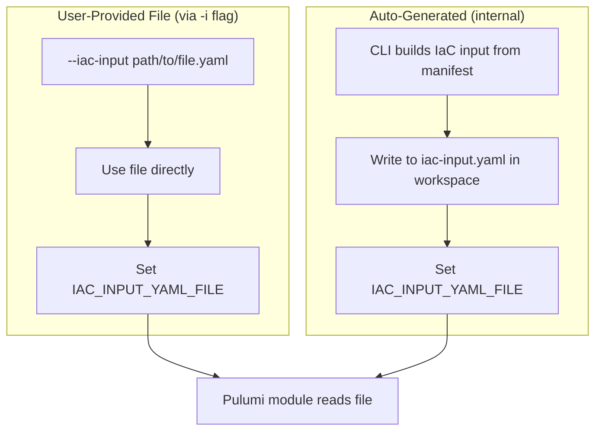

# IaC Input File Support with CLI Flag

**Date**: January 12, 2026
**Type**: Feature
**Components**: CLI Flags, Pulumi CLI Integration, IAC Stack Runner, Command Handlers

## Summary

Added support for passing IaC input YAML via file path using the new `--iac-input` / `-i` CLI flag, and changed the internal mechanism to write IaC input to a file instead of passing it through environment variable content. This avoids issues with large manifests hitting environment variable size limits.

## Problem Statement / Motivation

When deploying infrastructure with large manifests, the IaC input YAML content was passed directly via the `IAC_INPUT_YAML` environment variable. For complex deployments with extensive configurations, this could hit OS environment variable size limits or cause other issues.

### Pain Points

- Environment variable size limits could be exceeded with large IaC inputs
- No way to provide a pre-built IaC input file directly
- Users debugging Pulumi modules had to manually construct IaC input files

## Solution / What's New

Implemented a two-part enhancement:

1. **CLI Flag (`--iac-input` / `-i`)**: Users can provide a pre-built IaC input YAML file directly
2. **Internal File-Based Passing**: CLI now writes IaC input to a temp file and passes the path via `IAC_INPUT_YAML_FILE` environment variable



### Priority Order

When loading IaC input, the Pulumi module checks sources in this order:

1. Pulumi config `planton:iac-input`
2. `IAC_INPUT_YAML` env var (direct content) - for backward compatibility
3. `IAC_INPUT_YAML_FILE` env var (file path) - new primary mechanism

## Implementation Details

### New Flag Constant

**File**: `internal/cli/flag/flag.go`

```go
IacInput Flag = "iac-input"
```

### Environment Variable Renamed

**File**: `pkg/iac/pulumi/pulumimodule/iacinput/load_iac_input.go`

```go
const (
    PulumiConfigKey   = "planton:iac-input"
    FilePathEnvVar    = "IAC_INPUT_YAML_FILE"  // Renamed from IAC_INPUT_FILE_PATH
    YamlContentEnvVar = "IAC_INPUT_YAML"
)
```

### Updated Stack Runner

**File**: `pkg/iac/pulumi/pulumistack/run.go`

The `Run()` function now:
- Accepts `iacInputFilePath` parameter
- If user provides `--iac-input`, uses that file directly
- Otherwise, builds IaC input from manifest and writes to `iac-input.yaml` in workspace
- Sets `IAC_INPUT_YAML_FILE` env var with the file path

```go
// Determine IaC input file path:
// - If user provided --iac-input flag, use that file directly
// - Otherwise, build IaC input from manifest and write to temp file
var finalIacInputFilePath string
if iacInputFilePath != "" {
    finalIacInputFilePath = iacInputFilePath
} else {
    iacInputYamlContent, err := iacinput.BuildIacInputYaml(manifestObject, opts)
    // ... write to file
    finalIacInputFilePath = filepath.Join(pulumiModuleRepoPath, "iac-input.yaml")
}

pulumiCmd.Env = append(os.Environ(), 
    pulumimoduleiacinput.FilePathEnvVar+"="+finalIacInputFilePath)
```

### Commands Updated

The `--iac-input` / `-i` flag was added to:

- `planton apply`
- `planton plan`
- `planton destroy`
- `planton refresh`
- `planton pulumi update`
- `planton pulumi preview`
- `planton pulumi destroy`
- `planton pulumi refresh`

## Files Changed

| File | Change |
|------|--------|
| `internal/cli/flag/flag.go` | Added `IacInput` flag constant |
| `pkg/iac/pulumi/pulumimodule/iacinput/load_iac_input.go` | Renamed `FilePathEnvVar` to `IAC_INPUT_YAML_FILE` |
| `pkg/iac/pulumi/pulumistack/run.go` | Added `iacInputFilePath` param, file-based passing |
| `cmd/planton/root/apply.go` | Added flag, updated handler |
| `cmd/planton/root/plan.go` | Added flag, updated handler |
| `cmd/planton/root/destroy.go` | Added flag, updated handler |
| `cmd/planton/root/refresh.go` | Added flag, updated handler |
| `cmd/planton/root/pulumi.go` | Added flag to parent command |
| `cmd/planton/root/pulumi/*.go` | Updated `pulumistack.Run()` calls |

## Usage Examples

### With Pre-Built IaC Input File

```bash
# Apply using a pre-built IaC input file
planton apply -f manifest.yaml -i iac-input.yaml --stack org/project/stack

# Preview with IaC input file (short form)
planton plan -f manifest.yaml -i /path/to/iac-input.yaml --stack org/project/stack
```

### Traditional Approach (Still Works)

```bash
# CLI automatically builds IaC input from manifest
planton apply -f manifest.yaml --stack org/project/stack
```

## Benefits

- **No Size Limits**: File-based passing eliminates environment variable size constraints
- **Debugging Support**: Users can inspect the `iac-input.yaml` file in the workspace with `--no-cleanup`
- **Pre-Built Files**: Advanced users can provide custom IaC input files directly
- **Backward Compatible**: Existing workflows continue to work unchanged

## Impact

### For CLI Users

- New `--iac-input` / `-i` flag available on all deployment commands
- Large manifests no longer hit env var size limits
- Easier debugging with inspectable IaC input files

### For Pulumi Module Authors

- `IAC_INPUT_YAML_FILE` is now the primary env var for file paths
- `IAC_INPUT_YAML` still supported for backward compatibility
- Modules should prefer reading from file when available

## Related Work

- Follows pattern established by `--kube-context` flag implementation
- Complements the kubernetes context support via labels added earlier today

---

**Status**: ✅ Production Ready
**Timeline**: Single session implementation
