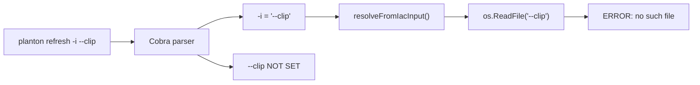
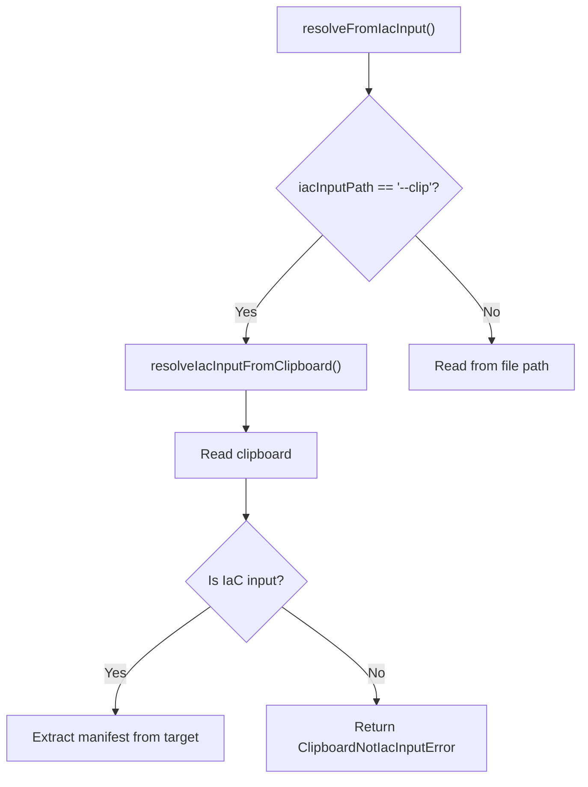

# Clipboard IaC Input UX Enhancement

**Date**: January 23, 2026
**Type**: Enhancement
**Components**: CLI Flags, Manifest Processing, User Experience, Error Handling

## Summary

Enhanced the CLI to intelligently handle the `-i --clip` flag combination by inferring user intent, and added beautiful error display for clipboard IaC input errors. This brings clipboard-based IaC input handling up to the same UX standards as other clipboard operations, following our ethos of guiding users towards success rather than just showing errors.

## Problem Statement / Motivation

When users ran `planton refresh -i --clip --local-module` with IaC input YAML in their clipboard, two issues occurred:

### Pain Points

1. **Flag Parsing Collision**: Cobra parsed `--clip` as the string value for `-i`, treating it as a file path
2. **Cryptic Error**: The error `open --clip: no such file or directory` was confusing and unhelpful
3. **Inconsistent UX**: Other clipboard errors had beautiful, informative displays, but this path didn't



## Solution / What's New

Implemented a two-part solution that follows our terminal UX standards:

### 1. Intent Inference

When `-i` receives a clipboard flag value (`--clip`, `--cb`, `--clipboard`, `-c`), we now recognize the user's intent and execute correctly instead of failing.



### 2. Beautiful Error Display

Added a new `ClipboardNotIacInputError` type with full beautiful UI treatment matching our established patterns.

## Implementation Details

### New Error Type

Added `ClipboardNotIacInputError` to `clipboard_errors.go`:

```go
type ClipboardNotIacInputError struct {
    Raw []byte
}

func (e *ClipboardNotIacInputError) Error() string {
    return "clipboard content is not an IaC input (missing 'target' field)"
}
```

### Beautiful UI Function

Added `ClipboardNotIacInput()` to `ui/clipboard.go` with full structured output:

- Clear header with icon
- Explanation of what went wrong
- Content preview of what was received
- Expected IaC input format with example
- Actionable tip for resolution

### Updated Resolver

Modified `resolveIacInputFromClipboard()` to return structured errors:

```go
func resolveIacInputFromClipboard() (string, bool, error) {
    raw, err := clipboard.Read()
    if err != nil {
        if strings.Contains(err.Error(), "empty") {
            return "", false, &ClipboardEmptyError{}
        }
        return "", false, errors.Wrap(err, "failed to read from clipboard")
    }

    if !iacinput.IsIacInput(raw) {
        return "", false, &ClipboardNotIacInputError{Raw: raw}
    }
    // ...
}
```

## Files Changed

| File | Change |
|------|--------|
| `internal/cli/manifest/clipboard_errors.go` | Added `ClipboardNotIacInputError` type, updated handlers |
| `internal/cli/ui/clipboard.go` | Added `ClipboardNotIacInput()` beautiful UI function |
| `internal/cli/manifest/resolve_from_iac_input.go` | Added clipboard flag detection and structured errors |
| `_rules/follow-planton-cli-terminal-ux-standards.mdc` | New rule documenting our terminal UX standards |

## Benefits

### For Users

- **Zero-friction workflow**: Both `-i --clip` and `--clip` now work correctly with IaC input
- **Clear guidance**: When errors occur, users see exactly what went wrong and how to fix it
- **Consistent experience**: All clipboard errors now have the same beautiful treatment

### For Developers

- **Documented standards**: Terminal UX standards are now codified in a rule file
- **Pattern to follow**: Clear three-layer error handling pattern established
- **Reference implementation**: `ClipboardNotIacInputError` serves as a template

## User Experience

### Before

```
● Loading manifest...
failed to resolve manifest: clipboard content is not an IaC input (missing 'target' field) ✖
```

### After

```
● Loading manifest...

════════════════════════════════════════════════════════════════════════════════
ℹ️  Not an IaC Input
════════════════════════════════════════════════════════════════════════════════
The clipboard content is valid YAML but not an IaC input.
IaC input files must have a "target" field at the root level.

Content preview:
   apiVersion: kubernetes.planton.com/v1
   kind: PostgresKubernetes
   metadata:
     name: my-postgres
   ...

Expected IaC input format:

    target:
      apiVersion: kubernetes.planton.com/v1
      kind: PostgresKubernetes
      ...
    provider_config:
      ...

💡 Tip: If your clipboard contains a raw manifest (not IaC input),
     use '--clip' without '-i' and it will be detected automatically.
════════════════════════════════════════════════════════════════════════════════
```

## Impact

### Commands Affected

All IaC operation commands that use `-i` flag with clipboard:
- `planton apply`
- `planton destroy`
- `planton plan`
- `planton refresh`
- `planton init`

### Backward Compatibility

- All existing workflows continue to work unchanged
- New behavior is additive - correctly handling a previously-broken case

## Terminal UX Standards Rule

Created `_rules/follow-planton-cli-terminal-ux-standards.mdc` to document our CLI UX philosophy:

**Core Ethos**: Never just show an error - guide the user towards success.

The rule covers:
- The three-layer error pattern (Error Type → UI Function → Handler)
- Required UI components (banner, explanation, preview, tips)
- Color palette and iconography from lipgloss
- Anti-patterns to avoid
- Quality checklist for error handling

## Related Work

- [2026-01-20 Clipboard Flag Extension](2026-01-20-141010-clipboard-flag-extension-validate-load.md) - Original clipboard support
- [2026-01-21 Terraform CLI Support](2026-01-21-064104-full-terraform-cli-support.md) - Recent CLI enhancements

---

**Status**: ✅ Production Ready
**Timeline**: Single session implementation
