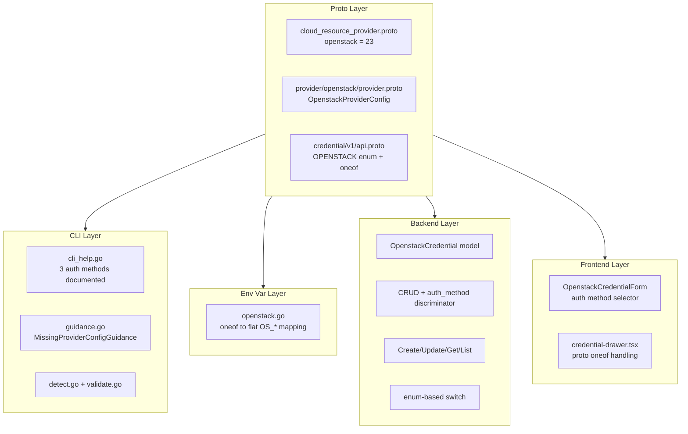
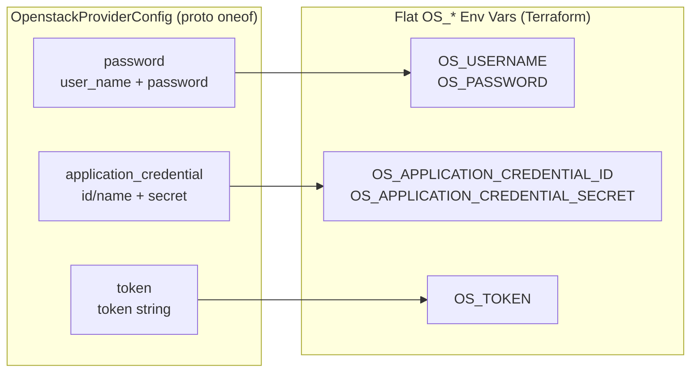

# OpenStack Provider Integration

**Date**: February 8, 2026
**Type**: Feature
**Components**: Provider Framework, API Definitions, CLI Integration, Backend Services, Frontend Credentials

## Summary

Added OpenStack as provider #23 to OpenMCF, enabling users to manage OpenStack cloud credentials through the platform. The integration spans all 6 system layers — proto definitions, CLI guidance, stack input / env var processing, provider detection, backend credential CRUD, and frontend credential forms. OpenStack's multi-method authentication model (password, application credentials, token) is handled via a structured `oneof` in the proto schema, providing type safety while mapping cleanly to the flat `OS_*` environment variables that the Terraform OpenStack provider expects.

## Problem Statement / Motivation

OpenMCF supports 12 cloud providers but had no OpenStack support. Organizations running private or hybrid OpenStack clouds could not store credentials, use the unified `--provider-config` flag, or leverage credential auto-resolution for OpenStack deployments.

### Pain Points

- No `openstack` entry in the `CloudResourceProvider` enum
- No credential storage or management for OpenStack
- No environment variable mapping for the Terraform OpenStack provider
- No frontend UI for capturing OpenStack credentials
- No CLI guidance for missing or invalid OpenStack credentials

## Solution / What's New

Implemented comprehensive OpenStack provider support following the established provider patterns, with one key architectural difference: OpenStack's authentication model uses a `oneof` for three auth methods, unlike simpler providers (Auth0, Cloudflare) that have flat credential fields.

### Architecture



### Auth Method Design



## Implementation Details

### 1. Proto Definitions

**Provider registration** (`cloud_resource_provider.proto`):

```protobuf
openstack = 23 [(provider_meta) = {
  group: "openstack.openmcf.org"
  display_name: "OpenStack"
}];
```

**Provider config** (`provider/openstack/provider.proto`): `OpenstackProviderConfig` with `oneof credentials` supporting `OpenstackPasswordCredentials`, `OpenstackApplicationCredentials`, and `OpenstackTokenCredentials`. Common fields (auth_url, region, project/domain context, TLS) sit alongside the oneof.

**Credential API** (`credential/v1/api.proto`): Added `OPENSTACK = 6` to `CredentialProvider` enum and `openstack = 13` to the `CredentialProviderConfig` oneof.

### 2. CLI Guidance

The `cli_help.go` constants drive terminal output quality. `EnvironmentVariablesHelp` presents all three auth methods as clearly labeled sections with export commands. `ConfigFileExample` shows application credentials (recommended for automation) as the primary example with password auth as a commented alternative.

### 3. Env Var Mapping

`loadOpenstackEnvVars` switches on the `credentials` oneof variant and flattens to the corresponding `OS_*` environment variables. Common fields (auth_url, region, project/domain context, TLS, endpoint_type) are emitted regardless of auth method.

### 4. Backend Credential Management

`OpenstackCredential` model uses an `AuthMethod` string discriminator to track which auth method is active. The repo stores all fields in a single MongoDB document, with only the relevant auth fields populated. The service layer validates auth-method-specific requirements (e.g., application credentials need either id or name, not neither).

### 5. Credential Resolver Improvement

Refactored the credential resolver to switch on `CloudResourceProvider` enum values instead of strings. The enum switch is type-safe and lets the compiler surface missing cases. Strings are only used where they're actually needed: the MongoDB query and error messages.

### 6. Frontend Credential Form

`OpenstackCredentialForm` uses a `SimpleSelect` for auth method selection, conditionally rendering the appropriate field group. Application credentials are the default selection. A flattened `OpenstackFormData` interface avoids proto oneof complexity in react-hook-form; the drawer reconstructs the correct proto oneof on submit.

## Files Changed

| Layer | New Files | Modified Files |
|-------|-----------|----------------|
| Proto | `provider/openstack/provider.proto` | `cloud_resource_provider.proto`, `credential/v1/api.proto` |
| Provider | `provider/openstack/cli_help.go`, `BUILD.bazel` | — |
| Stack Input | `providerenvvars/openstack.go` | `loader.go` |
| Provider Detect | — | `detect.go`, `guidance.go`, `validate.go` |
| Backend | — | `credential.go`, `credential_repo.go`, `credential_service.go`, `credential_resolver.go` |
| Frontend | `openstack.tsx` | `types.ts`, `credential-drawer.tsx`, `index.ts`, `utils.ts` |
| Generated | `provider.pb.go`, `provider_pb.ts` | `api.pb.go`, `api_pb.ts`, `cloud_resource_provider.pb.go`, `cloud_resource_provider_pb.ts` |

**Total**: 26 files, ~850 insertions

## Benefits

### For Users

- **Credential management**: Store OpenStack credentials securely through the web UI
- **CLI integration**: Pass credentials via the unified `-p` / `--provider-config` flag
- **Multi-method auth**: Choose password, application credentials, or token authentication
- **Rich guidance**: Clear terminal output with all three auth methods documented when credentials are missing

### For Developers

- **Pattern consistency**: Follows established provider patterns across all layers
- **Type-safe resolver**: Enum-based switch in credential resolver (improved from string-based)
- **Foundation for resources**: Ready for OpenStack resource kinds (compute, networking, storage) in future phases

## Impact

### Direct

- OpenStack appears in the credential provider dropdown in the web UI
- The `-p` flag accepts OpenStack provider config files
- Backend API supports OpenStack credential CRUD
- CLI guidance displays OpenStack-specific help

### Future Work Enabled

- OpenStack resource kinds (CloudResourceKind range 2500-2799)
- Compute, networking, block storage, identity, and other OpenStack service resources
- Terraform IaC modules wrapping the terraform-provider-openstack

## Related Work

- [2025-12-30 Auth0 Provider Integration](../2025-12/2025-12-30-054629-auth0-provider-integration.md) — Pattern reference for this implementation
- [2026-01-21 Unified Provider Config Flag Cleanup](../2026-01/2026-01-21-134715-unified-provider-config-flag-cleanup.md) — No per-provider CLI flags needed

---

**Status**: ✅ Production Ready
**Build**: CLI ✅, Backend ✅, Frontend proto stubs ✅ (frontend build has pre-existing unrelated failure)
