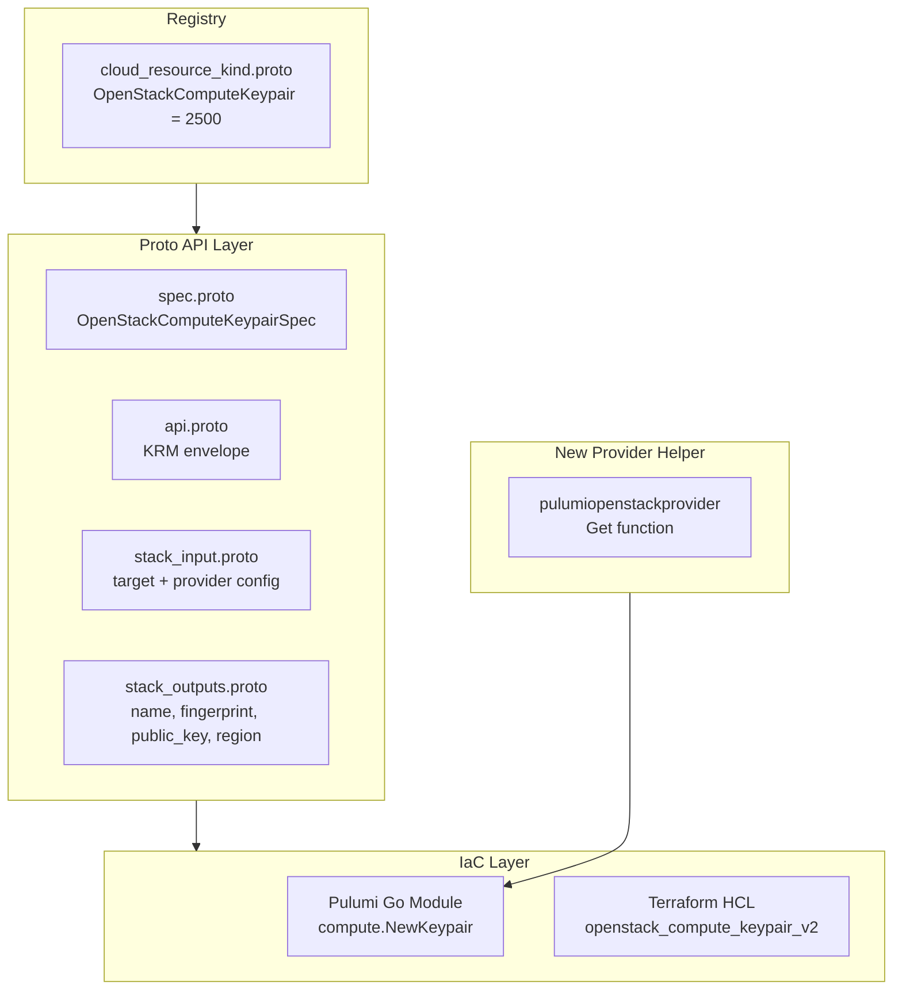

# OpenStackComputeKeypair Deployment Component

**Date**: February 8, 2026
**Type**: Feature
**Components**: Provider Framework, API Definitions, Pulumi IaC Module, Terraform IaC Module, Proto Validations

## Summary

Implemented `OpenStackComputeKeypair` as the first deployment component for the recently added OpenStack provider. This component enables declarative management of SSH keypairs in OpenStack Nova (Compute service) through both Pulumi and Terraform IaC modules. Additionally, renamed all `Openstack*` type names to `OpenStack*` across the codebase for consistent PascalCase naming aligned with the `OpenFga` convention.

## Problem Statement / Motivation

With OpenStack integrated as provider #23, there were no deployment components to actually manage OpenStack resources. SSH keypairs are a foundational compute primitive — they are required for launching instances with SSH access and are one of the simplest, most universally needed OpenStack resources.

### Pain Points

- No OpenStack deployment components existed (provider was credential-only)
- Users could not declaratively manage SSH keypairs for compute instances
- Existing `Openstack*` type names were inconsistent with `OpenFga*` naming convention
- No Pulumi provider helper existed for OpenStack (blocking all future Pulumi-based components)

## Solution / What's New

Created a complete `OpenStackComputeKeypair` deployment component following the CloudflareDnsRecord pattern (simple, single-resource component) with full IaC support, plus a codebase-wide rename for naming consistency.

### Architecture



### Registry Allocation

Allocated OpenStack provider block **2500-2799** (300 numbers) for future OpenStack components:

```protobuf
// 2500-2799: OpenStack resources
OpenStackComputeKeypair = 2500 [(kind_meta) = {
  provider: openstack
  version: v1
  id_prefix: "oskp"
}];
```

### Spec Design (80/20 Principle)

```protobuf
message OpenStackComputeKeypairSpec {
  string public_key = 1;  // Optional: import vs generate
  string region = 2;      // Optional: override provider region
}
```

Fields deliberately excluded: `user_id` (admin-only, microversion 2.10+), `value_specs` (escape hatch, adds complexity).

### Private Key Handling

The `private_key` is intentionally excluded from `stack_outputs.proto` following the platform principle that secrets belong in external secret managers. When a keypair is generated (no `public_key` provided), the private key is available as a sensitive IaC-level output only:

- **Pulumi**: Exported as a secret output via `pulumi.ToSecret()`
- **Terraform**: Marked `sensitive = true`

## Implementation Details

### 1. Codebase-Wide Rename: `Openstack` to `OpenStack`

Renamed all type/message names from `Openstack*` to `OpenStack*` for consistency with the `OpenFga*` naming convention:

| Before | After |
|--------|-------|
| `OpenstackProviderConfig` | `OpenStackProviderConfig` |
| `OpenstackPasswordCredentials` | `OpenStackPasswordCredentials` |
| `OpenstackApplicationCredentials` | `OpenStackApplicationCredentials` |
| `OpenstackTokenCredentials` | `OpenStackTokenCredentials` |
| `OpenstackCredential` (model) | `OpenStackCredential` |
| `OpenstackFormData` (TS) | `OpenStackFormData` |
| `OpenstackCredentialForm` (TSX) | `OpenStackCredentialForm` |

Scope: 2 proto files, 7 Go files, 3 TypeScript files, plus auto-regenerated stubs.

**Not renamed**: enum values (`openstack`), directory/package names (`provider/openstack/`), proto field names (`.Openstack` in oneof), env var names (`OS_*`).

### 2. Proto API (4 files)

**spec.proto**: Minimal schema with `public_key` (optional, OpenSSH format) and `region` (optional override). No validations beyond the KRM envelope constraints — the spec is intentionally simple.

**stack_outputs.proto**: Observable outputs only: `name`, `fingerprint`, `public_key`, `region`. No `private_key` (secret).

**api.proto**: KRM envelope with `apiVersion: "openstack.openmcf.org/v1"`, `kind: "OpenStackComputeKeypair"`, standard metadata/spec/status structure.

**stack_input.proto**: Aggregates `OpenStackComputeKeypair` target with `OpenStackProviderConfig` credentials.

### 3. Pulumi Provider Helper (New)

Created `pkg/iac/pulumi/pulumimodule/provider/openstack/pulumiopenstackprovider/provider.go` — the first OpenStack Pulumi provider helper. Maps `OpenStackProviderConfig` (with its `oneof credentials`) to Pulumi provider args:

- Supports all three auth methods (password, application credential, token)
- Falls back to `OS_*` environment variables when config is nil
- Handles TLS, endpoint type, and project/domain context

This helper is reusable by all future OpenStack Pulumi modules.

### 4. Pulumi Module (Go)

```
iac/pulumi/
├── main.go           # Entry point: loads stack input
├── module/
│   ├── main.go       # Provider setup and orchestration
│   ├── locals.go     # Data extraction from stack input
│   ├── keypair.go    # compute.NewKeypair + output exports
│   └── outputs.go    # Output name constants
├── Pulumi.yaml, Makefile, debug.sh
```

Uses `github.com/pulumi/pulumi-openstack/sdk/v5/go/openstack/compute`.

### 5. Terraform Module (HCL)

```
iac/tf/
├── provider.tf    # OpenStack provider via OS_* env vars
├── variables.tf   # metadata + spec inputs
├── locals.tf      # Derived values (keypair_name, is_import)
├── main.tf        # openstack_compute_keypair_v2 resource
└── outputs.tf     # name, fingerprint, public_key, region, private_key
```

Uses `terraform-provider-openstack/openstack ~> 3.0`.

### 6. Validation Tests (9 cases)

`spec_test.go` covers:
- Valid: keypair with public key, without public key (generated), with region override, with labels, with org/env metadata
- Invalid: wrong api_version, wrong kind, missing metadata, missing spec

### 7. Frontend Fix

Fixed pre-existing TypeScript type errors in the OpenStack credential form that surfaced during the rename:
- Removed unsupported `placeholder` props from `SimpleInput` components
- Changed loosely-typed `Record<string, unknown>` to `any` for the credentials oneof builder

## Files Changed

| Category | New Files | Modified Files |
|----------|-----------|----------------|
| Registry | — | `cloud_resource_kind.proto` |
| Rename (Proto) | — | `provider/openstack/provider.proto`, `credential/v1/api.proto` |
| Rename (Go) | — | 7 files (providerenvvars, providerdetect, models, service, repo) |
| Rename (TS) | — | 3 files (types.ts, openstack.tsx, credential-drawer.tsx) |
| Proto API | `spec.proto`, `api.proto`, `stack_input.proto`, `stack_outputs.proto` | — |
| Tests | `spec_test.go` | — |
| Pulumi Helper | `pulumiopenstackprovider/provider.go` | — |
| Pulumi Module | `main.go`, `module/*.go`, `Pulumi.yaml`, `Makefile`, `debug.sh` | — |
| Terraform | `provider.tf`, `variables.tf`, `locals.tf`, `main.tf`, `outputs.tf` | — |
| Docs | `README.md`, `examples.md`, `docs/README.md`, IaC READMEs, `overview.md` | — |
| Supporting | `hack/manifest.yaml` | — |
| Generated | `*.pb.go` (5 files), `*_pb.ts` (5 files) | — |
| Build | `BUILD.bazel` (4 files), `go.mod`, `go.sum`, `MODULE.bazel` | — |

**Total**: ~45 files, ~2500 lines

## Benefits

### For Users

- **Declarative SSH key management**: Configure OpenStack keypairs via YAML manifests
- **Two workflows**: Import existing keys (recommended) or let OpenStack generate
- **Credential integration**: Uses existing OpenStack credential system (`-p` flag)
- **Consistent naming**: `OpenStack*` types match the `OpenFga*` convention

### For Developers

- **Pulumi provider helper**: Reusable for all future OpenStack Pulumi modules
- **Pattern consistency**: Follows established CloudflareDnsRecord single-resource pattern
- **Clean naming**: `OpenStack*` PascalCase throughout the codebase
- **Foundation for resources**: OpenStack range 2500-2799 ready for compute, networking, storage

### For Platform

- **First OpenStack resource**: Opens the door to the full OpenStack service catalog
- **Build verified**: CLI, backend, and frontend all compile successfully
- **Tests pass**: 9/9 validation tests pass

## Impact

### Direct

- Users can manage OpenStack SSH keypairs through OpenMCF
- CLI supports `OpenStackComputeKeypair` manifests
- OpenStack provider now has its first deployment component

### Registry

- OpenStack range established: 2500-2799 (299 slots for future components)
- First infrastructure provider with private cloud support in the platform

### Future Work Enabled

- OpenStack compute instances (can reference keypairs)
- OpenStack networking (security groups, networks, subnets)
- OpenStack block storage (volumes)
- OpenStack identity (projects, users)
- OpenStack load balancers

## Related Work

- [2026-02-08 OpenStack Provider Integration](2026-02-08-215116-openstack-provider-integration.md) — Foundation this component builds on
- [2025-12-30 Auth0 Provider Integration](../2025-12/2025-12-30-054629-auth0-provider-integration.md) — Provider pattern reference
- [2025-12-30 Auth0Connection Deployment Component](../2025-12/2025-12-30-063818-auth0connection-deployment-component.md) — First-component-after-provider pattern reference

---

**Status**: ✅ Production Ready
**Build**: CLI ✅, Backend ✅, Frontend ✅, Tests 9/9 ✅
