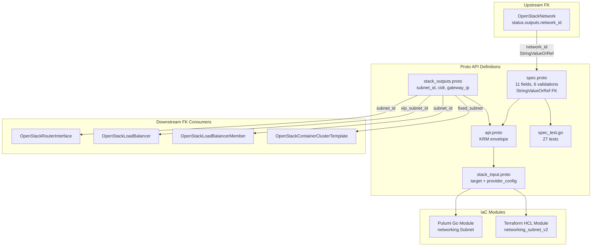

# OpenStackSubnet Deployment Component

**Date**: February 9, 2026
**Type**: Feature
**Components**: OpenStack Provider, Deployment Component

## Summary

Added the `OpenStackSubnet` deployment component (enum 2502) -- the first OpenStack component with a foreign key relationship. Subnets provide IP address allocation within a network, and every OpenStack workload that needs IP connectivity requires at least one. The `network_id` FK references `OpenStackNetwork.status.outputs.network_id` via the `StringValueOrRef` pattern.

## Problem Statement / Motivation

The `openstack/developer-environment` InfraChart requires a subnet to provide IP addressing within the developer's isolated network. The OpenStackNetwork component (2501) provides the Layer 2 broadcast domain, but without a subnet there is no IP allocation -- no IPs, no connectivity.

Additionally, this is the first OpenStack component to use the `StringValueOrRef` foreign key system, establishing the pattern for all downstream components (Router, RouterInterface, FloatingIp, Port, Instance, etc.) that reference networks and subnets.

### Pain Points

- Cannot deploy any workloads without subnet-based IP allocation
- Need to establish the FK pattern for the remaining 25 OpenStack components
- ARM (Phani) cannot test even basic network connectivity without subnets

## Solution / What's New

### OpenStackSubnet Component (2502)

Complete deployment component following the established Network pattern, enhanced with FK support:



**Proto API (4 files + tests):**

- `spec.proto` -- 11 fields with 6 validations:
  - `network_id` (StringValueOrRef FK, required)
  - `cidr` (required, CIDR format validation)
  - `ip_version` (optional, default 4, validated to 4 or 6)
  - `gateway_ip` / `no_gateway` (mutually exclusive, CEL validation)
  - `enable_dhcp` (optional, default true)
  - `dns_nameservers`, `allocation_pools`, `description`, `tags`, `region`
- `stack_outputs.proto` -- 6 outputs: subnet_id, name, cidr, gateway_ip, network_id, region
- `api.proto` -- KRM envelope with `openstack.planton.dev/v1` + `OpenStackSubnet`
- `stack_input.proto` -- target + provider_config
- `spec_test.go` -- 27 tests (15 positive, 12 negative)

**IaC Modules (feature parity):**

- Pulumi Go module: `networking.NewSubnet()` with FK resolution via `.GetValue()`
- Terraform HCL module: `openstack_networking_subnet_v2` with `dynamic` allocation pools

**Documentation:**

- `README.md` -- User-facing with FK examples (literal and value_from)
- `examples.md` -- 12 YAML examples covering all use cases
- `docs/README.md` -- Comprehensive research documentation

## Implementation Details

### Foreign Key Design

The `network_id` field uses `StringValueOrRef` with FK annotations:

```protobuf
dev.planton.shared.foreignkey.v1.StringValueOrRef network_id = 1 [
  (buf.validate.field).required = true,
  (dev.planton.shared.foreignkey.v1.default_kind) = OpenStackNetwork,
  (dev.planton.shared.foreignkey.v1.default_kind_field_path) = "status.outputs.network_id"
];
```

This enables two usage patterns:
1. **Literal**: `network_id: { value: "uuid-here" }` -- for standalone use
2. **Reference**: `network_id: { value_from: { name: "my-network" } }` -- for InfraChart DAG wiring

### Spec Fields (80/20 Analysis)

11 fields selected from the Terraform provider's 22 schema fields:

| Field | Type | Design Rationale |
|-------|------|-----------------|
| `network_id` | StringValueOrRef | Required FK to parent network |
| `cidr` | string | Required. Only addressing mode (subnetpool excluded) |
| `ip_version` | optional int32 | Default 4; validated to [4, 6] |
| `gateway_ip` | string | Optional custom gateway; mutually exclusive with no_gateway |
| `no_gateway` | bool | Disable gateway for isolated subnets |
| `enable_dhcp` | optional bool | Default true; proto3 bool defaults to false (foot-gun) |
| `dns_nameservers` | repeated string | DNS servers pushed via DHCP |
| `allocation_pools` | repeated AllocationPool | IP sub-range allocation |
| `description` | string | Human-readable, visible in Horizon |
| `tags` | repeated string | Unique; for filtering in OpenStack API |
| `region` | string | Region override |

Excluded: `prefix_length`, `subnetpool_id`, `tenant_id`, `ipv6_address_mode`, `ipv6_ra_mode`, `dns_publish_fixed_ip`, `segment_id`, `value_specs`, `service_types`.

### Gateway Mutual Exclusion

Message-level CEL expression prevents setting both `gateway_ip` and `no_gateway`:

```protobuf
option (buf.validate.message).cel = {
  id: "gateway.mutual_exclusion"
  message: "gateway_ip and no_gateway are mutually exclusive"
  expression: "!(this.gateway_ip != '' && this.no_gateway)"
};
```

## Benefits

- **Unlocks downstream components**: Router, RouterInterface, LoadBalancer, and ContainerClusterTemplate all need `subnet_id`
- **Establishes FK pattern**: First OpenStack component with `StringValueOrRef`, templates all 25 remaining components
- **InfraChart-ready**: Both literal and reference modes work for standalone and DAG-based deployments
- **27 validation tests**: Comprehensive coverage of all validations including FK presence, CIDR format, IP version, gateway exclusion, and tag uniqueness

## Impact

- **Downstream FK consumers**: OpenStackRouterInterface, OpenStackLoadBalancer, OpenStackLoadBalancerMember, and OpenStackContainerClusterTemplate will reference `OpenStackSubnet.status.outputs.subnet_id`
- **InfraChart 1 (developer-environment)**: Subnet is Layer 1 in the dependency graph (depends on Network, depended on by Router and Instance)
- **Pattern establishment**: All future OpenStack components with FKs will follow this same StringValueOrRef pattern

## Related Work

- OpenStack provider integration: `_changelog/2026-02/2026-02-08-215116-openstack-provider-integration.md`
- OpenStackKeypair component: `_changelog/2026-02/2026-02-08-223027-openstackcomputekeypair-deployment-component.md`
- OpenStackNetwork component: `_changelog/2026-02/2026-02-09-082447-openstack-network-component-and-forge-pipeline-cleanup.md`
- Parent project: `planton/_projects/20260209.01.openstack-planton-components/`

---

**Status**: Production Ready
**Timeline**: Single session
