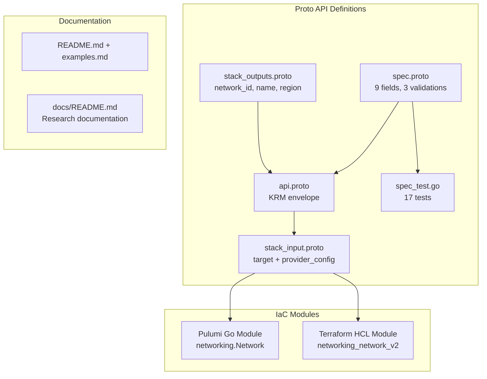
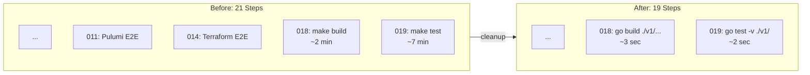

# OpenStackNetwork Component and Forge Pipeline Cleanup

**Date**: February 9, 2026
**Type**: Feature
**Components**: OpenStack Provider, Forge Pipeline, Deployment Component Rules

## Summary

Added the `OpenStackNetwork` deployment component (enum 2501) -- the foundational networking primitive for OpenStack -- and cleaned up the forge pipeline by removing unused E2E test steps and scoping build/test validation to component directories instead of the entire monorepo.

## Problem Statement / Motivation

The OpenStack provider integration was bootstrapped with a single component (`OpenStackKeypair`). To enable the `openstack/developer-environment` InfraChart for ARM, the next critical component is the Neutron network -- the root resource that every other OpenStack networking component depends on (Subnet, Router, Port, FloatingIp, Instance all reference `network_id`).

Additionally, the forge pipeline had two pain points:
1. **Unused E2E test steps** (rules 011, 014) that required a live OpenStack environment nobody had
2. **Monorepo-wide `make build` and `make test`** in validation steps that compiled the entire codebase and ran all 100+ component test suites, wasting minutes on every component operation

### Pain Points

- Building OpenStack InfraCharts requires networking components, starting with Network
- `make build` compiled the entire monorepo (Go + frontend + Gazelle) for single-component changes
- `make test` ran all tests across 100+ components when only 1 component changed
- E2E rules referenced in the forge pipeline could never actually run

## Solution / What's New

### 1. OpenStackNetwork Component (2501)

Complete deployment component following the established Keypair pattern:

### 2. Forge Pipeline Cleanup

## Implementation Details

### OpenStackNetwork spec.proto

9 fields selected via 80/20 analysis of the Terraform provider's 19 arguments:

| Field | Type | Design Rationale |
|-------|------|-----------------|
| `description` | `string` | Stored on OpenStack resource, visible in Horizon |
| `admin_state_up` | `optional bool` | Default `true` via middleware; `optional` needed because proto3 bool defaults to false |
| `shared` | `bool` | Admin-only; proto3 default (false) is correct for tenants |
| `external` | `bool` | Admin-only; proto3 default (false) is correct for tenants |
| `mtu` | `int32` | 0 = let OpenStack decide; validated `gte 0` |
| `dns_domain` | `string` | Validated: must end with `.` if set |
| `port_security_enabled` | `optional bool` | No default -- let deployment config decide |
| `tags` | `repeated string` | Validated: unique |
| `region` | `string` | Region override, same pattern as Keypair |

Excluded fields: `tenant_id`, `segments`, `value_specs`, `availability_zone_hints`, `transparent_vlan`, `qos_policy_id` -- all niche or admin-only.

### Forge Pipeline Changes

**Deleted files (4):**
- `_rules/deployment-component/forge/flow/011-pulumi-e2e.mdc`
- `_rules/deployment-component/forge/flow/014-terraform-e2e.mdc`
- `_rules/deployment-component/_scripts/pulumi_e2e_run.py`
- `_rules/deployment-component/_scripts/terraform_e2e_run.py`
- `.cursor/info/pulumi_e2e.md`

**Command replacements across 16 rule files:**
- `make build` --> `go build ./apis/dev/planton/provider/<provider>/<component>/v1/...`
- `make test` --> `go test -v ./apis/dev/planton/provider/<provider>/<component>/v1/`

These replacements were applied to: forge orchestrator, 5 lifecycle rules (update, fix, rename, delete, complete), 7 README files, and 1 authoring guide.

## Benefits

- **OpenStackNetwork** is the root of the OpenStack networking dependency tree -- enables all downstream components (Subnet, Router, Port, FloatingIp, Instance)
- **Build validation drops from ~2 minutes to ~3 seconds** (single component vs entire monorepo)
- **Test validation drops from ~7 minutes to ~2 seconds** (17 tests vs 1000+ tests)
- **Cleaner forge pipeline** -- 19 steps instead of 21, no dead-code E2E rules

## Impact

- **Downstream components**: OpenStackSubnet, OpenStackRouter, OpenStackNetworkPort, OpenStackFloatingIp, OpenStackInstance, and OpenStackContainerClusterTemplate all reference `OpenStackNetwork.status.outputs.network_id` as a foreign key
- **All lifecycle rules** (forge, update, fix, rename, delete, complete, audit) now use component-scoped validation
- **Developer experience**: Every forge or update operation completes validation in seconds, not minutes

## Related Work

- OpenStack provider integration: `_changelog/2026-02/2026-02-08-215116-openstack-provider-integration.md`
- OpenStackKeypair component: `_changelog/2026-02/2026-02-08-223027-openstackcomputekeypair-deployment-component.md`
- Parent project: `planton/_projects/20260209.01.openstack-planton-components/`

---

**Status**: Production Ready
**Timeline**: Single session (~2 hours)
