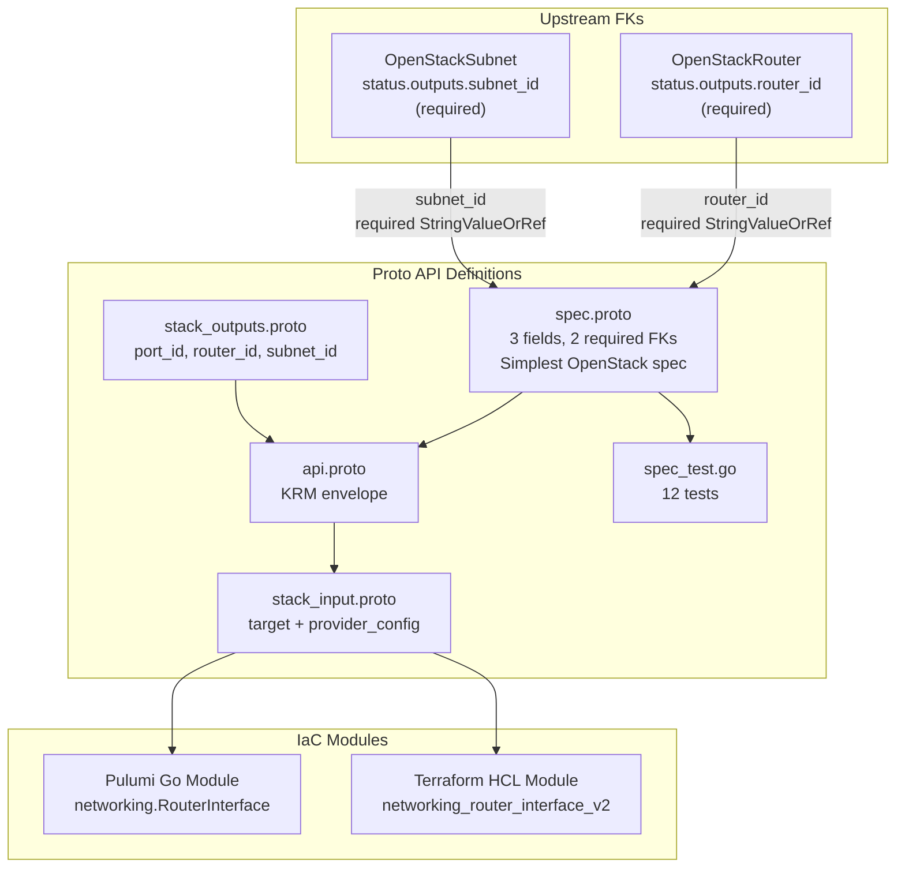

# OpenStackRouterInterface Deployment Component

**Date**: February 9, 2026
**Type**: Feature
**Components**: OpenStack Provider, Deployment Component

## Summary

Added the `OpenStackRouterInterface` deployment component (enum 2504) -- the first OpenStack component with two required `StringValueOrRef` foreign keys. Router interfaces connect a Neutron router to a subnet by creating a port on the subnet and attaching it to the router. This is the glue between Layer 2 (subnet) and Layer 3 (router) that enables subnets to route traffic to other subnets and to the external network.

## Problem Statement / Motivation

The `openstack/developer-environment` InfraChart requires a router interface to connect the developer's isolated subnet to the edge router. Without this component, the router exists, the subnet exists, but they are not connected -- instances on the subnet have no route to the internet or to other subnets.

Additionally, this is the first OpenStack component with **two required FKs** in one spec, establishing the pattern for future "join" resources like `OpenStackVolumeAttach` (Instance + Volume) and `OpenStackFloatingIpAssociate` (FloatingIp + Port).

### Pain Points

- Cannot connect subnets to routers without this component
- InfraChart 1 (developer-environment) dependency chain is incomplete: Network -> Subnet -> (gap) -> Router
- Need to establish the dual-FK pattern for future join resources

## Solution / What's New

### OpenStackRouterInterface Component (2504)

Complete deployment component following the established Router/Subnet pattern, notable for its simplicity:



**Proto API (4 files + tests):**

- `spec.proto` -- 3 fields with 2 required FKs:
  - `router_id` (required StringValueOrRef FK to OpenStackRouter)
  - `subnet_id` (required StringValueOrRef FK to OpenStackSubnet)
  - `region` (optional string override)
- `stack_outputs.proto` -- 4 outputs: port_id, router_id, subnet_id, region
- `api.proto` -- KRM envelope with `openstack.planton.dev/v1` + `OpenStackRouterInterface`
- `stack_input.proto` -- target + provider_config
- `spec_test.go` -- 12 tests (6 positive, 6 negative)

**IaC Modules (feature parity):**

- Pulumi Go module: `networking.NewRouterInterface()` with dual FK resolution via `.GetValue()`
- Terraform HCL module: `openstack_networking_router_interface_v2` with FK extraction in locals

**Documentation:**

- `README.md` -- User-facing with dual FK examples
- `examples.md` -- 8 YAML examples (literals, value_from, mixed modes, multi-subnet, region)
- `docs/README.md` -- Comprehensive research documentation

## Implementation Details

### Dual Foreign Key Design

Both `router_id` and `subnet_id` use required `StringValueOrRef` with FK annotations:

```protobuf
dev.planton.shared.foreignkey.v1.StringValueOrRef router_id = 1 [
  (buf.validate.field).required = true,
  (dev.planton.shared.foreignkey.v1.default_kind) = OpenStackRouter,
  (dev.planton.shared.foreignkey.v1.default_kind_field_path) = "status.outputs.router_id"
];

dev.planton.shared.foreignkey.v1.StringValueOrRef subnet_id = 2 [
  (buf.validate.field).required = true,
  (dev.planton.shared.foreignkey.v1.default_kind) = OpenStackSubnet,
  (dev.planton.shared.foreignkey.v1.default_kind_field_path) = "status.outputs.subnet_id"
];
```

### Spec Fields (80/20 Analysis)

3 fields selected from the Terraform provider's 5 schema fields:

| Field | Type | Design Rationale |
|-------|------|-----------------|
| `router_id` | required StringValueOrRef | Which router to attach to |
| `subnet_id` | required StringValueOrRef | Which subnet to connect |
| `region` | string | Region override for multi-region deployments |

Excluded: `port_id` (alternative attachment mode for advanced IP/MAC control, 95%+ of usage is subnet-based), `force_destroy` (operational escape hatch, proper dependency ordering handles this).

### Resource Identity

Unlike most OpenStack resources, a router interface has no "name" attribute. The Terraform resource ID is the UUID of the port that OpenStack auto-creates on the subnet. The `port_id` output captures this.

## Benefits

- **Completes the networking chain**: Network -> Subnet -> RouterInterface -> Router -> ExternalNetwork
- **Establishes dual-FK pattern**: First component with two required `StringValueOrRef` foreign keys, templates future join resources
- **Simplest component**: Only 3 fields -- proof that simple join resources don't need complexity
- **12 validation tests**: Covers all FK mode combinations (literal/literal, ref/ref, mixed) and negative cases

## Impact

- **InfraChart 1 (developer-environment)**: RouterInterface is Layer 3 in the dependency graph. With this component, the full networking stack is possible: Network -> Subnet -> RouterInterface -> Router -> ExternalNetwork
- **Phase 1 progress**: 4 of 9 networking components complete (Network, Subnet, Router, RouterInterface). 5 remaining: SecurityGroup, SecurityGroupRule, FloatingIp, FloatingIpAssociate, NetworkPort
- **Pattern establishment**: Dual-FK pattern will be reused by VolumeAttach, FloatingIpAssociate, and LoadBalancerMember

## Related Work

- OpenStack provider integration: `_changelog/2026-02/2026-02-08-215116-openstack-provider-integration.md`
- OpenStackKeypair component: `_changelog/2026-02/2026-02-08-223027-openstackcomputekeypair-deployment-component.md`
- OpenStackNetwork component: `_changelog/2026-02/2026-02-09-082447-openstack-network-component-and-forge-pipeline-cleanup.md`
- OpenStackSubnet component: `_changelog/2026-02/2026-02-09-032227-openstack-subnet-deployment-component.md`
- OpenStackRouter component: `_changelog/2026-02/2026-02-09-101500-openstack-router-deployment-component.md`
- Parent project: `planton/_projects/20260209.01.openstack-planton-components/`

---

**Status**: Production Ready
**Timeline**: Single session
