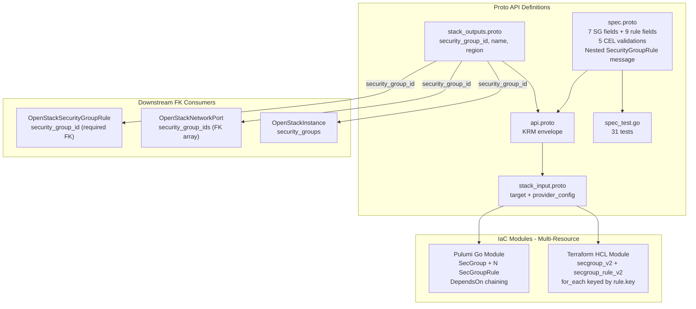

# OpenStackSecurityGroup Deployment Component

**Date**: February 9, 2026
**Type**: Feature
**Components**: OpenStack Provider, Deployment Component

## Summary

Added the `OpenStackSecurityGroup` deployment component (enum 2505) -- the first OpenStack component that manages multiple IaC resources from a single spec (1 security group + N inline rules). Security groups are the virtual firewall primitive in OpenStack, controlling ingress and egress traffic for instances and ports. This component supports inline rules for convenience (keyed by a user-provided `key` field for stable IaC state) and is referenced by `SecurityGroupRule`, `NetworkPort`, and `Instance` as a downstream FK.

## Problem Statement / Motivation

The `openstack/developer-environment` InfraChart requires security groups to control network access to developer instances. Without security groups, instances are either completely open or use the OpenStack default security group -- neither is acceptable for a production-ready platform.

Additionally, this is the first OpenStack component with a **multi-resource IaC pattern** (1 parent + N children), establishing the approach for `OpenStackFloatingIp` (with optional built-in association) and future components with inline child resources.

### Pain Points

- Cannot control network access to developer environment instances without security groups
- ARM (Phani) needs explicit firewall rules for compliance with ARM's internal security policies
- Need to establish the multi-resource IaC pattern for future components

## Solution / What's New

### OpenStackSecurityGroup Component (2505)

Complete deployment component with the first multi-resource IaC modules:



**Proto API (4 files + tests):**

- `spec.proto` -- 7 top-level fields + nested `SecurityGroupRule` message with 9 fields:
  - `description`, `delete_default_rules` (optional bool), `stateful` (optional bool), `rules` (repeated SecurityGroupRule), `tags` (unique), `region`
  - SecurityGroupRule: `key` (required, unique), `direction` (in: ingress/egress), `ethertype` (in: IPv4/IPv6), `protocol`, `port_range_min` (optional int32), `port_range_max` (optional int32), `remote_ip_prefix`, `remote_group_id`, `description`
  - 5 CEL validations: unique rule keys, port pair both-or-neither, ports require protocol, remote source mutual exclusion, direction/ethertype string-in constraints
- `stack_outputs.proto` -- 3 outputs: security_group_id, name, region
- `api.proto` -- KRM envelope with `openstack.openmcf.org/v1` + `OpenStackSecurityGroup`
- `stack_input.proto` -- target + provider_config
- `spec_test.go` -- 31 tests (19 positive, 12 negative)

**IaC Modules (feature parity, multi-resource):**

- Pulumi Go module: `networking.NewSecGroup()` + loop of `networking.NewSecGroupRule()` with `pulumi.DependsOn`
- Terraform HCL module: `openstack_networking_secgroup_v2` + `openstack_networking_secgroup_rule_v2` with `for_each` keyed by `rule.key`

**Documentation:**

- `README.md` -- User-facing with inline vs standalone comparison table
- `examples.md` -- 10 YAML examples (minimal, web server, zero-trust bastion, database, ICMP, K8s node, stateless, dual-stack, port range, fully-specified)
- `docs/README.md` -- Comprehensive research documentation covering TF provider analysis, 80/20 decisions, multi-resource pattern, and production best practices

## Implementation Details

### The `key` Field Innovation

A user-provided, required string field on each inline rule that serves as the IaC state key:

```protobuf
string key = 1 [(buf.validate.field).string.min_len = 1];
```

In Terraform: `for_each = { for rule in var.spec.rules : rule.key => rule }`
In Pulumi: `fmt.Sprintf("%s-rule-%s", sgName, rule.Key)`

This ensures adding/removing/reordering rules only affects the specific rule being changed.

### CEL Validations

5 CEL expressions enforce Terraform provider constraints at the proto level:

```protobuf
// On SecurityGroupRule:
has(this.port_range_min) == has(this.port_range_max)        // ports: both or neither
!has(this.port_range_min) || this.protocol != ''             // ports require protocol
this.remote_group_id == '' || this.remote_ip_prefix == ''   // mutually exclusive remotes

// On OpenStackSecurityGroupSpec:
this.rules.map(r, r.key).unique()                           // unique rule keys
```

### Port Range Design for ICMP

Uses `optional int32` for `port_range_min` and `port_range_max` to distinguish "not set" from "set to 0". ICMP type 0 (Echo Reply) is valid, and ICMP type 8 / code 0 (Echo Request) means `min > max` -- so no `min <= max` validation is applied.

### Spec Fields (80/20 Analysis)

7 security group fields selected from the Terraform provider's 8 schema fields:

| Field | Type | Design Rationale |
|-------|------|-----------------|
| `description` | string | Human-readable description |
| `delete_default_rules` | optional bool | Zero-trust baseline (no default -- conscious choice) |
| `stateful` | optional bool | High-performance stateless mode support |
| `rules` | repeated SecurityGroupRule | Inline rules for convenience |
| `tags` | repeated string | Pattern consistency |
| `region` | string | Region override |

Excluded: `tenant_id` (admin-only), `all_tags` (computed-only), `name` (from metadata).

9 rule fields selected from the Terraform provider's 12 schema fields:

| Field | Type | Design Rationale |
|-------|------|-----------------|
| `key` | string (required) | IaC state stability -- NEW field, not in TF |
| `direction` | string (required) | ingress/egress with string-in validation |
| `ethertype` | string (required) | IPv4/IPv6 with string-in validation |
| `protocol` | string | Any IANA protocol name or 0-255 |
| `port_range_min` | optional int32 | Supports ICMP type 0 (Echo Reply) |
| `port_range_max` | optional int32 | Supports ICMP code 0 |
| `remote_ip_prefix` | string | CIDR restriction |
| `remote_group_id` | string | Group-based restriction (plain UUID) |
| `description` | string | Per-rule documentation |

Excluded: `remote_address_group_id` (niche extension), `tenant_id` (admin-only).

## Benefits

- **Enables network access control**: Developer environments can now have explicit firewall rules
- **Establishes multi-resource pattern**: First component creating N+1 resources from a single spec
- **Stable IaC state**: The `key` field prevents cascading resource recreation when rules are modified
- **Zero-trust support**: `delete_default_rules` enables completely empty baseline
- **31 validation tests**: Comprehensive coverage of all 5 CEL validations, field constraints, and edge cases (including ICMP semantics)

## Impact

- **Downstream FK consumers**: SecurityGroupRule, NetworkPort, and Instance will reference `security_group_id`
- **InfraChart 1 (developer-environment)**: SecurityGroup is Layer 2 in the dependency graph (created after Network, before Port and Instance)
- **Phase 1 progress**: 5 of 9 networking components complete (Network, Subnet, Router, RouterInterface, SecurityGroup). 4 remaining: SecurityGroupRule, FloatingIp, FloatingIpAssociate, NetworkPort
- **Pattern establishment**: Multi-resource IaC pattern will be reused by FloatingIp (optional association) and potentially other components with inline children

## Related Work

- OpenStack provider integration: `_changelog/2026-02/2026-02-08-215116-openstack-provider-integration.md`
- OpenStackKeypair component: `_changelog/2026-02/2026-02-08-223027-openstackcomputekeypair-deployment-component.md`
- OpenStackNetwork component: `_changelog/2026-02/2026-02-09-082447-openstack-network-component-and-forge-pipeline-cleanup.md`
- OpenStackSubnet component: `_changelog/2026-02/2026-02-09-032227-openstack-subnet-deployment-component.md`
- OpenStackRouter component: `_changelog/2026-02/2026-02-09-101500-openstack-router-deployment-component.md`
- OpenStackRouterInterface component: `_changelog/2026-02/2026-02-09-094647-openstack-router-interface-deployment-component.md`
- Parent project: `planton/_projects/20260209.01.openstack-openmcf-components/`

---

**Status**: Production Ready
**Timeline**: Single session
