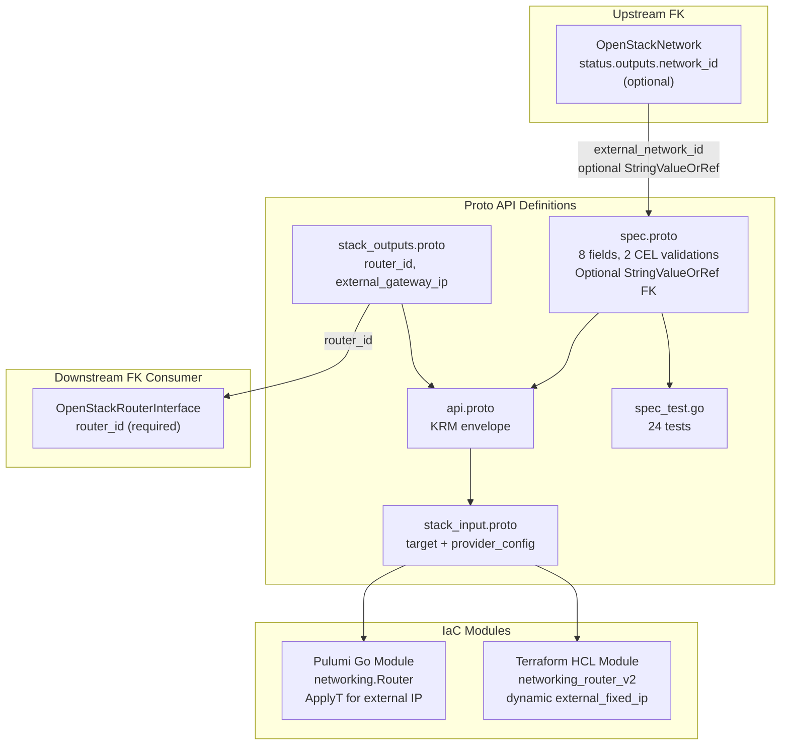

# OpenStackRouter Deployment Component

**Date**: February 9, 2026
**Type**: Feature
**Components**: OpenStack Provider, Deployment Component

## Summary

Added the `OpenStackRouter` deployment component (enum 2503) -- the first OpenStack component with an optional foreign key. Routers provide L3 routing between subnets and, when connected to an external network, enable SNAT/DNAT for internet access. The `external_network_id` FK references `OpenStackNetwork.status.outputs.network_id` via the optional `StringValueOrRef` pattern, and two message-level CEL validations enforce that `enable_snat` and `external_fixed_ips` are only set when an external gateway is configured.

## Problem Statement / Motivation

The `openstack/developer-environment` InfraChart requires a router to connect the developer's isolated subnet to the external/provider network for internet access. Without a router, instances can communicate within the subnet but have no path to the internet. The router also enables SNAT so that instances without floating IPs can reach external services.

Additionally, this is the first OpenStack component with an **optional** FK (Subnet's `network_id` was required), establishing the pattern for optional FK resolution across the codebase.

### Pain Points

- Cannot deploy developer environments without internet connectivity for instances
- Need to establish the optional FK pattern for future components
- ARM (Phani) cannot test real-world workflows without external network access

## Solution / What's New

### OpenStackRouter Component (2503)

Complete deployment component following the established Subnet pattern, enhanced with optional FK and CEL dependency guards:



**Proto API (4 files + tests):**

- `spec.proto` -- 8 fields with 2 message-level CEL validations + 1 field-level:
  - `external_network_id` (optional StringValueOrRef FK)
  - `admin_state_up` (optional, default true)
  - `enable_snat` (optional, CEL-guarded: requires external_network_id)
  - `distributed` (optional, DVR mode)
  - `external_fixed_ips` (repeated ExternalFixedIp, CEL-guarded: requires external_network_id)
  - `description`, `tags` (unique), `region`
- `stack_outputs.proto` -- 5 outputs: router_id, name, external_network_id, external_gateway_ip, region
- `api.proto` -- KRM envelope with `openstack.planton.dev/v1` + `OpenStackRouter`
- `stack_input.proto` -- target + provider_config
- `spec_test.go` -- 24 tests (16 positive, 8 negative)

**IaC Modules (feature parity):**

- Pulumi Go module: `networking.NewRouter()` with optional FK resolution, `ApplyT` for external_gateway_ip extraction
- Terraform HCL module: `openstack_networking_router_v2` with `dynamic` external_fixed_ip blocks, conditional external_gateway_ip output

**Documentation:**

- `README.md` -- User-facing with optional FK examples
- `examples.md` -- 12 YAML examples (internal-only, external gateway, SNAT, DVR, fixed IPs, value_from, etc.)
- `docs/README.md` -- Comprehensive research documentation

## Implementation Details

### Optional Foreign Key Design

The `external_network_id` field uses optional `StringValueOrRef` (no `required = true`):

```protobuf
dev.planton.shared.foreignkey.v1.StringValueOrRef external_network_id = 1 [
  (dev.planton.shared.foreignkey.v1.default_kind) = OpenStackNetwork,
  (dev.planton.shared.foreignkey.v1.default_kind_field_path) = "status.outputs.network_id"
];
```

### CEL Dependency Validations

Two message-level CEL expressions enforce TF provider `RequiredWith` constraints:

```protobuf
option (buf.validate.message).cel = {
  id: "enable_snat.requires_external_network"
  expression: "!has(this.enable_snat) || has(this.external_network_id)"
};

option (buf.validate.message).cel = {
  id: "external_fixed_ips.requires_external_network"
  expression: "this.external_fixed_ips.size() == 0 || has(this.external_network_id)"
};
```

### Spec Fields (80/20 Analysis)

8 fields selected from the Terraform provider's 16 schema fields:

| Field | Type | Design Rationale |
|-------|------|-----------------|
| `external_network_id` | optional StringValueOrRef | Optional FK to external/provider network |
| `admin_state_up` | optional bool | Default true; proto3 bool defaults to false = admin-down |
| `enable_snat` | optional bool | CEL-guarded; let OpenStack decide default |
| `distributed` | optional bool | DVR mode; ForceNew; let deployment decide |
| `external_fixed_ips` | repeated ExternalFixedIp | CEL-guarded; request specific external IPs |
| `description` | string | Pattern consistency with Network and Subnet |
| `tags` | repeated string | Unique; pattern consistency |
| `region` | string | Region override |

Excluded: `external_qos_policy_id`, `flavor_id`, `external_subnet_ids`, `tenant_id`, `value_specs`, `availability_zone_hints`, `vendor_options`, `name` (from metadata).

### External Gateway IP Output

Both IaC modules extract the primary external IP as a convenience output:

- **Pulumi**: `ApplyT` on `ExternalFixedIps` array to safely index [0].IpAddress
- **Terraform**: Conditional expression with `length()` check before indexing

## Benefits

- **Unlocks internet connectivity**: Developer environments can now reach external services
- **Establishes optional FK pattern**: First component with optional StringValueOrRef, templates future components
- **CEL dependency guards**: Prevent invalid configurations at validation time (before IaC execution)
- **24 validation tests**: Comprehensive coverage of all validations, CEL guards, and edge cases

## Impact

- **Downstream FK consumers**: OpenStackRouterInterface will reference `OpenStackRouter.status.outputs.router_id`
- **InfraChart 1 (developer-environment)**: Router is Layer 2 in the dependency graph (depends on external Network, depended on by RouterInterface)
- **Pattern establishment**: Optional FK + CEL dependency pattern will be reused by FloatingIp, SecurityGroupRule, and other components with conditional relationships

## Related Work

- OpenStack provider integration: `_changelog/2026-02/2026-02-08-215116-openstack-provider-integration.md`
- OpenStackKeypair component: `_changelog/2026-02/2026-02-08-223027-openstackcomputekeypair-deployment-component.md`
- OpenStackNetwork component: `_changelog/2026-02/2026-02-09-082447-openstack-network-component-and-forge-pipeline-cleanup.md`
- OpenStackSubnet component: `_changelog/2026-02/2026-02-09-032227-openstack-subnet-deployment-component.md`
- Parent project: `planton/_projects/20260209.01.openstack-planton-components/`

---

**Status**: Production Ready
**Timeline**: Single session
