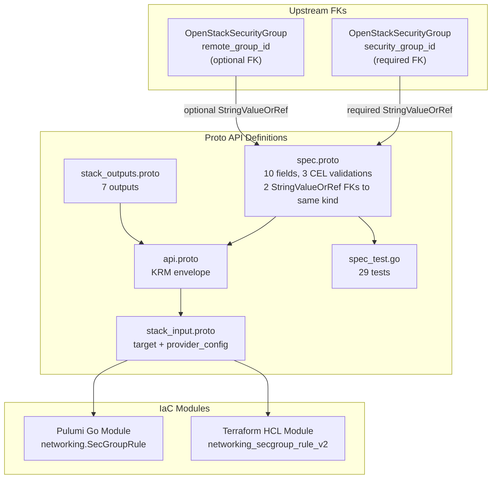

# OpenStackSecurityGroupRule Deployment Component

**Date**: February 9, 2026
**Type**: Feature
**Components**: OpenStack Provider, Deployment Component

## Summary

Added the `OpenStackSecurityGroupRule` deployment component (enum 2525) -- the first OpenStack component with two `StringValueOrRef` foreign keys pointing to the same kind (`OpenStackSecurityGroup`). This standalone rule component enables cross-security-group traffic filtering with DAG-resolved FK references in InfraCharts, complementing the inline rules already supported in `OpenStackSecurityGroup.rules[]`.

## Problem Statement / Motivation

The `openstack/developer-environment` and `openstack/kubernetes-environment` InfraCharts both need security group rules that reference other security groups (e.g., "allow SSH from bastion SG to app SG"). The inline rules in `OpenStackSecurityGroup` use plain strings for `remote_group_id`, which means they can't use `value_from` references to resolve UUIDs from other security groups created in the same InfraChart.

Additionally, when individual rules need to be visible as separate nodes in InfraChart DAG visualizations (for dependency clarity and operational transparency), they need to be their own KRM resources.

### Pain Points

- Inline rules cannot use FK resolution for cross-SG references
- No way to express "allow traffic from SG A to SG B" as a DAG edge in InfraCharts
- Individual rules are invisible in DAG visualizations when bundled as inline rules

## Solution / What's New

### OpenStackSecurityGroupRule Component (2525)

Complete deployment component following established patterns, with a novel dual-FK-to-same-kind design:



**Proto API (4 files + tests):**

- `spec.proto` -- 10 fields with 3 message-level CEL validations + 2 field-level `in` constraints:
  - `security_group_id` (required StringValueOrRef FK to OpenStackSecurityGroup)
  - `remote_group_id` (optional StringValueOrRef FK to OpenStackSecurityGroup)
  - `direction` (required, validated: "ingress" or "egress")
  - `ethertype` (required, validated: "IPv4" or "IPv6")
  - `protocol`, `port_range_min`, `port_range_max` (optional, with CEL mutual constraints)
  - `remote_ip_prefix` (mutually exclusive with remote_group_id, CEL-enforced)
  - `description`, `region`
- `stack_outputs.proto` -- 7 outputs: rule_id, security_group_id, direction, protocol, port_range_min, port_range_max, region
- `api.proto` -- KRM envelope with `openstack.planton.dev/v1` + `OpenStackSecurityGroupRule`
- `stack_input.proto` -- target + provider_config
- `spec_test.go` -- 29 tests (16 positive, 13 negative)

**IaC Modules (feature parity):**

- Pulumi Go module: `networking.NewSecGroupRule()` with dual FK resolution via `GetValue()`
- Terraform HCL module: `openstack_networking_secgroup_rule_v2` with FK extraction in locals

**Documentation:**

- `README.md` -- User-facing with standalone vs inline guidance, cross-SG FK examples
- `examples.md` -- 10 YAML examples (SSH, HTTPS, ICMP, egress, cross-SG, self-referencing, NodePort, IPv6, region)
- `docs/README.md` -- Research documentation with TF provider analysis and design rationale

## Implementation Details

### Dual FK to Same Kind

Both FKs resolve to `OpenStackSecurityGroup.status.outputs.security_group_id`:

```protobuf
// Required: which security group owns this rule
dev.planton.shared.foreignkey.v1.StringValueOrRef security_group_id = 1 [
  (buf.validate.field).required = true,
  (dev.planton.shared.foreignkey.v1.default_kind) = OpenStackSecurityGroup,
  (dev.planton.shared.foreignkey.v1.default_kind_field_path) = "status.outputs.security_group_id"
];

// Optional: traffic filter by another security group
dev.planton.shared.foreignkey.v1.StringValueOrRef remote_group_id = 8 [
  (dev.planton.shared.foreignkey.v1.default_kind) = OpenStackSecurityGroup,
  (dev.planton.shared.foreignkey.v1.default_kind_field_path) = "status.outputs.security_group_id"
];
```

### CEL Validation for Mixed-Type Mutual Exclusion

The `remote_source.mutual_exclusion` CEL uses `has()` for the message-type FK and `!= ''` for the plain string:

```protobuf
option (buf.validate.message).cel = {
  id: "remote_source.mutual_exclusion"
  message: "remote_group_id and remote_ip_prefix are mutually exclusive"
  expression: "!has(this.remote_group_id) || this.remote_ip_prefix == ''"
};
```

### Spec Fields (80/20 Analysis)

10 fields selected from the Terraform provider's 12 schema fields:

| Field | Type | Design Rationale |
|-------|------|-----------------|
| `security_group_id` | required StringValueOrRef | Which SG this rule belongs to |
| `direction` | string | "ingress" or "egress" (validated) |
| `ethertype` | string | "IPv4" or "IPv6" (validated) |
| `protocol` | string | tcp/udp/icmp/etc., empty = all |
| `port_range_min` | optional int32 | Lower port or ICMP type |
| `port_range_max` | optional int32 | Upper port or ICMP code |
| `remote_ip_prefix` | string | CIDR filter |
| `remote_group_id` | optional StringValueOrRef | Cross-SG traffic filter FK |
| `description` | string | Human-readable |
| `region` | string | Region override |

Excluded: `remote_address_group_id` (niche, address groups rarely used), `tenant_id` (admin-only, excluded from all components).

## Benefits

- **Unlocks cross-SG InfraChart rules**: "Allow SSH from bastion-sg to app-sg" expressed as DAG edges
- **Establishes dual-FK-to-same-kind pattern**: First component where two FKs resolve to the same CloudResourceKind
- **DAG visibility**: Each rule is a visible node in InfraChart dependency graphs
- **29 validation tests**: Comprehensive coverage of all CEL validations, FK modes, and edge cases
- **Single-resource IaC**: Simple, clean modules -- one TF/Pulumi resource per component (unlike SecurityGroup's N+1)

## Impact

- **InfraChart 1 (developer-environment)**: SecurityGroupRule enables cross-SG policies between bastion, app, and database tiers
- **Phase 1 progress**: 6 of 9 networking components complete. 3 remaining: FloatingIp (2506), FloatingIpAssociate (2526), NetworkPort (2507)
- **Pattern establishment**: Dual-FK-to-same-kind pattern validates that the FK system handles this cleanly, applicable to future components with similar needs

## Related Work

- OpenStack provider integration: `_changelog/2026-02/2026-02-08-215116-openstack-provider-integration.md`
- OpenStackSecurityGroup component: `_changelog/2026-02/2026-02-09-114030-openstack-security-group-deployment-component.md`
- OpenStackRouterInterface component (dual-FK pattern): `_changelog/2026-02/2026-02-09-094647-openstack-router-interface-deployment-component.md`
- Parent project: `planton/_projects/20260209.01.openstack-planton-components/`

---

**Status**: Production Ready
**Timeline**: Single session
