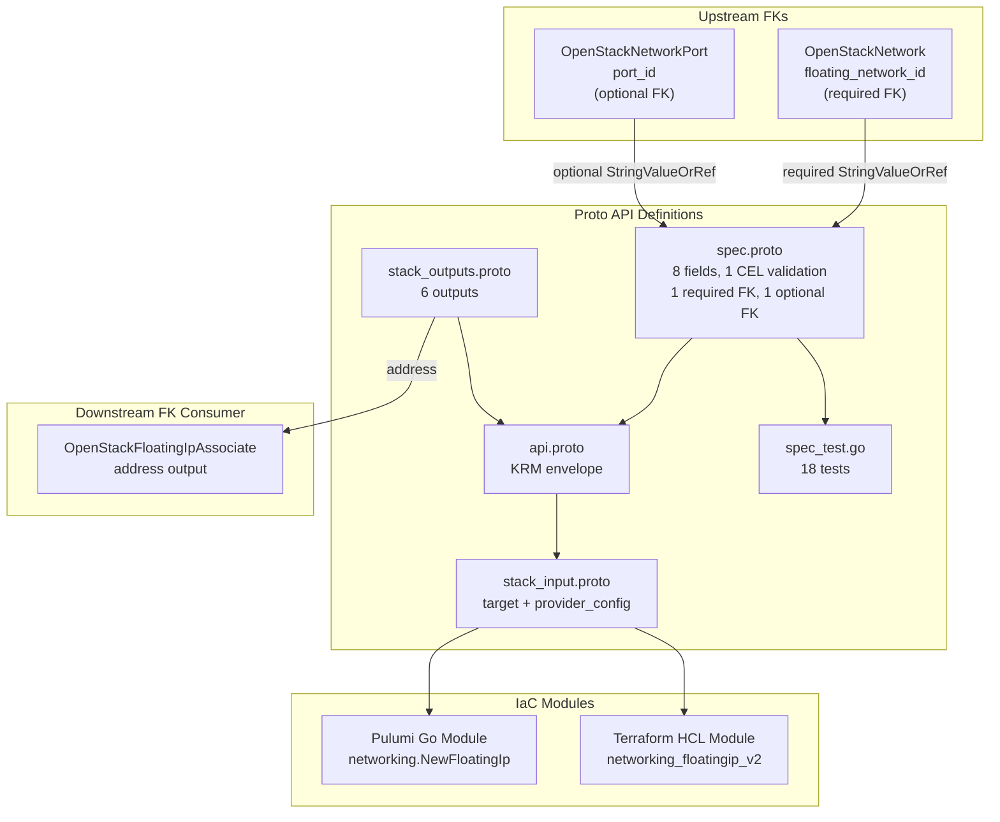

# OpenStackFloatingIp Deployment Component

**Date**: February 9, 2026
**Type**: Feature
**Components**: OpenStack Provider, Deployment Component

## Summary

Added the `OpenStackFloatingIp` deployment component (enum 2506) -- the OpenStack Neutron floating IP allocation resource with a required FK to `OpenStackNetwork` and an optional FK to `OpenStackNetworkPort`. This component supports two modes: allocation-only (for later association via `OpenStackFloatingIpAssociate`) and built-in association (when `port_id` is provided). Also pre-registered `OpenStackNetworkPort` (2507) in the `CloudResourceKind` enum as a forward reference for the FK annotation.

## Problem Statement / Motivation

The `openstack/developer-environment` InfraChart needs to assign public IP addresses to developer instances so they can be accessed from outside the OpenStack cloud. Without floating IPs, instances on tenant networks have no external connectivity.

Additionally, floating IPs are the bridge between private tenant networks and the outside world in OpenStack -- they serve the same role as AWS Elastic IPs or GCP external addresses. This is a critical networking primitive for any real-world OpenStack deployment.

### Pain Points

- No way to allocate public IPs through the OpenMCF platform
- Cannot associate public IPs with instance ports for external access
- The `openstack/developer-environment` InfraChart is blocked without this component

## Solution / What's New

### OpenStackFloatingIp Component (2506)

Complete deployment component with a required FK and an optional FK, plus a forward enum pre-registration:



**Proto API (4 files + tests):**

- `spec.proto` -- 8 fields with 1 message-level CEL validation:
  - `floating_network_id` (required StringValueOrRef FK to OpenStackNetwork)
  - `port_id` (optional StringValueOrRef FK to OpenStackNetworkPort)
  - `fixed_ip` (CEL: requires `port_id`)
  - `subnet_id` (plain string -- admin-managed external subnet)
  - `address` (specific IP request, ForceNew)
  - `description`, `tags`, `region`
- `stack_outputs.proto` -- 6 outputs: floating_ip_id, address, floating_network_id, port_id, fixed_ip, region
- `api.proto` -- KRM envelope with `openstack.openmcf.org/v1` + `OpenStackFloatingIp`
- `stack_input.proto` -- target + provider_config
- `spec_test.go` -- 18 tests (11 positive, 7 negative)

**IaC Modules (feature parity):**

- Pulumi Go module: `networking.NewFloatingIp()` with `Pool` mapped from `floating_network_id`
- Terraform HCL module: `openstack_networking_floatingip_v2` with `pool` mapped from `floating_network_id` via locals

**Documentation:**

- `README.md` -- User-facing with allocation vs. association guidance, FK relationship diagram
- `examples.md` -- 11 YAML examples (allocation-only, FK reference, literal port, FK port, port+fixed_ip, specific address, subnet, tags, region, fully-specified)
- `docs/README.md` -- Research documentation with TF provider field analysis, design rationale, production considerations

## Implementation Details

### Forward Enum Pre-Registration

The `port_id` FK uses `default_kind = OpenStackNetworkPort`, but `OpenStackNetworkPort` (2507) hadn't been created yet. Since the `default_kind` annotation is a typed enum reference, proto compilation fails without the enum value.

**Solution**: Pre-registered `OpenStackNetworkPort = 2507` in `cloud_resource_kind.proto` alongside `OpenStackFloatingIp = 2506`. The enum is a registry, not an implementation -- adding the entry early is clean and allows the FK annotation to compile.

### Single-Resource IaC (Correction from Plan)

The original plan suggested creating `floatingip_v2 + optional floatingip_associate_v2`. This was corrected:

- The `openstack_networking_floatingip_v2` resource natively supports `port_id` for built-in association
- Creating a second resource would be redundant and could cause state conflicts
- The separate `OpenStackFloatingIpAssociate` (2526) component handles DAG-visible association

### `pool` vs `floating_network_id` Mapping

The Terraform/Pulumi field is named `pool` (accepts network name or UUID). Our FK field is `floating_network_id` (more descriptive, follows OpenMCF conventions). The IaC modules bridge this:

```go
// Pulumi: Pool maps to floating_network_id
fipArgs.Pool = pulumi.String(locals.FloatingNetworkId)
```

```hcl
# Terraform: pool maps to floating_network_id via locals
pool = local.floating_network_id
```

### Spec Fields (80/20 Analysis)

8 fields selected from the Terraform provider's 14 schema fields:

| Field | Type | Design Rationale |
|-------|------|-----------------|
| `floating_network_id` | required StringValueOrRef | The external network pool (TF: `pool`) |
| `port_id` | optional StringValueOrRef | Built-in association to a port |
| `fixed_ip` | string | Multi-IP port disambiguation |
| `subnet_id` | string | External subnet allocation (plain, admin-managed) |
| `address` | string | Specific IP reservation (ForceNew) |
| `description` | string | Human-readable |
| `tags` | repeated string | Filtering, pattern consistency |
| `region` | string | Region override |

Excluded: `subnet_ids` (retry-loop, niche), `tenant_id` (admin-only), `value_specs` (escape hatch), `dns_name`/`dns_domain` (requires dns-integration extension), `all_tags` (computed-only).

## Benefits

- **Enables external connectivity**: Developer instances can now have public IP addresses
- **Dual-mode design**: Allocation-only for DAG-visible InfraCharts, built-in association for simplicity
- **Forward FK pre-registration**: Established pattern for registering enum entries ahead of component creation
- **18 validation tests**: Comprehensive coverage of required FK, optional FK, CEL dependency guard, tag uniqueness
- **`address` output as FK target**: `OpenStackFloatingIpAssociate` will reference `address` (not the UUID) for association

## Impact

- **InfraChart 1 (developer-environment)**: FloatingIp is Layer 4 in the dependency graph (after Network, Subnet, Router, SecurityGroup, Port, Instance)
- **Phase 1 progress**: 7 of 9 networking components complete. 2 remaining: FloatingIpAssociate (2526), NetworkPort (2507)
- **Enum pre-registration pattern**: OpenStackNetworkPort (2507) is registered and ready for immediate component creation

## Related Work

- OpenStack provider integration: `_changelog/2026-02/2026-02-08-215116-openstack-provider-integration.md`
- OpenStackNetwork component: `_changelog/2026-02/2026-02-09-082447-openstack-network-component-and-forge-pipeline-cleanup.md`
- OpenStackSubnet component: `_changelog/2026-02/2026-02-09-032227-openstack-subnet-deployment-component.md`
- OpenStackRouter component: `_changelog/2026-02/2026-02-09-101500-openstack-router-deployment-component.md`
- OpenStackRouterInterface component: `_changelog/2026-02/2026-02-09-094647-openstack-router-interface-deployment-component.md`
- OpenStackSecurityGroup component: `_changelog/2026-02/2026-02-09-100841-openstack-security-group-deployment-component.md`
- OpenStackSecurityGroupRule component: `_changelog/2026-02/2026-02-09-104004-openstack-security-group-rule-deployment-component.md`
- Parent project: `planton/_projects/20260209.01.openstack-openmcf-components/`

---

**Status**: Production Ready
**Timeline**: Single session
