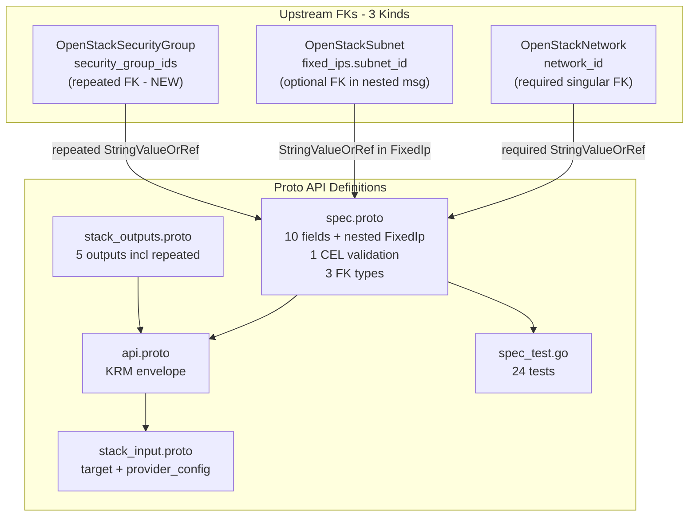

# OpenStackNetworkPort Deployment Component

**Date**: February 9, 2026
**Type**: Feature
**Components**: OpenStack Provider, Deployment Component

## Summary

Added the `OpenStackNetworkPort` deployment component (enum 2507) -- the first OpenStack component with `repeated StringValueOrRef` foreign keys and `StringValueOrRef` inside a nested message. A Neutron port provides stable network identity (MAC, IPs, security groups) for instances and is the bridge between floating IPs and tenant networks.

## Problem Statement / Motivation

The `openstack/developer-environment` InfraChart needs to create ports that wire together subnets, security groups, and floating IPs -- all created as separate chart components. Without explicit port creation, instance-inline networking doesn't support FK resolution for DAG-ordered deployment.

Additionally, both `OpenStackFloatingIp` and `OpenStackFloatingIpAssociate` already have FK references to `OpenStackNetworkPort.status.outputs.port_id` (the enum was pre-registered in Session 8), making this a prerequisite for completing the networking phase.

### Pain Points

- Instance-inline networking can't reference chart-local subnets or security groups via `value_from`
- Floating IP association requires a port_id target that doesn't exist yet
- No way to pre-provision stable network identities for orchestration

## Solution / What's New

### OpenStackNetworkPort Component (2507)

Complete deployment component introducing two new FK patterns:



## Implementation Details

### New Pattern 1: Repeated StringValueOrRef (`security_group_ids`)

First use of a repeated FK field in the entire OpenMCF codebase. Each element independently resolves as literal UUID or `value_from` reference:

```protobuf
repeated org.openmcf.shared.foreignkey.v1.StringValueOrRef security_group_ids = 3 [
  (org.openmcf.shared.foreignkey.v1.default_kind) = OpenStackSecurityGroup,
  (org.openmcf.shared.foreignkey.v1.default_kind_field_path) = "status.outputs.security_group_id"
];
```

IaC resolution (Pulumi):
```go
for _, sgRef := range stackInput.Target.Spec.SecurityGroupIds {
    locals.SecurityGroupIds = append(locals.SecurityGroupIds, sgRef.GetValue())
}
```

IaC resolution (Terraform):
```hcl
security_group_ids = [for sg in var.spec.security_group_ids : sg.value]
```

### New Pattern 2: StringValueOrRef in Nested Message (`FixedIp.subnet_id`)

First FK annotation inside a nested/repeated message:

```protobuf
message FixedIp {
  org.openmcf.shared.foreignkey.v1.StringValueOrRef subnet_id = 1 [
    (org.openmcf.shared.foreignkey.v1.default_kind) = OpenStackSubnet,
    (org.openmcf.shared.foreignkey.v1.default_kind_field_path) = "status.outputs.subnet_id"
  ];
  string ip_address = 2;
}
```

### `no_security_groups` Addition

Not in the original plan but critical for correctness. Without it, an empty `security_group_ids` list means "apply the default SG" (OpenStack behavior). With `no_security_groups = true`, the port explicitly has zero security groups. CEL mutual exclusion enforced.

### Spec Fields (80/20 Analysis)

10 fields selected from the TF provider's 26 attributes:

| Field | Type | Design Rationale |
|-------|------|-----------------|
| `network_id` | required StringValueOrRef | Core relationship, ForceNew |
| `fixed_ips` | repeated FixedIp | IP assignments with nested FK |
| `security_group_ids` | repeated StringValueOrRef | Multiple SG references for InfraCharts |
| `no_security_groups` | bool | Zero-trust bypass for LB VIPs |
| `admin_state_up` | optional bool | Default true, consistent pattern |
| `mac_address` | string | ForceNew, DPDK/bonding |
| `port_security_enabled` | optional bool | Inherits from network if unset |
| `description` | string | Consistent with all components |
| `tags` | repeated string | Filtering, unique constraint |
| `region` | string | Standard override |

## Benefits

- **Unlocks InfraChart port orchestration**: Ports can reference chart-local subnets and SGs via `value_from`
- **Establishes repeated FK pattern**: Validated that `repeated StringValueOrRef` works end-to-end
- **Establishes nested FK pattern**: Validated that `StringValueOrRef` inside nested messages works
- **Satisfies downstream dependencies**: FloatingIp and FloatingIpAssociate's `port_id` FK now has a real target
- **24 validation tests**: Comprehensive coverage of FKs, CEL, and edge cases

## Impact

- **Phase 1 progress**: 8 of 9 networking components complete
- **Pattern establishment**: Two new FK patterns (repeated, nested) are validated and reusable by future components (Instance, ContainerClusterTemplate)
- **InfraChart 1 readiness**: NetworkPort is the last networking primitive needed for the developer-environment chart's network layer

## Related Work

- OpenStackFloatingIp component (pre-registered 2507 enum): `_changelog/2026-02/2026-02-09-114030-openstack-floating-ip-deployment-component.md`
- OpenStackSecurityGroup (inline rules, multi-resource IaC): `_changelog/2026-02/2026-02-09-100841-openstack-security-group-deployment-component.md`
- Parent project: `planton/_projects/20260209.01.openstack-openmcf-components/`

---

**Status**: Production Ready
**Timeline**: Single session
