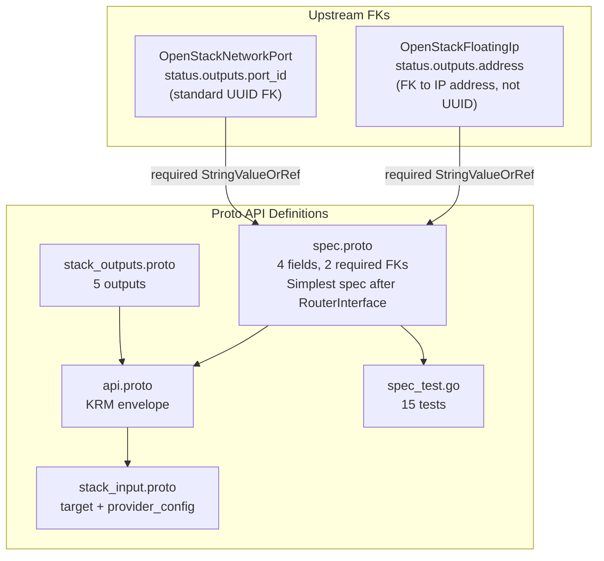

# OpenStackFloatingIpAssociate Deployment Component

**Date**: February 9, 2026
**Type**: Feature
**Components**: OpenStack Provider, Deployment Component

## Summary

Added the `OpenStackFloatingIpAssociate` deployment component (enum 2526) -- the DAG-visible "join" resource that binds a floating IP to a port, completing Phase 1 networking (9/9 components). This is the first component with an FK that targets a non-UUID output (`address` instead of an ID field).

## Problem Statement / Motivation

The `openstack/developer-environment` InfraChart needs floating IP association as a visible DAG node. While `OpenStackFloatingIp` supports built-in `port_id` association, that approach makes the association invisible in the dependency graph. InfraCharts need the association to appear as an explicit node with dependency edges to both the floating IP and the port.

### Pain Points

- Built-in association in OpenStackFloatingIp hides the relationship in DAG visualizations
- No way to decouple floating IP lifecycle from association lifecycle
- Association dependency ordering is implicit, not explicit

## Solution / What's New

### OpenStackFloatingIpAssociate Component (2526)

Simple dual-FK join resource, similar in structure to OpenStackRouterInterface:



## Implementation Details

### FK to Non-UUID Output (`address`)

The `floating_ip` FK annotation targets `OpenStackFloatingIp.status.outputs.address` (an IP address like "203.0.113.42"), not a UUID. This is the first FK in Planton that targets a non-UUID output. The TF provider's `floating_ip` attribute accepts either an IP address or a floating IP UUID, so both work.

```protobuf
dev.planton.shared.foreignkey.v1.StringValueOrRef floating_ip = 1 [
  (buf.validate.field).required = true,
  (dev.planton.shared.foreignkey.v1.default_kind) = OpenStackFloatingIp,
  (dev.planton.shared.foreignkey.v1.default_kind_field_path) = "status.outputs.address"
];
```

### Companion Slot Pattern

Enum 2526 follows the companion numbering:
- 2505/2525: SecurityGroup / SecurityGroupRule
- 2506/2526: FloatingIp / FloatingIpAssociate

### Spec Fields (4 total -- all from TF provider)

| Field | Type | Design Rationale |
|-------|------|-----------------|
| `floating_ip` | required StringValueOrRef | IP address or UUID, FK to FloatingIp.address |
| `port_id` | required StringValueOrRef | FK to NetworkPort.port_id |
| `fixed_ip` | string | For multi-IP ports |
| `region` | string | Standard override, ForceNew |

## Benefits

- **Completes Phase 1 networking**: All 9 networking components are now implemented
- **DAG visibility**: Floating IP association is an explicit, visible node in InfraChart dependency graphs
- **Decoupled lifecycle**: Floating IPs and associations can be managed independently
- **Establishes FK-to-address pattern**: First non-UUID FK target, applicable to future components
- **15 validation tests**: Coverage of both FK modes, edge cases, and envelope validation

## Impact

- **Phase 1 COMPLETE**: 9 of 9 networking components done (Network, Subnet, Router, RouterInterface, SecurityGroup, SecurityGroupRule, FloatingIp, NetworkPort, FloatingIpAssociate)
- **InfraChart readiness**: All networking primitives for the developer-environment chart are available
- **Next phase**: Phase 2 (Compute: OpenStackInstance, OpenStackServerGroup)

## Related Work

- OpenStackFloatingIp (built-in association): `_changelog/2026-02/2026-02-09-114030-openstack-floating-ip-deployment-component.md`
- OpenStackNetworkPort (port_id FK target): created in this session
- OpenStackRouterInterface (dual-FK pattern reference): `_changelog/2026-02/2026-02-09-094647-openstack-router-interface-deployment-component.md`
- Parent project: `planton/_projects/20260209.01.openstack-planton-components/`

---

**Status**: Production Ready
**Timeline**: Single session
