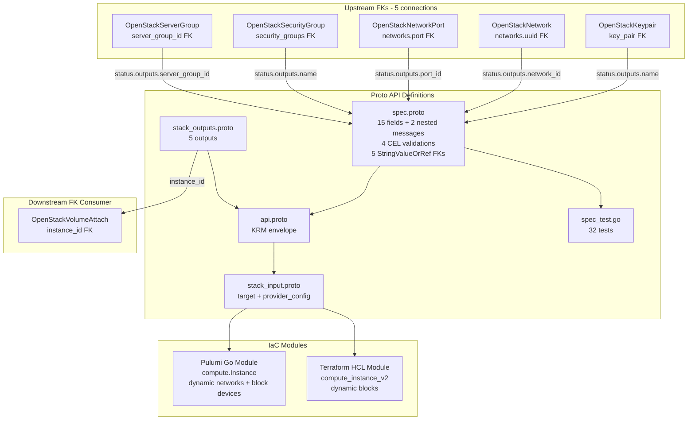

# OpenStackInstance Deployment Component

**Date**: February 9, 2026
**Type**: Feature
**Components**: OpenStack Provider, Deployment Component

## Summary

Added the `OpenStackInstance` deployment component (enum 2508) -- the most complex component in the OpenStack suite with 15 spec fields, 2 nested messages, 5 StringValueOrRef FKs, and 32 validation tests. An instance is the fundamental compute resource -- every developer workload, application server, and database runs as an instance. This component establishes two novel FK patterns: FKs that resolve to names (not UUIDs) and a flattened `server_group_id` replacing a nested `scheduler_hints` block.

## Problem Statement / Motivation

The `openstack/developer-environment` InfraChart cannot deploy developer workloads without instances. Instances are the culmination of all networking components (networks, ports, security groups) and placement components (server groups) -- they bind everything together into a running virtual machine.

This is the most important resource after networking and the primary deliverable for Phani at ARM.

### Pain Points

- Cannot deploy any workloads without compute instances
- ARM's primary use case requires instances with SSH keys, security groups, networks, and cloud-init
- Instance is the component that tests whether all FK relationships actually compose correctly

## Solution / What's New

### OpenStackInstance Component (2508)

The most complex component with the highest FK density in the entire OpenStack suite:



**Proto API (4 files + tests):**

- `spec.proto` -- 15 top-level fields + 2 nested messages:
  - Top-level: `flavor_name`, `flavor_id` (XOR), `image_name`, `image_id`, `key_pair` (FK), `networks` (repeated nested), `security_groups` (repeated FK), `block_device` (repeated nested), `user_data`, `metadata`, `config_drive`, `server_group_id` (FK), `availability_zone`, `tags`, `region`
  - `InstanceNetwork`: `uuid` (FK), `port` (FK), `fixed_ip_v4`, `access_network` -- with XOR CEL validation
  - `BlockDevice`: `source_type` (validated), `uuid`, `destination_type`, `boot_index`, `volume_size`, `delete_on_termination`, `volume_type`
  - 4 CEL validations: flavor XOR, networks min 1, network uuid XOR port, block_device source_type in-list + tags unique
- `stack_outputs.proto` -- 5 outputs: instance_id, name, access_ip_v4, access_ip_v6, region
- `api.proto` -- KRM envelope with `openstack.planton.dev/v1` + `OpenStackInstance`
- `stack_input.proto` -- target + provider_config
- `spec_test.go` -- 32 tests (20 positive, 12 negative)

**IaC Modules (feature parity):**

- Pulumi Go module: `compute.NewInstance()` with dynamic networks, block devices, scheduler hints, and security group name resolution
- Terraform HCL module: `openstack_compute_instance_v2` with `dynamic` blocks for network, block_device, and scheduler_hints

## Implementation Details

### Novel Pattern: FK Resolving to Name (not UUID)

Two FK fields resolve to `status.outputs.name` instead of the usual UUID:

```protobuf
// key_pair -> keypair name (Nova API uses names)
dev.planton.shared.foreignkey.v1.StringValueOrRef key_pair = 5 [
  (dev.planton.shared.foreignkey.v1.default_kind) = OpenStackKeypair,
  (dev.planton.shared.foreignkey.v1.default_kind_field_path) = "status.outputs.name"
];

// security_groups -> SG names (Compute API uses names, unlike Neutron which uses UUIDs)
repeated dev.planton.shared.foreignkey.v1.StringValueOrRef security_groups = 7 [
  (dev.planton.shared.foreignkey.v1.default_kind) = OpenStackSecurityGroup,
  (dev.planton.shared.foreignkey.v1.default_kind_field_path) = "status.outputs.name"
];
```

This is the first component where FKs resolve to names. The DAG ordering benefit (Instance waits for Keypair/SecurityGroup creation) justifies the StringValueOrRef pattern even though the resolved value is a name.

### Flattened `server_group_id` (departure from plan)

The original plan specified `scheduler_hints (group FK -> ServerGroup)`. The TF provider nests `group` inside a `scheduler_hints` block with 8 fields. Since we only need 1 for 80/20, we flatten to `server_group_id`:

```yaml
# Cleaner (our approach):
server_group_id:
  value_from:
    name: ha-group

# vs. nested (plan's original approach):
scheduler_hints:
  group:
    value_from:
      name: ha-group
```

The IaC modules map `server_group_id` to `scheduler_hints { group = ... }` internally.

### `image_id` and `image_name` as plain strings (departure from plan)

The original plan said `image_id (FK -> Image, optional)`. We use plain strings because:
- 95%+ of instances reference pre-existing images by name
- OpenStackImage (2514) doesn't exist yet (Phase 4)
- InfraCharts that create both an Image and an Instance from it are extremely rare
- Can add FK support when Image component is created if demand warrants it

### Spec Fields (80/20 Analysis)

15 fields selected from the Terraform provider's 30+ schema fields. Key exclusions:

| Excluded Field | Reason |
|---------------|--------|
| `personality` | Deprecated in modern Nova; conflicts with cloud-init |
| `admin_pass` | Sensitive, not for declarative IaC |
| `network_mode` | Replaced by requiring explicit networks |
| `power_state` | Managing power via IaC is risky |
| `stop_before_destroy` | Operational, not infrastructure |
| `force_delete` | Operational escape hatch |
| `vendor_options` | Terraform-specific workaround |

## Benefits

- **Unlocks compute workloads**: Developers can now deploy VMs on OpenStack through Planton
- **Most FK connections**: 5 FKs validate that the FK system composes correctly across networking and compute
- **Two novel patterns**: Name-resolving FKs and flattened scheduler_hints
- **32 validation tests**: Comprehensive coverage of all CEL validations, FK modes, nested messages, and edge cases
- **Boot flexibility**: Both image-based and volume-based boot supported via block_device

## Impact

- **Phase 2 COMPLETE**: Both compute components done (ServerGroup + Instance)
- **InfraChart 1 (developer-environment)**: Instance is the core deliverable -- Layer 5 in the dependency graph
- **Downstream**: OpenStackVolumeAttach (Phase 3) will reference `instance_id`
- **FK density record**: 5 FKs in one component, including 2 novel name-resolving patterns

## Related Work

- OpenStackServerGroup: `_changelog/2026-02/2026-02-09-123024-openstack-server-group-deployment-component.md`
- OpenStack networking components: `_changelog/2026-02/2026-02-09-*`
- Parent project: `planton/_projects/20260209.01.openstack-planton-components/`

---

**Status**: Production Ready
**Timeline**: Single session
