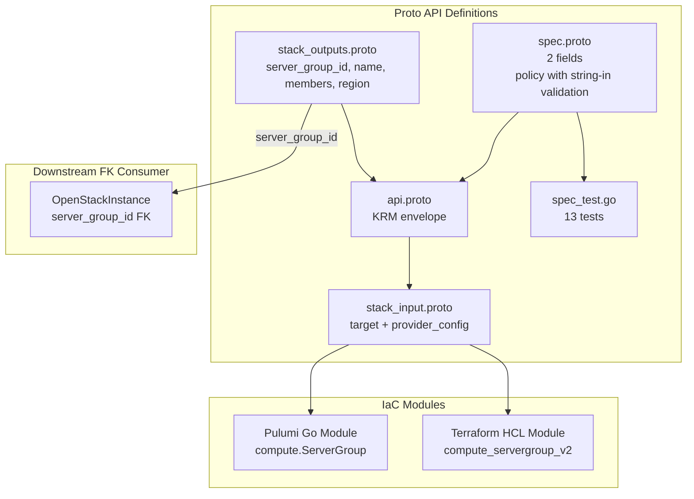

# OpenStackServerGroup Deployment Component

**Date**: February 9, 2026
**Type**: Feature
**Components**: OpenStack Provider, Deployment Component

## Summary

Added the `OpenStackServerGroup` deployment component (enum 2509) -- a simple placement constraint resource that controls whether compute instances are co-located on the same hypervisor or spread across different hypervisors. This is the first Compute-service component and establishes the FK target for `OpenStackInstance.server_group_id`.

## Problem Statement / Motivation

The `openstack/developer-environment` InfraChart needs high-availability instance placement. Without server groups, instances could be randomly placed on the same hypervisor -- a single host failure would take down all instances. Anti-affinity server groups ensure database replicas and application instances survive host failures.

Additionally, the Instance component (next in Phase 2) needs to reference server groups via `scheduler_hints.group`, so the ServerGroup component must exist first as an FK target.

### Pain Points

- No way to ensure HA placement for developer environment instances
- Instance component needs a server group FK target before it can be built
- ARM (Phani) needs anti-affinity for database workloads on their OpenStack infrastructure

## Solution / What's New

### OpenStackServerGroup Component (2509)

One of the simplest components in the 27-component set -- 2 spec fields, no FKs, single-resource IaC:

**Proto API (4 files + tests):**

- `spec.proto` -- 2 fields:
  - `policy` (required string, validated to: "affinity", "anti-affinity", "soft-affinity", "soft-anti-affinity")
  - `region` (optional string, region override)
- `stack_outputs.proto` -- 4 outputs: server_group_id, name, members (computed list), region
- `api.proto` -- KRM envelope with `openstack.openmcf.org/v1` + `OpenStackServerGroup`
- `stack_input.proto` -- target + provider_config
- `spec_test.go` -- 13 tests (6 positive, 7 negative)

**IaC Modules (feature parity):**

- Pulumi Go module: `compute.NewServerGroup()` with singular policy string
- Terraform HCL module: `openstack_compute_servergroup_v2` with `policies = [var.spec.policy]`

## Implementation Details

### Design Decision: Singular `policy` instead of `policies` list

The Terraform provider models policies as a list with `MinItems=1, MaxItems=1`. The Nova API only supports one policy per server group. We use a singular `string policy` field:
- Cleaner YAML: `policy: anti-affinity` vs `policies: ["anti-affinity"]`
- Simple string-in validation (no list size constraints)
- The Pulumi SDK already models this as `StringPtrInput` (singular)
- IaC modules wrap the singular value into a list for the API

### Pulumi SDK Discovery

During implementation, we discovered that the Pulumi OpenStack SDK v5 models the `Policies` field as `pulumi.StringPtrInput` (a single string pointer), not a `StringArray`. This validates the singular `policy` design -- the SDK already agrees that this is semantically a single value.

### Fields Excluded

| Field | Reason |
|-------|--------|
| `rules` / `max_server_per_host` | Requires Nova API 2.64+, only for anti-affinity. Niche optimization. |
| `value_specs` | Escape hatch. Excluded from all components. |

## Benefits

- **Enables HA placement**: Anti-affinity ensures instances survive host failures
- **FK target for Instance**: Server group ID used by Instance's `server_group_id` field
- **Simplest component**: 2 spec fields, single-resource IaC, establishes the Phase 2 foundation
- **13 validation tests**: All 4 policy variants, invalid values, wrong case sensitivity

## Impact

- **Phase 2 progress**: 1 of 2 compute components complete (ServerGroup done, Instance next)
- **InfraChart 1 (developer-environment)**: Server groups enable HA placement for developer instances
- **Also pre-registered OpenStackInstance (2508)**: Enum entry added ahead of Instance component creation

## Related Work

- OpenStack networking components: `_changelog/2026-02/2026-02-09-*`
- Parent project: `planton/_projects/20260209.01.openstack-openmcf-components/`

---

**Status**: Production Ready
**Timeline**: Single session
