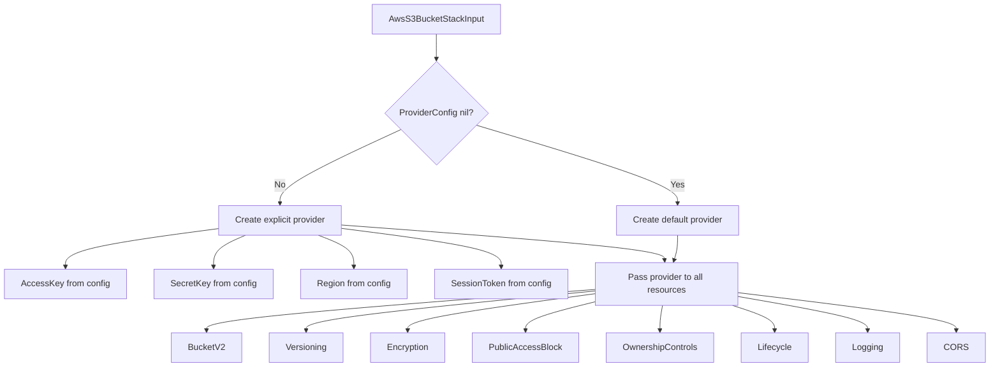

# Fix AwsS3Bucket Pulumi Module: Add Explicit AWS Provider

**Date**: February 9, 2026
**Type**: Bug Fix
**Components**: AWS Provider, Pulumi CLI Integration, IAC Stack Runner

## Summary

Fixed a critical bug in the AwsS3Bucket Pulumi module where the AWS provider was not explicitly created from `provider_config` in the stack input. All S3 resources were being created against the Pulumi default provider, which failed to resolve credentials and region, causing deployment failures with `sts.auto.amazonaws.com` DNS errors. The fix follows the same explicit provider pattern already used by AwsRdsInstance and upgrades the Pulumi AWS SDK from v6 to v7.

## Problem Statement / Motivation

When deploying an AwsS3Bucket resource via the OpenMCF Pulumi runner, the deployment failed immediately with:

```
error: pulumi:providers:aws resource 'default_6_83_2' has a problem: unable to validate AWS credentials.
Details: Post "https://sts.auto.amazonaws.com/": dial tcp: lookup sts.auto.amazonaws.com: no such host
```

### Pain Points

- The `default_6_83_2` provider name revealed that Pulumi was auto-creating a default AWS provider rather than using an explicit one
- The `sts.auto.amazonaws.com` endpoint is the STS URL when no region is configured -- the "auto" pseudo-region cannot be DNS-resolved
- The stack input YAML provides `provider_config` with `access_key_id`, `secret_access_key`, and `region: us-east-1`, but the Pulumi module ignored it entirely
- Other AWS components (e.g., AwsRdsInstance) already had the correct pattern, making this an inconsistency

## Solution / What's New

Applied a targeted fix to the AwsS3Bucket Pulumi module, modeled after the existing AwsRdsInstance implementation.

### Provider Creation Flow



## Implementation Details

### Source Code Fix: `module/main.go`

**File**: `apis/org/openmcf/provider/aws/awss3bucket/v1/iac/pulumi/module/main.go`

1. **Upgraded SDK**: Changed import from `pulumi-aws/sdk/v6` to `pulumi-aws/sdk/v7` for consistency with AwsRdsInstance
2. **Added explicit provider creation**: Reads `stackInput.ProviderConfig` and creates an `aws.NewProvider()` with AccessKeyId, SecretAccessKey, Region, and SessionToken
3. **Passed provider to all resources**: Added `pulumi.Provider(provider)` to all 8 resource creation calls (BucketV2, BucketVersioningV2, BucketServerSideEncryptionConfigurationV2, BucketPublicAccessBlock, BucketOwnershipControls, BucketLifecycleConfigurationV2, BucketLoggingV2, BucketCorsConfigurationV2)

### Documentation Fix: `README.md`

Updated "AWS Provider Initialization" and "Credential Management" sections to accurately describe the explicit provider creation from `provider_config`.

## Benefits

- **Deployments work**: AwsS3Bucket can now be deployed using credentials from the stack input `provider_config`
- **Region targeting**: The explicit provider ensures resources are created in the correct AWS region
- **Consistency**: AwsS3Bucket now follows the same provider pattern as AwsRdsInstance and other AWS components
- **SDK alignment**: Upgraded to Pulumi AWS SDK v7, matching the version used by newer components

## Impact

- **Users deploying AwsS3Bucket**: Deployments that were previously failing with credential errors will now succeed
- **No breaking changes**: The fix is additive; the stack input format is unchanged
- **Backward compatible**: If `provider_config` is nil, falls back to a default provider (environment variable credentials)

## Related Work

- **Reference implementation**: `apis/org/openmcf/provider/aws/awsrdsinstance/v1/iac/pulumi/module/main.go` -- the correct pattern this fix was modeled after
- **AWS Provider Config**: `apis/org/openmcf/provider/aws/provider.proto` -- defines `AwsProviderConfig` with account_id, access_key_id, secret_access_key, region, session_token

---

**Status**: Production Ready
**Validation**: `go build` and `go test` pass successfully
