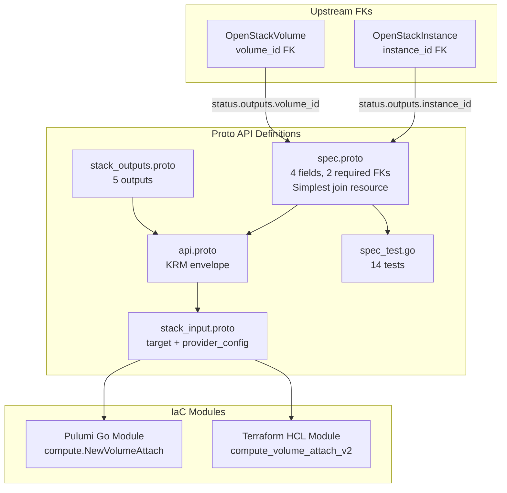

# OpenStackVolumeAttach Deployment Component

**Date**: February 9, 2026
**Type**: Feature
**Components**: OpenStack Provider, Deployment Component

## Summary

Added the `OpenStackVolumeAttach` deployment component (enum 2511) -- a join resource attaching a Cinder volume to a compute instance with 2 required StringValueOrRef FKs. This completes Phase 3 (Block Storage) and unlocks InfraChart 1 (`openstack/developer-environment`). All 15 components needed for the developer environment are now implemented.

## Problem Statement / Motivation

Volumes and instances are created independently in InfraCharts. Without a DAG-visible join resource, there is no way to express "attach this volume to this instance" as a dependency edge in the InfraChart pipeline. The attachment must wait for both the volume to be "available" and the instance to be "running."

### Pain Points

- No way to attach persistent storage to instances through InfraCharts
- Volume and Instance creation are independent; attachment requires both to exist first
- ARM (Phani) needs database volumes attached to developer environment instances

## Solution / What's New

### OpenStackVolumeAttach Component (2511)

One of the simplest join resources -- 4 spec fields, 2 required FKs, no CEL validations:

**Proto API (4 files + tests):**

- `spec.proto` -- 4 fields:
  - `instance_id` (required FK -> OpenStackInstance)
  - `volume_id` (required FK -> OpenStackVolume)
  - `device` (optional, e.g., "/dev/vdb")
  - `region` (optional override)
- `stack_outputs.proto` -- 5 outputs: id, instance_id, volume_id, device, region
- `api.proto` -- KRM envelope with `openstack.openmcf.org/v1` + `OpenStackVolumeAttach`
- `stack_input.proto` -- target + provider_config
- `spec_test.go` -- 14 tests (7 positive, 7 negative)

**IaC Modules (feature parity):**

- Pulumi Go module: `compute.NewVolumeAttach()` -- uses the compute package (not blockstorage)
- Terraform HCL module: `openstack_compute_volume_attach_v2` -- Nova API (not Cinder admin)

## Implementation Details

### Correct Pulumi Package: `compute` not `blockstorage`

The Pulumi OpenStack SDK has two VolumeAttach types:
- `blockstorage.VolumeAttach` -- maps to `openstack_blockstorage_volume_attach_v3` (Cinder admin API)
- `compute.VolumeAttach` -- maps to `openstack_compute_volume_attach_v2` (Nova tenant API)

We use `compute.VolumeAttach` because the TF resource is `openstack_compute_volume_attach_v2` (the tenant-facing Nova API). The blockstorage variant is an admin-only Cinder attachment API that most tenant users cannot access.

### Join Resource Pattern (3rd instance)

VolumeAttach follows the established join-resource pattern:

| Component | FK 1 | FK 2 | Optional Fields |
|-----------|------|------|-----------------|
| RouterInterface | router_id | subnet_id | region |
| FloatingIpAssociate | floating_ip | port_id | fixed_ip, region |
| **VolumeAttach** | **instance_id** | **volume_id** | **device, region** |

### Fields Excluded (80/20)

| Excluded Field | Reason |
|---------------|--------|
| `multiattach` | SAN shared volumes, niche |
| `tag` | PCI device tagging, niche |
| `vendor_options` | TF-specific workaround, always excluded |

## Benefits

- **Phase 3 COMPLETE**: Both block storage components done (Volume + VolumeAttach)
- **InfraChart 1 unlocked**: All 15 components for `openstack/developer-environment` are now implemented
- **DAG visibility**: Volume-to-Instance relationship is an explicit, transparent dependency edge
- **14 validation tests**: All FK modes (literal, value_from), envelope validations, missing-field cases

## Impact

- **Phase 3 COMPLETE**: 2 of 2 block storage components done
- **15 of 27 components complete** (including OpenStackKeypair)
- **InfraChart 1 ready**: developer-environment can now be built with Network, Subnet, Router, RouterInterface, SecurityGroup, FloatingIp, NetworkPort, FloatingIpAssociate, Instance, ServerGroup, Keypair, Volume, VolumeAttach
- **Join resource count**: 3 of 3 join resources complete (RouterInterface, FloatingIpAssociate, VolumeAttach)

## Related Work

- OpenStackVolume: `_changelog/2026-02/2026-02-09-132514-openstack-volume-deployment-component.md`
- Join resource patterns: RouterInterface, FloatingIpAssociate
- Parent project: `planton/_projects/20260209.01.openstack-openmcf-components/`

---

**Status**: Production Ready
**Timeline**: Single session
