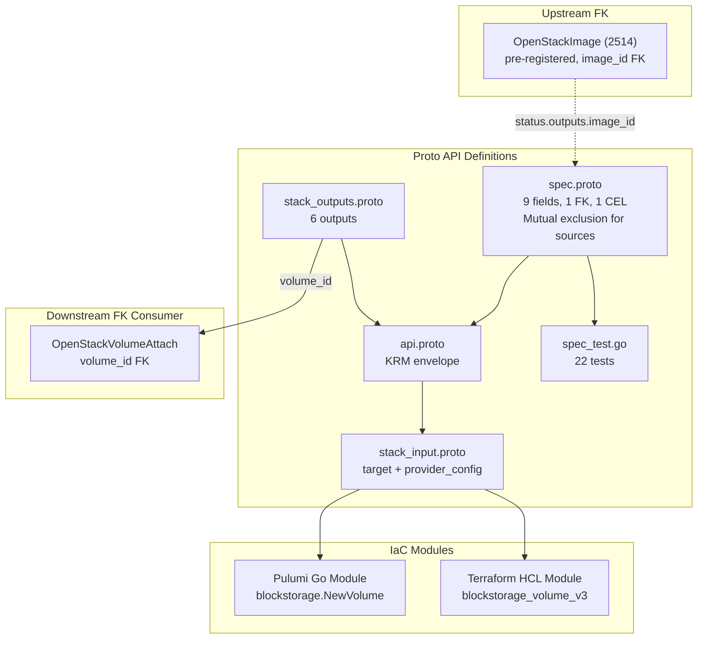

# OpenStackVolume Deployment Component

**Date**: February 9, 2026
**Type**: Feature
**Components**: OpenStack Provider, Deployment Component

## Summary

Added the `OpenStackVolume` deployment component (enum 2510) -- a Cinder block storage volume with 9 spec fields, 1 StringValueOrRef FK to OpenStackImage, and a CEL mutual exclusion validation for volume sources. This is the first Block Storage component and establishes the FK target for `OpenStackVolumeAttach`. Also pre-registered `OpenStackImage` (2514) for forward FK compatibility.

## Problem Statement / Motivation

The `openstack/developer-environment` InfraChart cannot provide persistent storage without Cinder volumes. Instances have ephemeral disks that are destroyed with the instance -- databases, application state, and any data that must survive instance termination requires an attached Cinder volume.

Additionally, bootable volumes (created from Glance images) are a common pattern for production workloads where the root disk needs to be larger or faster than what the flavor provides.

### Pain Points

- Cannot provide persistent storage for developer workloads
- Cannot create bootable volumes from images for production instances
- VolumeAttach (next component) needs Volume as an FK target

## Solution / What's New

### OpenStackVolume Component (2510)



**Proto API (4 files + tests):**

- `spec.proto` -- 9 fields:
  - `description`, `size` (required, > 0), `volume_type`, `availability_zone`
  - `snapshot_id`, `source_vol_id` (plain strings, mutually exclusive sources)
  - `image_id` (StringValueOrRef FK -> OpenStackImage)
  - `metadata` (map), `region`
  - 1 CEL validation: mutual exclusion of snapshot_id, source_vol_id, image_id
- `stack_outputs.proto` -- 6 outputs: volume_id, name, size, volume_type, availability_zone, region
- `api.proto` -- KRM envelope with `openstack.openmcf.org/v1` + `OpenStackVolume`
- `stack_input.proto` -- target + provider_config
- `spec_test.go` -- 22 tests (12 positive, 10 negative)

**IaC Modules (feature parity):**

- Pulumi Go module: `blockstorage.NewVolume()` with optional FK resolution for `image_id`
- Terraform HCL module: `openstack_blockstorage_volume_v3` with ternary null handling

### Pre-registered OpenStackImage (2514)

Pre-registered `OpenStackImage = 2514` in `cloud_resource_kind.proto` to enable the forward FK annotation on Volume's `image_id` field. This follows the same pattern from Session 8 where FloatingIp pre-registered NetworkPort (2507).

## Implementation Details

### CEL: Mixed-Type Mutual Exclusion

The three source fields use different types -- `snapshot_id` and `source_vol_id` are plain strings, while `image_id` is a `StringValueOrRef` message. The CEL expression handles this with mixed checks:

```
((this.snapshot_id != '' ? 1 : 0) + (this.source_vol_id != '' ? 1 : 0) + (has(this.image_id) ? 1 : 0)) <= 1
```

- `!= ''` for plain strings (proto3 default is empty string)
- `has()` for message-type fields (checks if the message is set)

### Pulumi SDK Discovery: `NewVolume` not `NewVolumeV3`

The Pulumi OpenStack SDK v5 names the blockstorage volume resource as `blockstorage.Volume` / `blockstorage.NewVolume()` -- dropping the "V3" suffix. The Terraform resource name `openstack_blockstorage_volume_v3` includes "v3" because it represents the Cinder V3 API, but the Pulumi SDK abstracts this away.

### Fields Excluded (80/20)

| Excluded Field | Reason |
|---------------|--------|
| `enable_online_resize` | TF operational behavior, not infrastructure |
| `volume_retype_policy` | TF-specific behavior for type changes |
| `backup_id` | Backup restoration is niche |
| `consistency_group_id` | Admin-only CG operations |
| `source_replica` | Replication is niche |
| `scheduler_hints` | Volume placement hints, niche |

## Benefits

- **Persistent storage**: Developers can now provision durable block storage on OpenStack
- **Bootable volumes**: Create volumes from images for production root disks
- **Forward-compatible FK**: `image_id` is ready for InfraChart DAG wiring when OpenStackImage is built
- **22 validation tests**: Comprehensive coverage including all 4 mutual exclusion combinations

## Impact

- **Phase 3 progress**: 1 of 2 block storage components complete
- **InfraChart 1**: Volume is Layer 6 in the developer-environment dependency graph
- **Downstream**: VolumeAttach references `volume_id` output
- **Pre-registration**: OpenStackImage (2514) enum ready for Phase 4

## Related Work

- OpenStackVolumeAttach: `_changelog/2026-02/2026-02-09-132514-openstack-volume-attach-deployment-component.md`
- OpenStack compute components: `_changelog/2026-02/2026-02-09-123024-*`
- Parent project: `planton/_projects/20260209.01.openstack-openmcf-components/`

---

**Status**: Production Ready
**Timeline**: Single session
