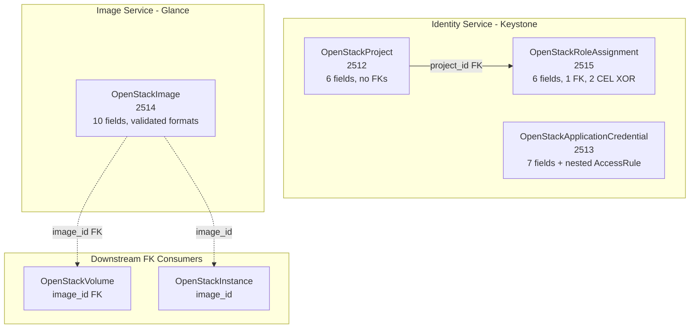

# OpenStack Phase 4: Identity and Image Deployment Components

**Date**: February 9, 2026
**Type**: Feature
**Components**: OpenStack Provider, Deployment Components (4)

## Summary

Added 4 Phase 4 OpenStack deployment components -- OpenStackProject (2512), OpenStackApplicationCredential (2513), OpenStackImage (2514), and OpenStackRoleAssignment (2515) -- completing the Identity and Images service coverage. These components enable automated tenant provisioning, scoped application credentials, custom image management, and role-based access control. Total OpenStack components: 19 of 27.

## Problem Statement / Motivation

The `openstack/project-landing-zone` InfraChart requires Identity service components to automate tenant onboarding. Without these, platform teams cannot:
- Provision new projects for development teams
- Create scoped credentials for CI/CD pipelines
- Upload and manage custom VM images
- Assign roles to users and groups on projects

Additionally, `OpenStackImage` (2514) was forward-registered in Session 8 when `OpenStackVolume` referenced it via FK -- the component itself was deferred to Phase 4.

### Pain Points

- No automated project provisioning for ARM teams
- No scoped credential management for automation
- Volume's `image_id` FK pointed to a pre-registered but unimplemented component
- No role assignment automation for landing zone workflows

## Solution / What's New

### 4 Components Created

### OpenStackProject (2512) -- 13 tests

Simple admin-level resource for Keystone project/tenant management:
- 6 spec fields: `description`, `domain_id`, `enabled` (default: true), `parent_id`, `tags`, `region`
- `enabled` uses `optional bool` with `(dev.planton.shared.options.default) = "true"` -- proto3 bool defaults to false, which would disable new projects
- FK target for `OpenStackRoleAssignment.project_id`
- Excluded `is_domain` -- creating Keystone domains via the Project API is confusing and extremely rare

### OpenStackImage (2514) -- 22 tests

Glance image management with strict format validation:
- 10 spec fields with 2 required (`container_format`, `disk_format`)
- Both format fields use `buf.validate` `in` constraints against the full Terraform provider allowlist
- 3 optional defaults: `protected` (false), `hidden` (false), `visibility` ("private")
- `image_source_url` as the only image source (excluded `local_file_path` and `web_download` -- impractical for pipeline-based IaC)
- Resolves the forward-registered enum from Session 8 -- Volume's `image_id` FK now points to a real component

### OpenStackApplicationCredential (2513) -- 15 tests

Immutable scoped credentials with nested access rules:
- 7 spec fields + nested `AccessRule` message (path, method, service)
- `method` validated to HTTP methods: `["POST", "GET", "HEAD", "PATCH", "PUT", "DELETE"]`
- `unrestricted` defaults to `false` for security
- `secret` output marked as SENSITIVE in both Pulumi and Terraform
- ALL fields are ForceNew -- documented prominently
- `project_id` is Computed (from auth scope, NOT user-configurable)

### OpenStackRoleAssignment (2515) -- 13 tests

Authorization binding with dual CEL XOR validations and FK:
- 6 spec fields: `role_id` (required), `project_id` (FK), `domain_id`, `user_id`, `group_id`, `region`
- `project_id` uses `StringValueOrRef` FK -> `OpenStackProject.status.outputs.project_id`
- 2 message-level CEL validations:
  - Scope XOR: `(has(this.project_id) ? 1 : 0) + (this.domain_id != '' ? 1 : 0) == 1`
  - Principal XOR: `(this.user_id != '' ? 1 : 0) + (this.group_id != '' ? 1 : 0) == 1`
- Mixed-type CEL checks: `has()` for StringValueOrRef message, `!= ''` for plain strings

## Implementation Details

### Enum Registration (Batch)

All 4 enums registered in a single edit to `cloud_resource_kind.proto`:

| Kind | Enum | ID Prefix |
|------|------|-----------|
| OpenStackProject | 2512 | `osprj` |
| OpenStackApplicationCredential | 2513 | `osac` |
| OpenStackImage | 2514 | `osimg` (already existed) |
| OpenStackRoleAssignment | 2515 | `osra` |

### Pulumi SDK Packages

- `identity.NewProject()` -- `openstack/identity`
- `identity.NewApplicationCredential()` -- `openstack/identity`
- `images.NewImage()` -- `openstack/images`
- `identity.NewRoleAssignment()` -- `openstack/identity`

### FK Resolution Pattern in RoleAssignment

RoleAssignment introduces a `resolveStringValueOrRef()` helper in the Pulumi module that extracts the literal value from the oneof wrapper. The middleware resolves `value_from` references before IaC runs, so the function always receives a literal value.

### Design Decision: InfraCharts Deferred

Changed from the original plan's interleaved approach. All 27 components will be completed before building any InfraCharts. Rationale: completing the full component set first ensures all FK relationships are validated before chart templates reference them.

## Benefits

- **Phase 4 COMPLETE**: All 4 identity/image components done (63 total tests)
- **19 of 27 components**: 70% of the OpenStack component set implemented
- **Forward reference resolved**: Volume's `image_id` FK now points to a real OpenStackImage component
- **Landing zone ready**: Project + RoleAssignment enable the `openstack/project-landing-zone` InfraChart
- **CI/CD credential management**: ApplicationCredential with fine-grained access rules

## Impact

- **Phase 4 COMPLETE**: 4 of 4 identity/image components done
- **19 of 27 total components** (including OpenStackKeypair)
- **Remaining**: Phase 5 (5 load balancing) + Phase 6 (4 DNS + container infra)
- **InfraChart 3 (project-landing-zone)**: All prerequisite components now exist

## Related Work

- OpenStack Phase 1-3 components: `_changelog/2026-02/2026-02-09-*`
- Forward registration of Image (2514): Session 8 (FloatingIp changelog)
- Parent project: `planton/_projects/20260209.01.openstack-planton-components/`

---

**Status**: Production Ready
**Timeline**: Single session
