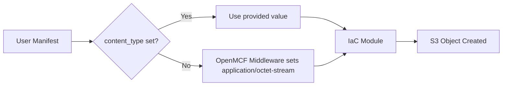

# AWS S3 Object Set Deployment Component

**Date**: February 9, 2026
**Type**: Feature
**Components**: API Definitions, Provider Framework, Pulumi CLI Integration, Terraform Module

## Summary

Added a new `AwsS3ObjectSet` deployment component that declaratively manages uploading one or more S3 objects to a target bucket. The component uses a foreign key reference to `AwsS3Bucket` for the bucket field, supports inline text and base64 binary content, and includes both Pulumi and Terraform IaC implementations with full feature parity. The `content_type` field uses the `optional` + default field option pattern so OpenMCF middleware automatically populates `application/octet-stream` when unset.

## Problem Statement / Motivation

Infrastructure tools make it easy to create S3 buckets, but populating them with initial content -- configuration files, static assets, seed data -- requires a separate step. Teams either manually upload files after deployment, write ad-hoc scripts with `aws s3 cp`, or scatter individual `aws_s3_object` Terraform resources across modules. This creates a two-phase deployment problem where infrastructure is "up" but not functional until someone remembers to upload the content.

### Pain Points

- No single declarative resource for managing a batch of S3 objects
- Bucket name coordination between bucket creation and object upload requires manual output passing
- Repetitive boilerplate when uploading multiple objects with shared tags and metadata
- Default content-type handling scattered across IaC modules instead of being centralized

## Solution / What's New

A complete `AwsS3ObjectSet` deployment component following the OpenMCF ideal state, registered as `CloudResourceKind = 224` with id prefix `s3objs`.

### Foreign Key Bucket Reference

The `bucket` field uses `StringValueOrRef` with default kind annotation, enabling both literal bucket names and component references:

```yaml
# Literal bucket name
bucket:
  value: my-existing-bucket

# Reference to AwsS3Bucket component (resolves status.outputs.bucket_id)
bucket:
  valueFrom:
    name: my-s3-bucket
```

This mirrors the pattern used by `KubernetesDeployment.namespace` referencing `KubernetesNamespace`.

### Multi-Object Batch Upload

```yaml
spec:
  bucket:
    value: my-bucket
  awsRegion: us-east-1
  tags:
    environment: production
  objects:
    - key: config/app.json
      content: '{"port": 5432}'
      contentType: application/json
    - key: index.html
      content: "<html>...</html>"
      contentType: text/html
      cacheControl: max-age=300
```

### Default Content-Type via `optional` Field Option

The `content_type` field uses the `optional` keyword with `(org.openmcf.shared.options.default) = "application/octet-stream"`. OpenMCF middleware guarantees this field is populated before IaC modules execute, eliminating defensive default handling in both Pulumi and Terraform implementations.



## Implementation Details

### Proto API (4 files)

| File | Purpose |
|------|---------|
| `spec.proto` | `AwsS3ObjectSetSpec` with FK bucket, objects list, tag inheritance |
| `stack_outputs.proto` | ETag and version ID maps per object |
| `api.proto` | KRM envelope: `aws.openmcf.org/v1` / `AwsS3ObjectSet` |
| `stack_input.proto` | Standard stack input with `AwsProviderConfig` |

Key spec design:
- `bucket`: `StringValueOrRef` with `default_kind = AwsS3Bucket`
- `objects`: repeated `AwsS3Object` with `min_items = 1` validation
- `AwsS3Object.source`: oneof `content` (text) / `content_base64` (binary) with CEL validation
- `content_type`: `optional` with default `application/octet-stream`
- Tag inheritance: set-level tags + object-level tags (object takes precedence)

### Pulumi Module (Go)

Iterates over `spec.objects`, creates `s3.BucketObjectv2` per entry. Tags merge hierarchically: labels -> set tags -> object tags. The `content_type` is always passed through via `obj.GetContentType()` since middleware guarantees population.

### Terraform Module

Uses `for_each` over objects keyed by S3 key. `aws_s3_object` resource with `content`/`content_base64` mutual exclusivity handled by Terraform's null coalescing. Tag merging via `merge()`.

### Validation Tests

13 Ginkgo tests covering:
- Positive: minimal spec, multiple objects, tags, cache control, ACL, FK references
- Negative: missing bucket, empty region, empty objects, empty key, missing content source

## Benefits

- **Declarative object management**: S3 objects managed alongside infrastructure, not as an afterthought
- **Foreign key wiring**: Bucket name resolved automatically from `AwsS3Bucket` components
- **Batch efficiency**: Single resource for N objects, reducing configuration duplication
- **Centralized defaults**: `content_type` default handled by OpenMCF middleware, not duplicated in IaC modules
- **Full IaC parity**: Both Pulumi and Terraform modules with identical capabilities

## Impact

- **New component**: `AwsS3ObjectSet` available for all OpenMCF users
- **Registry**: `CloudResourceKind = 224`, id prefix `s3objs`
- **32 files** created across proto definitions, Go stubs, TypeScript stubs, Pulumi module, Terraform module, documentation, and tests
- **13/13 tests passing**, `go build` clean

## Related Work

- `AwsS3Bucket` component -- the natural companion; creates the bucket that this component populates
- `KubernetesDeployment.namespace` FK pattern -- same `StringValueOrRef` + `default_kind` approach reused here
- `optional` + default field option pattern -- established by components like `KubernetesGhaRunnerScaleSet`

---

**Status**: Production Ready
**Timeline**: Single session
