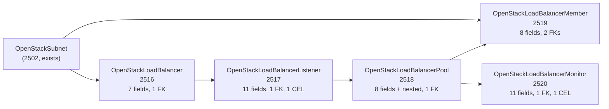

# OpenStack Phase 5: Load Balancing Deployment Components

**Date**: February 9, 2026
**Type**: Feature
**Components**: OpenStack Provider, Deployment Components (5)

## Summary

Added 5 Phase 5 OpenStack Octavia load balancing deployment components -- OpenStackLoadBalancer (2516), OpenStackLoadBalancerListener (2517), OpenStackLoadBalancerPool (2518), OpenStackLoadBalancerMember (2519), and OpenStackLoadBalancerMonitor (2520) -- completing the load balancing service coverage. These components form a linear dependency chain from VIP to health check, enabling full L4/L7 load balancing on OpenStack. Total OpenStack components: 24 of 27.

## Problem Statement / Motivation

The `openstack/developer-environment` and `openstack/kubernetes-environment` InfraCharts need load balancing for production-grade workload access. Without these components, users cannot:
- Expose applications behind a highly-available Virtual IP
- Terminate TLS at the load balancer
- Distribute traffic across multiple backend instances
- Monitor backend health and automatically drain unhealthy members

### Pain Points

- No automated Octavia LB provisioning for ARM teams
- No InfraChart-ready load balancing DAG (LB -> Listener -> Pool -> Member/Monitor)
- Manual Octavia configuration is error-prone (5 interdependent resources)

## Solution / What's New

### 5 Components Created

### OpenStackLoadBalancer (2516) -- 15 tests

Octavia load balancer root resource:
- 7 spec fields: `vip_subnet_id` (required FK), `vip_address`, `description`, `admin_state_up` (default: true), `flavor_id`, `tags`, `region`
- FK: `vip_subnet_id` -> `OpenStackSubnet.status.outputs.subnet_id`
- 6 outputs including computed `vip_address` and `vip_port_id`
- TF has AtLeastOneOf(vip_network_id, vip_subnet_id, vip_port_id) -- we expose vip_subnet_id only (80/20)

### OpenStackLoadBalancerListener (2517) -- 28 tests

First component with `map<string, string>` field and protocol-dependent CEL:
- 11 spec fields: `loadbalancer_id` (required FK), `protocol` (5 validated values), `protocol_port` (1-65535), `description`, `connection_limit`, `default_tls_container_ref`, `insert_headers` (map), `allowed_cidrs`, `admin_state_up`, `tags`, `region`
- CEL: `TERMINATED_HTTPS` requires `default_tls_container_ref` -- prevents unusable TLS listener configs
- `insert_headers` enables X-Forwarded-For -- critical for HTTP load balancing
- Excluded: SCTP, PROMETHEUS protocols, all HSTS fields, TLS ciphers/versions, timeout fields, SNI container refs

### OpenStackLoadBalancerPool (2518) -- 29 tests

Backend pool with nested SessionPersistence message:
- 8 spec fields + `SessionPersistence` nested message (type + cookie_name)
- `listener_id` FK only (ExactlyOneOf with loadbalancer_id deferred to v2 -- shared pools are an L7-policy niche)
- CEL on SessionPersistence: `cookie_name` requires `APP_COOKIE` type
- Protocols: HTTP, HTTPS, TCP, UDP, PROXY (excluded SCTP, PROXYV2)
- LB methods: ROUND_ROBIN, LEAST_CONNECTIONS, SOURCE_IP, SOURCE_IP_PORT

### OpenStackLoadBalancerMember (2519) -- 22 tests

Pool member with optional weight and dual FKs:
- 8 spec fields: `pool_id` (required FK), `address` (plain string, not FK), `protocol_port` (1-65535), `subnet_id` (optional FK), `weight` (optional int32, 0-256), `admin_state_up`, `tags`, `region`
- `address` is plain string -- backends can be VMs, containers, bare metal, or external services
- `weight` uses `optional int32` -- proto3 int32 defaults to 0 (disabled member), optional distinguishes "not set" (Octavia default 1) from "explicitly 0" (drain)

### OpenStackLoadBalancerMonitor (2520) -- 31 tests

Health monitor with combined HTTP-only CEL guard:
- 11 spec fields: `pool_id` (required FK), `type` (6 validated values), `delay`, `timeout`, `max_retries` (1-10), `max_retries_down` (optional, 1-10), `url_path`, `http_method` (9 validated values), `expected_codes`, `admin_state_up`, `region`
- Combined CEL: url_path/http_method/expected_codes require HTTP or HTTPS type
- **NO tags support** -- TF provider `openstack_lb_monitor_v2` doesn't have a tags attribute
- First component where tags are explicitly excluded with documentation explaining why

## Implementation Details

### Enum Registration (Batch)

All 5 enums registered in a single edit to `cloud_resource_kind.proto`:

| Kind | Enum | ID Prefix |
|------|------|-----------|
| OpenStackLoadBalancer | 2516 | `oslb` |
| OpenStackLoadBalancerListener | 2517 | `oslbl` |
| OpenStackLoadBalancerPool | 2518 | `oslbp` |
| OpenStackLoadBalancerMember | 2519 | `oslbm` |
| OpenStackLoadBalancerMonitor | 2520 | `oslbmon` |

### Pulumi SDK Package

All 5 use `loadbalancer` package from `github.com/pulumi/pulumi-openstack/sdk/v5/go/openstack/loadbalancer`:
- `loadbalancer.NewLoadBalancer()`
- `loadbalancer.NewListener()`
- `loadbalancer.NewPool()` with `loadbalancer.PoolPersistenceArgs`
- `loadbalancer.NewMember()` with `PoolId` as a required argument
- `loadbalancer.NewMonitor()`

### TF Resources

- `openstack_lb_loadbalancer_v2`
- `openstack_lb_listener_v2`
- `openstack_lb_pool_v2` with `listener_id` (NOT `loadbalancer_id`)
- `openstack_lb_member_v2` with `pool_id`
- `openstack_lb_monitor_v2` (NO tags)

### Proto Lint Fix: `has(this)` Invalid in Field-Level CEL

Discovered during `make protos` that `has(this)` is invalid in field-level CEL expressions. For `optional int32` fields, buf.validate automatically skips field-level CEL when the field is unset, making the guard unnecessary. Fixed by removing `!has(this) ||` prefix from weight and max_retries_down validations.

### Provider Source References

Both Terraform and Pulumi OpenStack providers are now cloned locally in the workspace:
- TF: `~/scm/github.com/terraform-provider-openstack/terraform-provider-openstack/`
- Pulumi: `~/scm/github.com/pulumi/pulumi-openstack/`

This eliminates the need for internet lookups when building components.

## Benefits

- **Phase 5 COMPLETE**: All 5 load balancing components done (125 total tests)
- **24 of 27 components**: 89% of the OpenStack component set implemented
- **Full LB chain**: LB -> Listener -> Pool -> Member/Monitor as InfraChart-ready DAG
- **TLS termination ready**: TERMINATED_HTTPS with Barbican container ref support
- **HTTP-aware**: X-Forwarded-For via insert_headers, IP whitelisting via allowed_cidrs
- **Health monitoring**: HTTP, HTTPS, PING, TCP, TLS-HELLO, UDP-CONNECT check types

## Impact

- **Phase 5 COMPLETE**: 5 of 5 load balancing components done
- **24 of 27 total components** (including OpenStackKeypair)
- **Remaining**: Phase 6 (2 DNS + 2 container infra = 4 components)
- **InfraChart 1 (developer-environment)**: Can now include load balancing
- **InfraChart 2 (kubernetes-environment)**: Load balancing prerequisites complete

## Related Work

- OpenStack Phase 1-4 components: `_changelog/2026-02/2026-02-09-*`
- Provider repos cloned: terraform-provider-openstack, pulumi-openstack
- Parent project: `planton/_projects/20260209.01.openstack-planton-components/`

---

**Status**: Production Ready
**Timeline**: Single session
