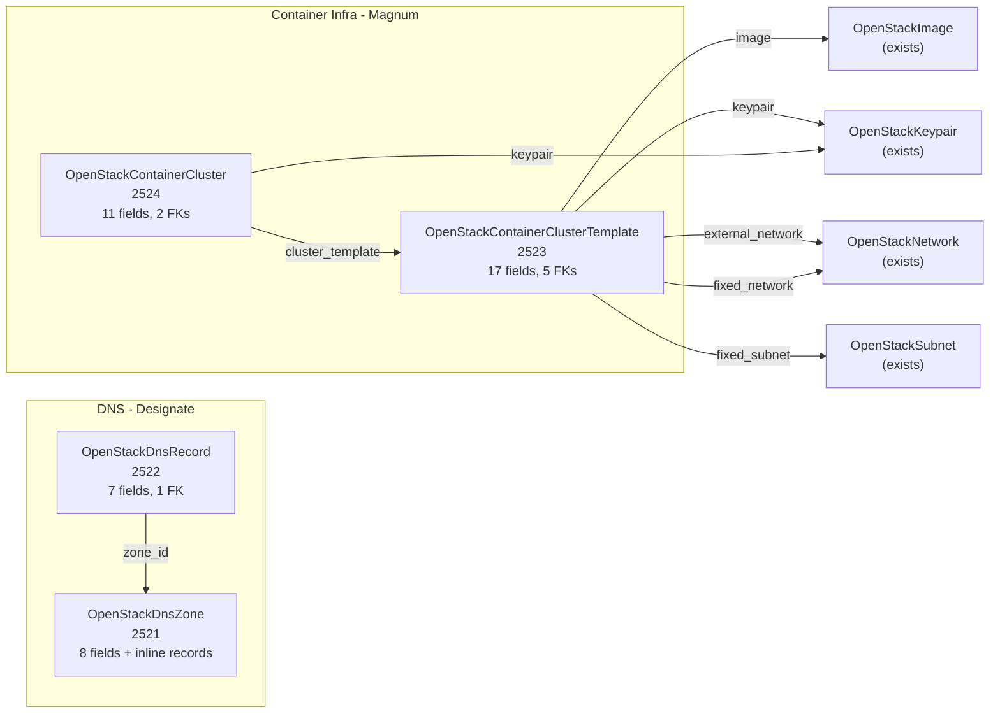

# OpenStack Phase 6: DNS + Container Infra Deployment Components

**Date**: February 9, 2026
**Type**: Feature
**Components**: OpenStack Provider, Deployment Components (4)

## Summary

Added 4 Phase 6 OpenStack deployment components -- OpenStackDnsZone (2521), OpenStackDnsRecord (2522), OpenStackContainerClusterTemplate (2523), and OpenStackContainerCluster (2524) -- completing all 27 planned OpenStack deployment components. DNS components follow the established zone-with-inline-records pattern from GCP/AWS/Azure. Container Infra components enable Kubernetes-on-OpenStack via Magnum with full kubeconfig output support. Total OpenStack components: 27 of 27 (100%).

## Problem Statement / Motivation

The `openstack/kubernetes-environment` InfraChart needs Magnum cluster templates and clusters for Kubernetes deployment on OpenStack. DNS zone management is needed for all three planned InfraCharts (developer-environment, kubernetes-environment, project-landing-zone). Without these components, Phani at ARM cannot:
- Create DNS zones and records for service discovery and external access
- Deploy Kubernetes clusters on OpenStack via Magnum
- Retrieve kubeconfig credentials for cluster access

### Pain Points

- No automated DNS zone/record management for ARM teams
- No Kubernetes-on-OpenStack provisioning via Planton
- Manual Magnum cluster creation is error-prone (template + cluster + kubeconfig)

## Solution / What's New

### 4 Components Created

### OpenStackDnsZone (2521) -- 25 tests

Multi-resource IaC pattern (zone + inline records):
- 8 spec fields: `domain_name` (required, domain regex), `email`, `description`, `ttl`, `type` (PRIMARY/SECONDARY), `masters` (CEL guard for SECONDARY), `records` (inline), `region`
- Nested `OpenStackDnsRecord` message with local `RecordType` enum (13 types: A through NAPTR)
- `domain_name` field with explicit domain validation regex -- separate from `metadata.name` because DNS values have different validation rules
- CEL: SECONDARY zones require masters; type validation when set
- TF: `openstack_dns_zone_v2` + `openstack_dns_recordset_v2` (for_each keyed by type+name)
- Pulumi: `dns.NewZone()` + `dns.NewRecordSet()` per inline record

### OpenStackDnsRecord (2522) -- 24 tests

Standalone DNS record for DAG-visible InfraChart wiring:
- 7 spec fields: `zone_id` (required FK), `record_name` (required, FQDN regex with trailing dot), `type` (required, local RecordType enum), `values` (required), `ttl`, `description`, `region`
- Local `RecordType` enum with 13 DNS record types
- Pulumi uses `spec.Type.String()` -- never hardcoded type strings
- `record_name` field aligns with `name` field on GcpDnsRecord and AwsRoute53DnsRecord
- `values` field name aligns with GCP/AWS/Azure DNS record patterns

### OpenStackContainerClusterTemplate (2523) -- 21 tests

Magnum cluster blueprint with 5 StringValueOrRef FKs:
- 17 spec fields covering COE, image, keypair, networking, flavors, labels, and cluster settings
- FKs: `image` (required, -> Image), `keypair` (-> Keypair), `external_network` (-> Network), `fixed_network` (-> Network), `fixed_subnet` (-> Subnet)
- Added `floating_ip_enabled`, `master_lb_enabled`, `tls_disabled` beyond original plan -- critical for real K8s deployments
- Notable: NO ForceNew fields in TF (all updatable via PATCH) -- unusual among OpenStack resources
- Field renames from plan: `keypair` (not `keypair_id`), `external_network` (not `external_network_id`)

### OpenStackContainerCluster (2524) -- 17 tests

Magnum Kubernetes cluster with sensitive kubeconfig outputs:
- 11 spec fields with 2 FKs: `cluster_template` (required, -> Template), `keypair` (-> Keypair)
- 12 outputs including 5 kubeconfig fields marked sensitive
- Almost all fields are ForceNew; only `node_count` and `cluster_template` are updatable
- Kubeconfig outputs: `kubeconfig_raw` (full YAML), `kubeconfig_host`, `kubeconfig_cluster_ca_cert`, `kubeconfig_client_cert`, `kubeconfig_client_key`
- Pulumi exports kubeconfig fields via `pulumi.ToSecret()` for credential protection
- TF outputs use `sensitive = true` for kubeconfig fields

## Implementation Details

### Enum Registration (Batch)

All 4 enums registered in `cloud_resource_kind.proto`:

| Kind | Enum | ID Prefix |
|------|------|-----------|
| OpenStackDnsZone | 2521 | `osdz` |
| OpenStackDnsRecord | 2522 | `osdr` |
| OpenStackContainerClusterTemplate | 2523 | `oscct` |
| OpenStackContainerCluster | 2524 | `oscc` |

### DNS Pattern Alignment

The DNS components follow the established cross-provider pattern:
- **Zone with inline records**: Same as GcpDnsZone, AwsRoute53Zone, AzureDnsZone
- **Standalone record**: Same as GcpDnsRecord, AwsRoute53DnsRecord
- **Each declares its own RecordType enum**: No shared enum between zone and record
- **`values` field naming**: Aligns with GCP/AWS/Azure (not `records`)
- **`domain_name` on zone, `record_name` on record**: Explicit fields with domain/FQDN regex validation

### Pulumi SDK Packages

- DNS: `github.com/pulumi/pulumi-openstack/sdk/v5/go/openstack/dns` (NewZone, NewRecordSet)
- Container Infra: `github.com/pulumi/pulumi-openstack/sdk/v5/go/openstack/containerinfra` (NewClusterTemplate, NewCluster)

### TF Resources

- `openstack_dns_zone_v2` + `openstack_dns_recordset_v2`
- `openstack_containerinfra_clustertemplate_v1`
- `openstack_containerinfra_cluster_v1`

## Benefits

- **Phase 6 COMPLETE**: All 4 DNS + Container Infra components done (87 total tests)
- **27 of 27 components**: 100% of the OpenStack component set implemented
- **DNS zone with inline records**: Same UX as GCP/AWS/Azure zones
- **Full Kubernetes-on-OpenStack**: Template -> Cluster -> kubeconfig pipeline
- **Sensitive credential handling**: kubeconfig outputs protected in both Pulumi and TF
- **Cross-provider consistency**: DNS patterns align with GCP, AWS, Azure conventions

## Impact

- **Phase 6 COMPLETE**: 4 of 4 DNS + Container Infra components done
- **27 of 27 total components** (including OpenStackKeypair)
- **All 3 InfraCharts unblocked**: developer-environment, kubernetes-environment, project-landing-zone
- **InfraChart 2 (kubernetes-environment)**: Full Magnum template -> cluster -> kubeconfig chain ready

## Related Work

- OpenStack Phase 1-5 components: `_changelog/2026-02/2026-02-09-*`
- Provider repos: terraform-provider-openstack, pulumi-openstack (cloned locally)
- Parent project: `planton/_projects/20260209.01.openstack-openmcf-components/`

---

**Status**: Production Ready
**Timeline**: Single session
