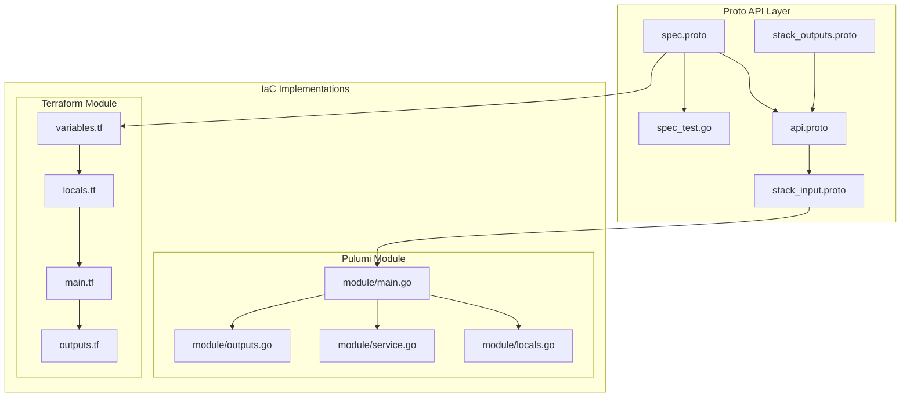

# KubernetesService Deployment Component

**Date**: February 10, 2026
**Type**: Feature
**Components**: API Definitions, Protobuf Schemas, Kubernetes Provider, Pulumi CLI Integration, Provider Framework

## Summary

Added the `KubernetesService` deployment component to Planton, providing declarative management of Kubernetes Service resources as standalone deployment units. The component includes complete proto API definitions with validation, dual IaC implementations (Pulumi and Terraform) with feature parity, comprehensive documentation, and 29 passing validation tests. This is the first "config" category Kubernetes primitive alongside `KubernetesNamespace`.

## Problem Statement / Motivation

While workload components like `KubernetesDeployment` and `KubernetesStatefulSet` automatically create Services for their pods, there was no way to manage standalone Kubernetes Services through Planton. This left several real-world use cases unaddressed.

### Pain Points

- No way to create **ExternalName services** to proxy external DNS endpoints (e.g., RDS instances, third-party APIs)
- No mechanism for **services without selectors** pointing to non-Kubernetes backends
- **Headless services** for StatefulSets managed outside Planton had to be created manually
- **LoadBalancer/NodePort services** for existing cluster workloads required out-of-band kubectl or Helm management
- Services targeting pods managed by Helm charts, operators, or other tools had no Planton integration

## Solution / What's New

A complete deployment component following the Planton forge process (19 steps), registered as `KubernetesService = 849` in the cloud resource kind registry.

### Component Architecture

### Supported Service Types

| Type | Description | Use Case |
|------|-------------|----------|
| ClusterIP | Internal cluster IP | Inter-service communication (default) |
| NodePort | Static port on nodes | Dev/test, bare metal clusters |
| LoadBalancer | Cloud provider LB | Production external access |
| ExternalName | DNS CNAME alias | Proxying to external endpoints |
| Headless | clusterIP: None | StatefulSet DNS, custom discovery |

## Implementation Details

### Proto Schema (80/20 Scoping)

The `KubernetesServiceSpec` exposes 13 fields covering the 80% use case:

- **Service identity**: `namespace`, `name`, `labels`, `annotations`
- **Routing**: `selector`, `ports`, `type`
- **Advanced**: `headless`, `external_dns_name`, `external_traffic_policy`, `session_affinity`, `load_balancer_source_ranges`

Three nested enums (`KubernetesServiceType`, `KubernetesServiceExternalTrafficPolicy`, `KubernetesServiceSessionAffinity`) and one port-level enum (`KubernetesServiceProtocol`) follow the Planton lowercase convention.

The `protocol` field on `KubernetesServicePort` uses the `(dev.planton.shared.options.default) = "TCP"` pattern so Planton middleware handles the default centrally.

### Cross-Field Validations (CEL)

Three message-level CEL validations catch configuration errors at schema time:

1. **`external_name_requires_dns_name`**: ExternalName type requires `external_dns_name` to be set
2. **`headless_incompatible_with_nodeport_loadbalancer`**: Headless cannot be combined with NodePort or LoadBalancer
3. **`non_external_name_requires_ports`**: Non-ExternalName services must have at least one port

### Naming Decision: `external_dns_name`

The field was named `external_dns_name` instead of `external_name` because protobuf uses C++ scoping rules where enum values exist in the enclosing scope. The enum value `external_name` in `KubernetesServiceType` would conflict with a field of the same name. The chosen name is also more descriptive.

### Pulumi Module

The module follows the standard Planton pattern:

- **`locals.go`**: Maps protobuf enums to Kubernetes API strings (e.g., `cluster_ip` -> `"ClusterIP"`), merges standard labels
- **`service.go`**: Creates `kubernetes.core/v1.Service` with conditional configuration based on service type
- **`outputs.go`**: Exports 6 stack outputs including cluster IP, LB ingress, and internal DNS name

### Terraform Module

Feature parity with Pulumi:

- **`locals.tf`**: Lookup maps for enum-to-string conversion, computed labels/annotations
- **`main.tf`**: `kubernetes_service_v1` resource with dynamic port blocks
- **`outputs.tf`**: 6 outputs matching `KubernetesServiceStackOutputs`

## Benefits

- **Standalone service management**: Services can now be managed independently of workload lifecycle
- **Schema validation**: Configuration errors caught at validation time, not at deployment time
- **Cloud-agnostic LB config**: Cloud-specific annotations are just manifest fields, abstracted behind a consistent interface
- **Dual IaC support**: Same manifest deploys with either Pulumi or Terraform
- **GitOps ready**: Services defined in version control, deployed through CI/CD pipelines

## Impact

### Users
- Can now manage all four Kubernetes Service types plus headless through Planton manifests
- ExternalName services enable clean integration with external databases and APIs
- Cloud-provider LB annotations (AWS NLB, GCP NEG, Azure ILB) are documented in examples

### Developers
- Component follows the established forge pattern -- consistent with all other components
- 29 validation tests provide a safety net for future schema changes
- Comprehensive research documentation captures design rationale

## Files Created

| Category | Count | Key Files |
|----------|-------|-----------|
| Proto definitions | 4 | `spec.proto`, `api.proto`, `stack_input.proto`, `stack_outputs.proto` |
| Generated stubs | 4 | `*.pb.go` files |
| Tests | 1 | `spec_test.go` (29 tests) |
| Pulumi module | 4 | `main.go`, `locals.go`, `service.go`, `outputs.go` |
| Pulumi entrypoint | 3 | `main.go`, `Pulumi.yaml`, `Makefile` |
| Terraform module | 5 | `provider.tf`, `variables.tf`, `locals.tf`, `main.tf`, `outputs.tf` |
| Documentation | 7 | README, examples, research docs, Pulumi/TF READMEs, overview, debug.sh |
| Supporting | 2 | `BUILD.bazel`, `iac/hack/manifest.yaml` |
| Registry | 1 | `cloud_resource_kind.proto` (modified) |
| **Total** | **31** | |

## Related Work

- **KubernetesNamespace**: The other "config" category Kubernetes primitive, used as the reference implementation for this component
- **KubernetesDeployment / KubernetesStatefulSet**: Workload components that auto-create Services; this component handles the standalone case
- **KubernetesSecret**: Planned as a companion "config" category component on the same branch (`feat/kubernetes/service-and-secret-components`)

---

**Status**: Production Ready
**Timeline**: Single session implementation following the 19-step forge process
