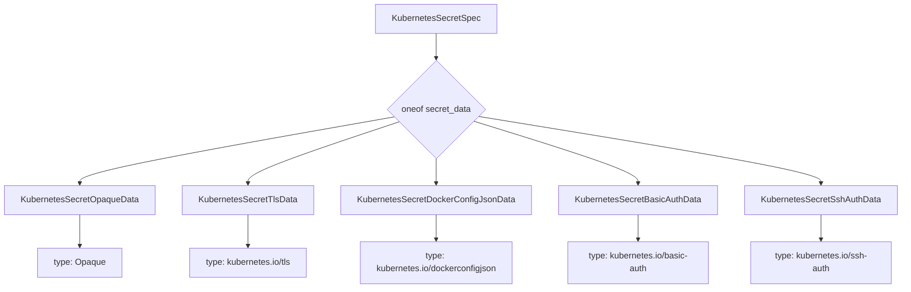
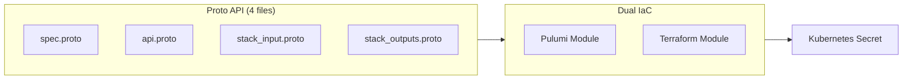

# Add KubernetesSecret Deployment Component

**Date**: February 10, 2026
**Type**: Feature
**Components**: API Definitions, Kubernetes Provider, Pulumi CLI Integration, Terraform Module

## Summary

Added the **KubernetesSecret** deployment component to OpenMCF, implementing a "Secret-as-a-Service" pattern with type-safe protobuf variants for all five common Kubernetes secret types: Opaque, TLS, DockerConfigJson, BasicAuth, and SSHAuth. The component includes complete proto API definitions, 27 validation tests, dual IaC implementations (Pulumi + Terraform), and comprehensive documentation. Registered as `KubernetesSecret = 850` in the Kubernetes provider range.

## Problem Statement / Motivation

Kubernetes Secrets are foundational to every cluster, yet managing them declaratively with proper typing and validation requires boilerplate across IaC tools. Users creating TLS secrets must manually ensure `tls.crt` and `tls.key` keys are present; Docker registry secrets require constructing `.dockerconfigjson` JSON by hand; and there's no schema-level enforcement that prevents mistyped keys or missing required fields.

### Pain Points

- **No type safety**: Terraform and Pulumi both use untyped `data` maps for secret values -- mistyped keys silently create broken secrets
- **No schema validation**: A TLS secret missing its private key only fails at pod startup, not at plan/preview time
- **DockerConfigJson construction**: Users must manually construct the nested JSON structure for registry credentials
- **No declarative lifecycle**: Many teams resort to `kubectl create secret` which is imperative and has no state tracking
- **Complementary to KubernetesExternalSecrets**: ESO handles secrets from external stores; there was no OpenMCF component for secrets created directly from literal values

## Solution / What's New

A complete deployment component at `apis/org/openmcf/provider/kubernetes/kubernetessecret/v1/` following the full forge workflow (19 steps).

### Type-Safe Secret Data via Protobuf `oneof`

The core design uses a protobuf `oneof` with five distinct sub-messages, each modeling a Kubernetes secret type:

Each variant has typed, validated fields:

| Variant | Required Fields | Kubernetes Type |
|---------|----------------|-----------------|
| `opaque` | `data` map (min 1 entry) | `Opaque` |
| `tls` | `tls_crt`, `tls_key` | `kubernetes.io/tls` |
| `docker_config_json` | `registry_server`, `username`, `password` | `kubernetes.io/dockerconfigjson` |
| `basic_auth` | `username`, `password` | `kubernetes.io/basic-auth` |
| `ssh_auth` | `ssh_private_key` | `kubernetes.io/ssh-auth` |

### Component Architecture

## Implementation Details

### Proto API Definitions

- **`spec.proto`**: 188 lines defining `KubernetesSecretSpec` with `oneof secret_data` and 5 type-safe sub-messages. Includes `buf.validate` rules (DNS name validation, required fields per type) and a message-level CEL validation enforcing that at least one variant is set. The `namespace` field defaults to `"default"` via `(org.openmcf.shared.options.default)`.

- **`api.proto`**: KRM envelope with `api_version = "kubernetes.openmcf.org/v1"` and `kind = "KubernetesSecret"`.

- **`stack_outputs.proto`**: Three outputs: `secret_name`, `secret_namespace`, `secret_type`.

- **`stack_input.proto`**: Standard `target` + `provider_config` pattern matching KubernetesNamespace.

### Validation Tests

27 Ginkgo/Gomega tests (10 positive, 17 negative) covering:
- All 5 secret type variants (valid specs)
- DNS name validation (uppercase, dots, leading/trailing hyphens, length)
- Namespace validation (uppercase, length)
- Missing secret data (oneof enforcement)
- Empty data maps (Opaque with no entries)
- Missing required fields per type (TLS without key, DockerConfigJson without server, etc.)

### Pulumi Module

- **`locals.go`**: Core type mapping engine -- inspects the protobuf `oneof` variant and translates to Kubernetes secret type string + `stringData` map. Includes `buildDockerConfigJSON()` which constructs the `.dockerconfigjson` JSON with base64 auth token from structured fields.
- **`secret.go`**: Creates `kubernetes.core.v1.Secret` with computed type, stringData, labels, annotations, and immutability flag.
- **`main.go`**: Standard orchestrator: init locals, create provider, create secret, export outputs.
- **`outputs.go`**: Exports `secret_name`, `secret_namespace`, `secret_type`.

### Terraform Module

- **`variables.tf`**: Mirrors the proto spec with optional object blocks per secret type variant.
- **`locals.tf`**: Determines secret type and constructs data map based on which variable block is non-null. Uses `base64encode()` for DockerConfigJson auth token.
- **`main.tf`**: Single `kubernetes_secret_v1` resource.

### Additional Changes

- **Registry**: Added `KubernetesSecret = 850` with `id_prefix: "k8ssec"` to `cloud_resource_kind.proto`.
- **KubernetesService fixes**: Added missing BUILD.bazel files, minor fixes to locals.go, outputs.go, and spec_test.go from the previous KubernetesService commit.
- **Makefile cleanup**: Removed obsolete `update-deps` targets from 15 Kubernetes component Pulumi Makefiles.

## Benefits

- **Schema-level type safety**: Mistyped keys and missing fields are caught at validation time, not at pod startup
- **Structured DockerConfigJson**: Users provide `registry_server`, `username`, `password` -- the IaC module constructs the JSON
- **Immutable secrets**: First-class support for Kubernetes 1.21+ immutable secrets
- **Dual IaC parity**: Both Pulumi (Go) and Terraform (HCL) implementations with identical behavior
- **27 validation tests**: Comprehensive coverage of all types and edge cases
- **Production documentation**: README, examples (8 scenarios), and research deep-dive

## Impact

- **Platform engineers**: Can now manage Kubernetes Secrets declaratively with proper typing through OpenMCF
- **End users**: Get IDE autocompletion and validation for secret data fields instead of raw string maps
- **CI/CD pipelines**: Can validate secret manifests before deployment via `openmcf validate`
- **Complements KubernetesExternalSecrets (enum 829)**: ExternalSecrets syncs from external stores; KubernetesSecret creates from literal values

## Related Work

- **KubernetesService** (enum 849): Sibling component on the same branch (`feat/kubernetes/service-and-secret-components`)
- **KubernetesNamespace** (enum 836): Primary reference pattern for this implementation
- **kubernetes_secret.proto** (shared utility): Existing `KubernetesSecretKeyRef` and `KubernetesSensitiveValue` types for *referencing* secrets -- complementary to this component which *creates* them

---

**Status**: Production Ready
**Timeline**: Single session, full forge workflow (19 steps)
