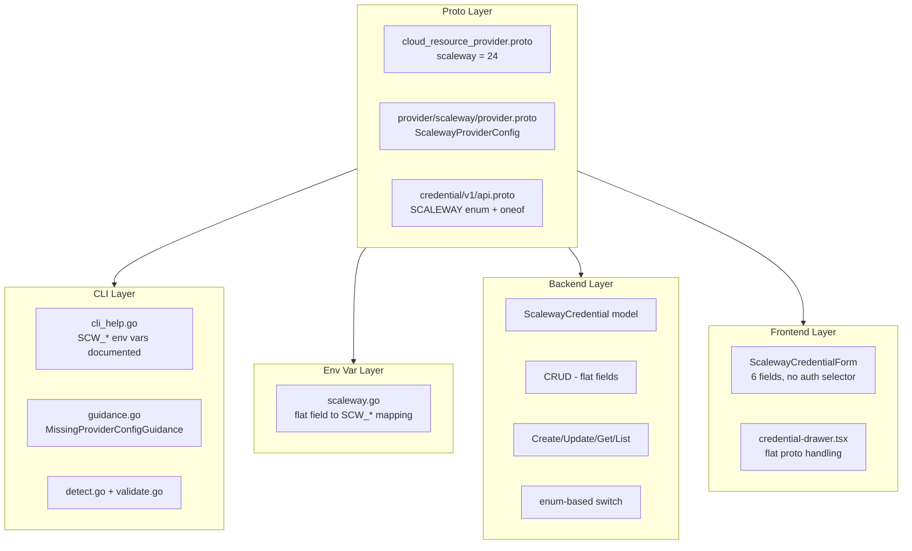
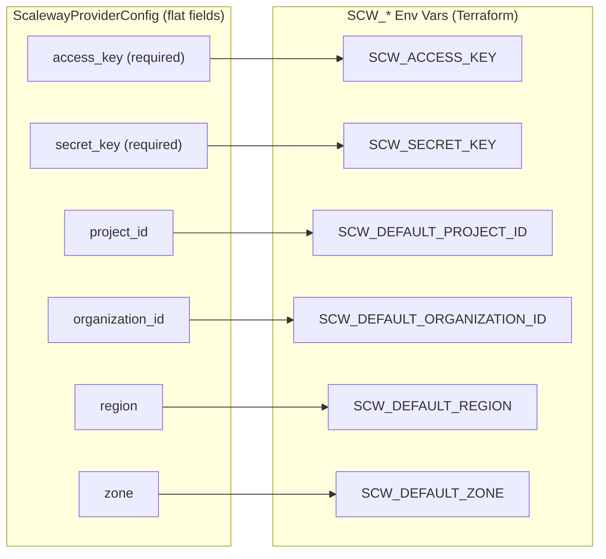

# Scaleway Provider Integration

**Date**: February 12, 2026
**Type**: Feature
**Components**: Provider Framework, API Definitions, CLI Integration, Backend Services, Frontend Credentials

## Summary

Added Scaleway as provider #24 to OpenMCF, enabling users to manage Scaleway cloud credentials through the platform. The integration spans all 6 system layers -- proto definitions, CLI guidance, stack input / env var processing, provider detection, backend credential CRUD, and frontend credential forms. Scaleway's flat access key / secret key authentication model maps cleanly to 6 `SCW_*` environment variables without the oneof complexity required by OpenStack.

## Problem Statement / Motivation

OpenMCF supports 13 cloud providers but had no Scaleway support. Organizations using Scaleway's European cloud infrastructure could not store credentials, use the unified `--provider-config` flag, or leverage credential auto-resolution for Scaleway deployments.

### Pain Points

- No `scaleway` entry in the `CloudResourceProvider` enum
- No credential storage or management for Scaleway
- No environment variable mapping for the Terraform Scaleway provider
- No frontend UI for capturing Scaleway credentials
- No CLI guidance for missing or invalid Scaleway credentials

## Solution / What's New

Implemented comprehensive Scaleway provider support following the established provider patterns. Unlike OpenStack's multi-method authentication (which uses a proto `oneof`), Scaleway uses a simple flat credential model similar to AWS/Civo, resulting in a cleaner, more straightforward integration.

### Architecture



### Authentication Model



## Implementation Details

### 1. Proto Definitions

**Provider registration** (`cloud_resource_provider.proto`):

```protobuf
scaleway = 24 [(provider_meta) = {
  group: "scaleway.openmcf.org"
  display_name: "Scaleway"
}];
```

**Provider config** (`provider/scaleway/provider.proto`): `ScalewayProviderConfig` with 6 flat fields -- `access_key`, `secret_key`, `project_id`, `organization_id`, `region`, `zone`. The `access_key` and `secret_key` fields use `buf.validate.field.required`.

**Credential API** (`credential/v1/api.proto`): Added `SCALEWAY = 7` to `CredentialProvider` enum and `scaleway = 14` to the `CredentialProviderConfig` oneof.

### 2. CLI Guidance

The `cli_help.go` constants drive terminal output quality. `EnvironmentVariablesHelp` presents required and optional variables with clear grouping. `ConfigFileExample` shows the recommended YAML format with optional fields commented.

### 3. Env Var Mapping

`loadScalewayEnvVars` maps flat proto fields directly to `SCW_*` environment variables. No oneof switching needed -- each non-empty field maps to exactly one env var.

### 4. Backend Credential Management

`ScalewayCredential` model stores 6 flat fields in MongoDB. No `AuthMethod` discriminator needed (unlike OpenStack). The service layer validates that `access_key` and `secret_key` are provided, with clean proto-to-model and model-to-proto conversions.

### 5. Frontend Credential Form

`ScalewayCredentialForm` renders 6 input fields. Access Key and Secret Key are required, the rest are optional. No auth method selector needed, unlike OpenStack's 3-method selector.

### 6. Catalog Documentation

Added Scaleway provider page at `/docs/catalog/scaleway` with provider logo SVG and entry in the main catalog index.

## Files Changed

| Layer | New Files | Modified Files |
|-------|-----------|----------------|
| Proto | `provider/scaleway/provider.proto` | `cloud_resource_provider.proto`, `credential/v1/api.proto` |
| Provider | `provider/scaleway/cli_help.go`, `BUILD.bazel` | -- |
| Stack Input | `providerenvvars/scaleway.go` | `loader.go` |
| Provider Detect | -- | `detect.go`, `guidance.go`, `validate.go` |
| Backend | -- | `credential.go`, `credential_repo.go`, `credential_service.go`, `credential_resolver.go` |
| Frontend | `scaleway.tsx` | `types.ts`, `credential-drawer.tsx`, `index.ts`, `utils.ts` |
| Catalog | `scaleway/index.md`, `scaleway.svg` | `catalog/index.md` |
| Generated | `provider.pb.go`, `provider_pb.ts` | `api.pb.go`, `api_pb.ts`, `cloud_resource_provider.pb.go`, `cloud_resource_provider_pb.ts` |

**Total**: 29 files, ~500 insertions

## Benefits

### For Users

- **Credential management**: Store Scaleway credentials securely through the web UI
- **CLI integration**: Pass credentials via the unified `-p` / `--provider-config` flag
- **Simple auth model**: Only access key and secret key required
- **Rich guidance**: Clear terminal output with environment variable export commands when credentials are missing

### For Developers

- **Pattern consistency**: Follows established provider patterns across all layers
- **Foundation for resources**: Ready for Scaleway resource kinds in future phases
- **Clean model**: Flat credential model -- no oneof complexity, no auth method discriminator

## Impact

### Direct

- Scaleway appears in the credential provider dropdown in the web UI
- The `-p` flag accepts Scaleway provider config files
- Backend API supports Scaleway credential CRUD
- CLI guidance displays Scaleway-specific help

### Future Work Enabled

- Scaleway resource kinds (CloudResourceKind range to be assigned)
- Instance, VPC, Kubernetes, Load Balancer, DNS, and other Scaleway service resources
- Terraform IaC modules wrapping the terraform-provider-scaleway

## Related Work

- [2026-02-08 OpenStack Provider Integration](2026-02-08-215116-openstack-provider-integration.md) -- Pattern reference for this implementation

---

**Status**: Production Ready
**Build**: CLI `go build` passes, Backend `go build` passes, Frontend proto stubs generated, no linter errors
