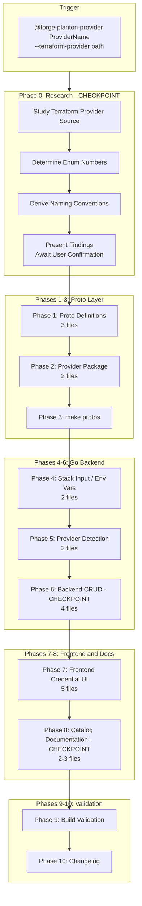

# Forge Planton Provider Rule

**Date**: February 12, 2026
**Type**: Feature
**Components**: Provider Framework, Cursor Rules, Developer Experience

## Summary

Created `forge-planton-provider.mdc`, a comprehensive Cursor orchestrator rule that automates the entire process of adding a new cloud provider to Planton. The rule encodes institutional knowledge from 15 existing provider integrations into an 11-phase, interactive workflow that spans all 6 system layers -- proto definitions, CLI guidance, stack input / env var processing, provider detection, backend credential CRUD, and frontend credential forms -- plus catalog documentation, build validation, and changelog generation.

## Problem Statement / Motivation

Adding a new cloud provider to Planton requires modifying ~25-30 files across 6 system layers. Until now, this process relied on tribal knowledge: the developer had to study existing provider changelogs (Auth0, OpenStack, Scaleway), manually trace the patterns through proto files, Go backend code, TypeScript frontend code, and documentation -- then replicate those patterns for the new provider. Each integration took multiple hours and carried risk of missing a switch case, forgetting a file, or introducing inconsistencies.

### Pain Points

- No codified process -- each new provider integration required re-discovering the full file set
- Easy to miss touch points: a forgotten switch case in `credential_service.go` or `guidance.go` would surface only at runtime
- The Terraform provider's authentication model had to be manually researched and classified (flat vs. multi-method oneof)
- Enum number assignment for `CloudResourceProvider`, `CredentialProvider`, and the `CredentialProviderConfig` oneof required manual counting
- No interactive checkpoints -- developers would make assumptions about auth models or field names and discover mistakes late

## Solution / What's New

A single, self-contained `.mdc` rule that an AI agent follows step-by-step, with explicit interactive checkpoints where the human confirms critical decisions before code is written.

### Architecture

### Key Design Decisions

**Self-contained rule (no sub-rules):** Unlike `forge-planton-component.mdc` which orchestrates 19 sub-rules in `flow/`, the provider forge keeps all phase instructions inline. Rationale: each provider-integration phase is pattern-following (add a case here, create a file matching this template), while component forging phases are individually complex (generating Pulumi modules, Terraform HCL, research docs). A single file is easier to maintain and review.

**3 interactive checkpoints:** The rule pauses at Phase 0 (research confirmation), Phase 6 (backend model confirmation), and Phase 8 (icon/documentation). This prevents the AI from brute-forcing through assumptions on authentication models, field names, or enum numbers.

**Auth model branching:** The rule classifies providers as "flat" (single auth method, like Scaleway/Auth0/AWS) or "multi-method oneof" (multiple mutually exclusive auth strategies, like OpenStack). This classification propagates through all phases -- affecting proto structure, env var loader logic, backend model (with/without auth method discriminator), and frontend form (with/without auth method selector). An explicit decision guide defaults to flat when uncertain.

## Implementation Details

### Rule Structure (791 lines)

| Section | Lines | Purpose |
|---------|-------|---------|
| Header (Purpose, Role, What Forge Creates) | ~30 | Context and deliverable checklist |
| Usage | ~15 | Invocation syntax and argument docs |
| Phase 0: Research | ~40 | Terraform provider study + enum discovery |
| Phase 1: Proto Definitions | ~40 | provider.proto, cloud_resource_provider.proto, credential api.proto |
| Phase 2: Provider Package | ~60 | cli_help.go template + BUILD.bazel template |
| Phase 3: Proto Generation | ~20 | `make protos` + verification |
| Phase 4: Stack Input / Env Vars | ~30 | Env var loader + loader.go switch |
| Phase 5: Provider Detection | ~25 | guidance.go (4 switches) + validate.go |
| Phase 6: Backend CRUD | ~70 | Model, repo, service, resolver patterns |
| Phase 7: Frontend UI | ~100 | Form component, types, drawer, index, utils |
| Phase 8: Catalog Documentation | ~40 | Provider page, icon, catalog index |
| Phase 9: Build Validation | ~25 | Go build commands + common error fixes |
| Phase 10: Changelog | ~60 | Changelog template with mermaid diagrams |
| Reference Files | ~45 | Canonical pattern files per layer |
| Auth Model Decision Guide | ~15 | Flat vs. multi-method classification |
| Notes | ~10 | Runtime constraints and gotchas |

### Pattern References

The rule points to specific existing files as canonical templates for every phase:

- **Flat model reference**: Scaleway (provider.proto, cli_help.go, scaleway.go env vars, scaleway.tsx form)
- **Multi-method model reference**: OpenStack (provider.proto with oneof, openstack.go env vars with switch, openstack.tsx form with auth selector)
- **Changelog references**: All 3 provider integration changelogs (Auth0, OpenStack, Scaleway)

### Files Changed Table Template

The rule instructs the agent to produce a files-changed table matching this pattern from the Scaleway changelog:

| Layer | New Files | Modified Files |
|-------|-----------|----------------|
| Proto | `provider/<provider>/provider.proto` | `cloud_resource_provider.proto`, `credential/v1/api.proto` |
| Provider | `provider/<provider>/cli_help.go`, `BUILD.bazel` | -- |
| Stack Input | `providerenvvars/<provider>.go` | `loader.go` |
| Provider Detect | -- | `detect.go`, `guidance.go`, `validate.go` |
| Backend | -- | `credential.go`, `credential_repo.go`, `credential_service.go`, `credential_resolver.go` |
| Frontend | `<provider>.tsx` | `types.ts`, `credential-drawer.tsx`, `index.ts`, `utils.ts` |
| Catalog | `<provider>/index.md`, `<provider>.svg` | `catalog/index.md` |
| Generated | `provider.pb.go`, `provider_pb.ts` | `api.pb.go`, `api_pb.ts`, `cloud_resource_provider.pb.go`, `cloud_resource_provider_pb.ts` |

## Benefits

### For the Platform Operator (User)

- **One command to add a provider**: `@forge-planton-provider Hetzner --terraform-provider terraform-provider-hcloud` replaces hours of manual file tracing
- **No missed files**: The rule tracks all 25-30 files systematically across all 6 layers
- **Interactive safety**: Critical decisions (auth model, enum numbers, field names) are confirmed before code is written
- **Consistent quality**: Every new provider follows the exact same patterns as existing providers

### For the Codebase

- **Reduced technical debt**: No more providers with subtly different patterns because a developer forgot a step
- **Pattern enforcement**: The rule references canonical files, ensuring new code matches existing conventions
- **Build validation**: Phase 9 catches integration errors before they reach runtime
- **Documentation built-in**: Catalog pages, CLI help, and changelogs are part of the workflow, not afterthoughts

### For Future Maintainers

- **Institutional knowledge preserved**: The auth model decision guide, enum numbering, and layer-by-layer instructions capture knowledge that previously existed only in developer memory
- **Self-documenting process**: The rule itself serves as documentation of what "adding a provider" means in Planton

## Impact

### Direct

- New file: `_rules/deployment-component/forge/forge-planton-provider.mdc` (791 lines)
- The rule is ready to use immediately for the next provider integration
- Complements the existing `forge-planton-component.mdc` rule, completing the forge tooling for both providers and components

### Future Work Enabled

- Any new cloud provider (Hetzner, Linode, OVHcloud, Vultr, etc.) can be added by triggering this rule with the corresponding Terraform provider
- The rule can be extended with additional phases if new system layers are added (e.g., provider-specific testing, provider health checks)
- The auth model decision guide can be refined as more multi-method providers are encountered

## Related Work

- [2025-12-30 Auth0 Provider Integration](2025-12-30-054629-auth0-provider-integration.md) -- First provider integration changelog, established the pattern
- [2026-02-08 OpenStack Provider Integration](2026-02-08-215116-openstack-provider-integration.md) -- Multi-method (oneof) variant, introduced auth method complexity
- [2026-02-12 Scaleway Provider Integration](2026-02-12-181851-scaleway-provider-integration.md) -- Most recent flat provider, served as primary pattern reference
- `_rules/deployment-component/forge/forge-planton-component.mdc` -- Sibling rule for component forging (19 sub-rules, different scope)

---

**Status**: Production Ready
**Build**: N/A (rule file only, no code compilation)
