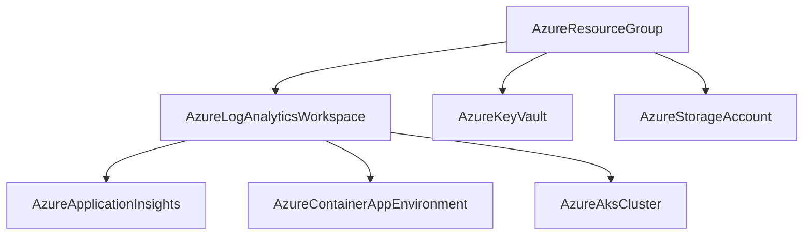

# Azure Resource Group and Log Analytics Workspace Components

**Date**: February 13, 2026
**Type**: Feature
**Components**: API Definitions, Azure Provider, Pulumi CLI Integration, Terraform Module

## Summary

Added two new Azure deployment components to OpenMCF: `AzureResourceGroup` (enum 400) and `AzureLogAnalyticsWorkspace` (enum 450). AzureResourceGroup is a new foundational resource that makes resource groups a first-class citizen in the composability model, and AzureLogAnalyticsWorkspace is the first Azure resource to use `StringValueOrRef resource_group` for proper infra-chart DAG wiring.

## Problem Statement / Motivation

Azure resource expansion from 10 to 33 resource kinds requires foundational components to be in place before higher-level resources can be built. Two gaps existed:

### Pain Points

- **Resource groups were not modeled as a first-class resource** -- the `resource_group` field on Azure specs was a plain `string`, making it the only cross-resource reference that didn't use `StringValueOrRef`. This created a hole in the infra-chart dependency graph.
- **No monitoring foundation** -- Log Analytics Workspaces are required by Container Insights (AKS), Application Insights, and Container App Environments, but no workspace component existed.
- **Existing Azure enum numbering didn't leave room** for a resource group at the front of the Azure block.

## Solution / What's New

### AzureResourceGroup (R00, enum 400)

A deliberately minimal component with 2 spec fields and 3 outputs:

```yaml
apiVersion: azure.openmcf.org/v1
kind: AzureResourceGroup
metadata:
  name: platform-rg
spec:
  name: prod-platform-rg
  region: eastus
```

### AzureLogAnalyticsWorkspace (R01, enum 450)

The first Azure resource to use `StringValueOrRef resource_group`, demonstrating the new composability pattern:

```yaml
apiVersion: azure.openmcf.org/v1
kind: AzureLogAnalyticsWorkspace
metadata:
  name: platform-law
spec:
  region: eastus
  resource_group:
    valueFrom:
      kind: AzureResourceGroup
      name: platform-rg
      fieldPath: status.outputs.resource_group_name
  name: prod-platform-law
  sku: PerGB2018
  retention_in_days: 90
```

### Infra Chart DAG Pattern



## Implementation Details

### Enum Renumbering

Existing Azure resources (400-409) were shifted to 401-410 to make room for AzureResourceGroup at 400. This is safe because no Azure resources are in production use yet.

| Previous | New | Resource |
|----------|-----|----------|
| - | 400 | AzureResourceGroup (NEW) |
| 400 | 401 | AzureAksCluster |
| 401 | 402 | AzureAksNodePool |
| ... | ... | ... |
| 409 | 410 | AzureDnsRecord |

### Proto Design

**AzureResourceGroup** (`spec.proto`):
- `string name` -- required, 1-90 chars (Azure limit)
- `string region` -- required

**AzureLogAnalyticsWorkspace** (`spec.proto`):
- `string region` -- required
- `StringValueOrRef resource_group` -- required, with `default_kind: AzureResourceGroup`
- `string name` -- required, 4-63 chars
- `optional string sku` -- default: "PerGB2018"
- `optional int32 retention_in_days` -- default: 30, range: 30-730
- `optional double daily_quota_gb` -- default: -1 (unlimited)

Note: `daily_quota_gb` uses `double` (not `int32`) because Azure's API supports fractional GB values.

### Both Components Include

- 4 proto files (spec, stack_outputs, api, stack_input)
- Comprehensive validation tests (12 and 18 tests respectively, all passing)
- Complete Pulumi module (Go, using `pulumi-azure` classic SDK v6)
- Complete Terraform module (HCL, using `azurerm` provider ~> 4.0)
- 3-tier documentation (README, examples, research docs)
- Test manifest and debug tooling

### Design Decision DD05

AzureResourceGroup as a first-class resource supersedes DD02 (which had decided against modeling resource groups). The rationale: `StringValueOrRef` composability is the core architecture of infra charts, and resource groups were the only Azure dependency that didn't use it.

## Benefits

- **Complete DAG visibility** -- infra charts can now express the full Azure dependency graph starting from resource groups at Layer 0
- **Impact analysis** -- the platform can answer "what resources are affected if this resource group is deleted?"
- **Monitoring foundation** -- LAW enables Container Insights, Application Insights, and Sentinel integration for all downstream Azure resources
- **Pattern established** -- all 22 remaining Azure resources will follow the `StringValueOrRef resource_group` pattern

## Impact

- **New files**: ~40 files across 2 component directories
- **Modified files**: `cloud_resource_kind.proto` (enum renumbering + 2 new entries), plus regenerated .pb.go and .pb.ts stubs
- **Test coverage**: 30 validation tests (12 + 18), all passing
- **Queue progress**: 2 of 24 Azure resources complete (R00, R01)

## Related Work

- Part of project **20260212.05.sp.azure-resource-expansion** (expanding Azure from 10 to 33 resource kinds)
- Next resource: R02 AzureApplicationInsights (depends on LAW's `workspace_id`)
- Follow-up iteration: Migrate existing 10 Azure resources to use `StringValueOrRef resource_group`

---

**Status**: Production Ready
**Timeline**: Single session (2026-02-13)
