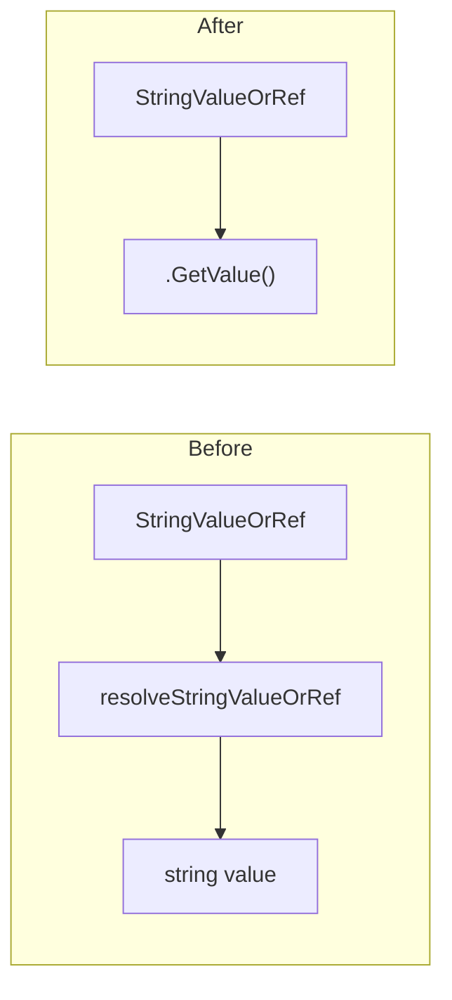
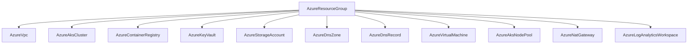

# Azure Resource Group StringValueOrRef Migration

**Date**: February 13, 2026
**Type**: Refactoring
**Components**: API Definitions, Pulumi Modules, Terraform Modules, Azure Provider

## Summary

Migrated all 10 existing Azure resources to use `StringValueOrRef resource_group` instead of plain `string` or implicit derivation, establishing `AzureResourceGroup` as the explicit Layer 0 dependency in the Azure resource graph. Also removed the `resolveStringValueOrRef` anti-pattern from all IaC modules across the codebase, replacing it with the cleaner `.GetValue()` pattern.

## Problem Statement / Motivation

Per design decision DD05, `AzureResourceGroup` (enum 400) was added as a first-class Planton resource. However, the 10 existing Azure resources handled resource groups inconsistently:

### Pain Points

- **5 resources used `string resource_group`** (keyvault, storageaccount, dnszone, dnsrecord, virtualmachine) -- these worked but couldn't participate in infra-chart dependency graphs because plain strings have no reference semantics
- **3 resources created their own resource groups internally** (vpc, akscluster, containerregistry) -- each generated `rg-{name}` and called `NewResourceGroup()`, preventing shared resource groups and breaking composability
- **2 resources derived resource groups via fragile hacks** (aksnodepool parsed `rg-{clusterName}` by convention, natgateway parsed the subnet_id string to extract the RG and hardcoded `"eastus"` as the region)
- **The `resolveStringValueOrRef` helper function** was copy-pasted into Pulumi modules, leaking a Planton-internal concern (valueFrom resolution) into what should be provider-agnostic open-source modules

## Solution / What's New

### Unified resource_group Pattern

Every Azure resource now has a `StringValueOrRef resource_group` field with consistent annotations:

```protobuf
dev.planton.shared.foreignkey.v1.StringValueOrRef resource_group = N [
  (buf.validate.field).required = true,
  (dev.planton.shared.foreignkey.v1.default_kind) = AzureResourceGroup,
  (dev.planton.shared.foreignkey.v1.default_kind_field_path) = "status.outputs.resource_group_name"
];
```

### Architecture Rule: .GetValue() over resolveStringValueOrRef

Established and enforced the rule that IaC modules must use `.GetValue()` directly on `StringValueOrRef` fields. The platform middleware resolves all `valueFrom` references before modules run, so the helper function was unnecessary.



### Resource Group Dependency Graph



## Implementation Details

### Three Migration Groups

| Group | Resources | Change Type | Complexity |
|-------|-----------|-------------|------------|
| A | keyvault, storageaccount, dnszone, dnsrecord, virtualmachine | Field type change (`string` to `StringValueOrRef`) | Mechanical |
| B | vpc, akscluster, containerregistry | Add field + remove inline RG creation | High -- IaC refactoring |
| C | aksnodepool, natgateway | Add field + remove derivation hacks | Medium |

### Anti-pattern Cleanup

Removed `resolveStringValueOrRef` from 2 files across the codebase:
- `azureloganalyticsworkspace/v1/iac/pulumi/module/locals.go`
- `openstackroleassignment/v1/iac/pulumi/module/role_assignment.go`

### Missing Fields Added

- **azurevpc**: Added `string region` (was hardcoded to `"eastus"`)
- **azurenatgateway**: Added `string region` (was hardcoded to `"eastus"`) and `StringValueOrRef resource_group` (was parsed from subnet_id string)

### Files Changed

91 files changed across proto definitions, generated Go/TypeScript stubs, Pulumi modules, Terraform modules, and test files.

## Benefits

- **Complete dependency graph**: Every Azure resource explicitly declares its resource group dependency, enabling full DAG visualization and impact analysis
- **Infra-chart composability**: Resource groups can now be wired via `valueFrom` references in infra charts, establishing Layer 0 in every Azure chart
- **No more hidden resource groups**: VPC, AKS, and ACR no longer create surprise resource groups -- users control naming and placement
- **Eliminated hardcoded regions**: VPC and NAT Gateway no longer hardcode `"eastus"`
- **Cleaner IaC modules**: No `resolveStringValueOrRef` function or `foreignkeyv1` import in any Pulumi module -- just `.GetValue()`
- **Consistent pattern**: All 12 Azure resources (10 existing + 2 newly forged) now follow identical resource_group wiring

## Impact

- **Proto breaking change**: Field type changed from `string` to `StringValueOrRef` on same field numbers. Acceptable per DD05 since these resources are pre-production.
- **IaC behavior change**: VPC, AKS cluster, and container registry no longer self-create resource groups. Users must provide one explicitly (or reference an `AzureResourceGroup`).
- **Test updates**: All test files updated to use `stringRef()` helper with `foreignkeyv1.StringValueOrRef` struct literals.

## Related Work

- **DD05**: AzureResourceGroup as a first-class Planton resource (approved 2026-02-13)
- **R00**: AzureResourceGroup forged (2026-02-13)
- **R01**: AzureLogAnalyticsWorkspace forged with StringValueOrRef resource_group (2026-02-13)
- **Next**: Continue forging remaining 22 Azure resources (R02-R23) in the expansion project

---

**Status**: Production Ready
**Timeline**: Single session
