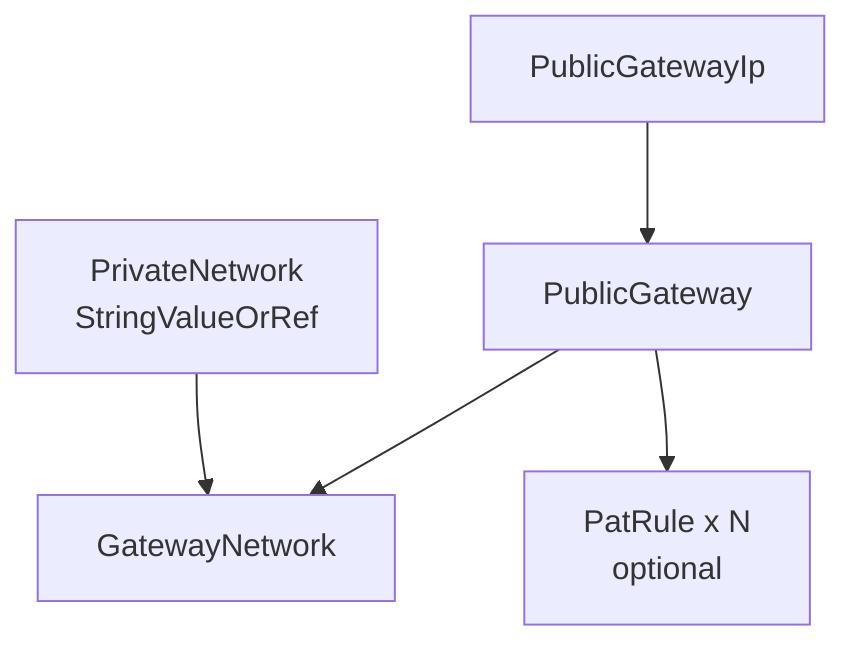

# Scaleway Public Gateway Resource Kind (R03)

**Date**: February 13, 2026
**Type**: Feature
**Components**: API Definitions, Pulumi CLI Integration, Provider Framework, Resource Management

## Summary

Implemented ScalewayPublicGateway as the first composite Scaleway resource kind in OpenMCF. This resource bundles a Flexible IP, Public Gateway appliance, and GatewayNetwork attachment into a single declarative unit, providing NAT masquerade, SSH bastion, and port forwarding capabilities for Scaleway Private Networks. Includes full Pulumi (Go) and Terraform (HCL) implementations with comprehensive documentation.

## Problem Statement / Motivation

Scaleway resources attached to a Private Network have no direct internet access by default. A Public Gateway is required to provide NAT for outbound traffic, SSH bastion for secure access, and port forwarding for selective inbound access. In Scaleway's Terraform provider, this requires managing three separate resources (IP, Gateway, GatewayNetwork) with correct dependency wiring. OpenMCF needs to bundle these into a single, composable resource kind.

### Pain Points

- Provisioning a functional Public Gateway requires creating 3+ Terraform/Pulumi resources manually
- Dependency ordering between IP, Gateway, and GatewayNetwork must be managed manually
- Infra chart authors need a single resource that they can wire via `StringValueOrRef` references
- This is the first composite resource in the Scaleway provider -- establishing patterns for R05 (LoadBalancer), R06 (Instance), R09 (RdbInstance), and others

## Solution / What's New

### Composite Resource Design

ScalewayPublicGateway bundles 3 always-created resources + optional PAT rules:



### Key Design Decisions

1. **DHCP resources skipped** -- Scaleway deprecated gateway DHCP in favor of Private Network IPAM. The `scaleway_vpc_public_gateway_dhcp` and `_dhcp_reservation` resources are not included.
2. **Zone instead of region** -- Public Gateways are the first zonal Scaleway resource in OpenMCF (unlike VPCs and Private Networks which are regional).
3. **Single network attachment** -- The 80% use case is one gateway per Private Network. Multi-attachment support can be added later if needed.
4. **Reverse DNS on IP directly** -- Set via the IP resource's `reverse` field rather than a separate `ip_reverse_dns` resource, simplifying the composite.
5. **PAT rules included** -- Port forwarding rules bundled as optional `repeated` field, following the AwsAlb pattern of bundling listeners.

### StringValueOrRef Dependency

The `private_network_id` field uses `StringValueOrRef` with `default_kind = ScalewayPrivateNetwork`, enabling infra chart composition:

```yaml
privateNetworkId:
  valueFrom:
    kind: ScalewayPrivateNetwork
    name: app-network
    fieldPath: status.outputs.private_network_id
```

## Implementation Details

### Proto Schemas (4 files)

- `spec.proto` -- ScalewayPublicGatewaySpec with nested `Bastion` and `PatRule` messages
- `stack_outputs.proto` -- Exports `gateway_id`, `public_ip_address`, `public_ip_id`, `gateway_network_id`
- `api.proto` -- Standard OpenMCF resource envelope
- `stack_input.proto` -- Stack input with target and provider config

### Pulumi Go Module (5 files)

- **`gateway.go`** -- Composite resource creation: IP -> Gateway -> GatewayNetwork -> optional PAT rules
- **`locals.go`** -- Resolves `StringValueOrRef` for `private_network_id`, builds tag slice
- **`main.go`** -- Module entry point, creates Scaleway provider, delegates to `gateway()`
- **`outputs.go`** -- Stack output constant names

### Terraform HCL Module (5 files)

- **`main.tf`** -- 4 resource blocks with conditional PAT rules via `for_each`
- **`variables.tf`** -- Complex nested type for spec with optional bastion and pat_rules objects
- **`locals.tf`** -- Safe unwrapping of optional nested objects
- **`outputs.tf`** -- 8 outputs including gateway status and zone
- **`provider.tf`** -- Scaleway provider configured with `zone` (not `region`)

### Documentation (2 files)

- **`README.md`** -- Component overview, bundled resource table, constraints, use cases
- **`examples.md`** -- 6 examples covering minimal NAT, bastion, valueFrom, PAT rules, full Kapsule stack, and email gateway

## Benefits

- **Single declaration** creates 3+ correctly-wired cloud resources
- **Infra-chart ready** -- `StringValueOrRef` on `private_network_id` enables DAG-based composition
- **Composite pattern established** -- Sets the template for LoadBalancer, Instance, RdbInstance, and other composite Scaleway kinds
- **Zonal resource handling** -- First resource to use `zone` instead of `region`, extending OpenMCF's Scaleway coverage model
- **Production features** -- NAT masquerade, SSH bastion with IP allowlisting, SMTP control, reverse DNS, port forwarding

## Impact

- **Users**: Can deploy a fully functional Public Gateway (NAT + bastion + PAT) with a single YAML manifest
- **Infra chart authors**: Can compose gateway into `kapsule-environment` and `serverless-environment` charts
- **Platform**: Extends the Scaleway provider to 3 implemented kinds (VPC, Private Network, Public Gateway) out of 19 total

## Related Work

- **R01: ScalewayVpc** (`2026-02-13-083039-scaleway-vpc-resource-kind-and-codegen-fix.md`) -- Layer 0 foundation
- **R02: ScalewayPrivateNetwork** (`2026-02-13-040014-scaleway-private-network-resource-kind.md`) -- Layer 1 connector, first `StringValueOrRef` resource
- **DD01: Composite Resources** -- Design decision defining the bundling strategy
- **AwsAlb** -- Reference composite pattern (ALB + listeners + DNS)

---

**Status**: Production Ready
**Timeline**: 1 session (R03 of 19 Scaleway resource kinds)
