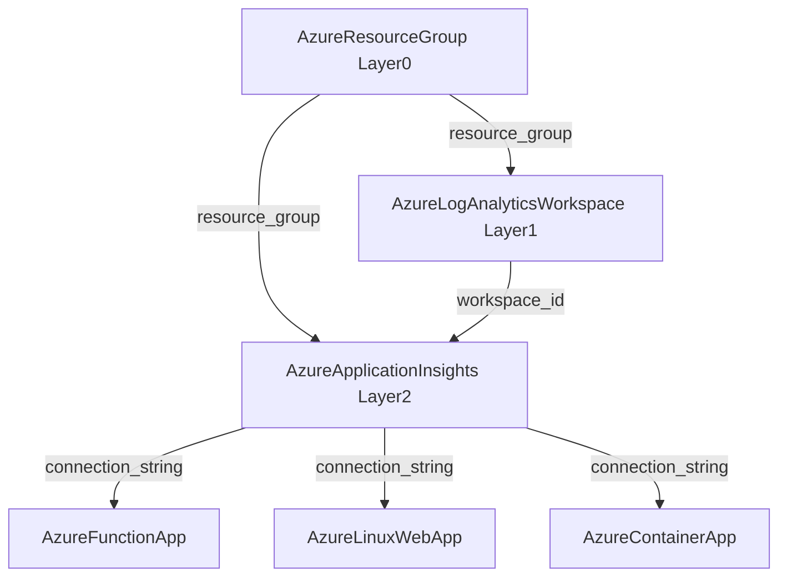

# AzureApplicationInsights Deployment Component

**Date**: February 13, 2026
**Type**: Feature
**Components**: API Definitions, Azure Provider, IaC Modules, Documentation

## Summary

Added `AzureApplicationInsights` (enum 451, id_prefix `azai`) as a new OpenMCF deployment component. This is the third Azure resource forged in the Azure resource expansion project (R02), following AzureResourceGroup (R00) and AzureLogAnalyticsWorkspace (R01). It provides workspace-based APM monitoring with full Pulumi and Terraform IaC parity.

## Problem Statement / Motivation

Azure Application Insights is the standard APM layer in Azure, consumed by Function Apps, Web Apps, and Container Apps. The upcoming infra charts (function-app-environment, web-app-environment, container-apps-environment) require an Application Insights resource for telemetry wiring. Without this component, infra charts cannot provision end-to-end observability stacks.

### Pain Points

- No OpenMCF component existed for Azure APM telemetry
- Infra chart observability layers were blocked on this resource
- Downstream resources (AzureFunctionApp, AzureLinuxWebApp, AzureContainerApp) need `connection_string` for APM integration

## Solution / What's New

A complete deployment component covering proto APIs, Pulumi module, Terraform module, and comprehensive documentation.

### Dependency Chain

### Key Design Decisions

- **application_type as string, not enum**: Uses exact Azure API values (`"web"`, `"java"`, `"Node.JS"`, `"other"`) as plain strings with `buf.validate.field.string.in` validation. Avoids proto identifier restrictions (dots in `"Node.JS"`) and enables zero-conversion passthrough to Azure providers.

- **workspace_id required**: Enforces workspace-based Application Insights. Classic mode is deprecated by Microsoft. This is a forward-looking design choice that ensures all infra charts wire through Log Analytics Workspace.

- **sampling_percentage added**: Not in the original plan but identified during Terraform provider research as a critical 80/20 field. Controls telemetry volume and cost. Enterprise teams routinely set this to 25-50%.

- **daily_data_cap_in_gb as double**: Changed from `int32` (original plan) to `double` to support fractional GB values (e.g., 0.5 GB for dev environments). Consistent with LAW's `daily_quota_gb` field.

- **retention_in_days discrete validation**: Azure only allows specific values (30, 60, 90, 120, 180, 270, 365, 550, 730), not a free range. Uses `buf.validate.field.int32.in` for exact enforcement.

## Implementation Details

### Files Created (31 total)

**Proto APIs (4 + 4 stubs + 1 test + 1 BUILD.bazel)**:
- `spec.proto` -- 8 fields with validations and defaults
- `stack_outputs.proto` -- 4 outputs (app_insights_id, instrumentation_key, connection_string, app_id)
- `api.proto` -- KRM envelope (apiVersion, kind, metadata, spec, status)
- `stack_input.proto` -- IaC module input (target + provider_config)
- `spec_test.go` -- 22 validation tests

**Pulumi Module (5 files + 1 BUILD.bazel)**:
- `module/main.go` -- Creates Azure provider + appinsights.Insights resource
- `module/locals.go` -- StringValueOrRef resolution (.GetValue()), tag building
- `module/outputs.go` -- Output constant definitions
- `main.go` -- Pulumi entrypoint with stack input loading

**Terraform Module (5 files)**:
- `main.tf` -- `azurerm_application_insights` resource
- `variables.tf` -- Mirrors spec.proto with matching defaults
- `locals.tf` -- Tag computation
- `outputs.tf` -- 4 outputs with sensitivity markers
- `provider.tf` -- azurerm ~> 4.0

**Documentation (5 files)**:
- `README.md` -- Component overview, field table, outputs, quick example
- `examples.md` -- 8 examples (minimal, dev, prod, java, node, infra chart wiring, compliance)
- `docs/README.md` -- Research document (sampling strategy, retention model, 80/20 analysis)
- `iac/pulumi/README.md` + `overview.md` -- Pulumi module docs
- `iac/tf/README.md` -- Terraform module docs

**Supporting (3 files)**:
- `iac/hack/manifest.yaml` -- Test manifest
- `iac/pulumi/Makefile`, `debug.sh`, `Pulumi.yaml` -- Build tooling

### Registry Update

Added enum `AzureApplicationInsights = 451` to `cloud_resource_kind.proto`.

## Benefits

- **Infra chart unblocked**: function-app-environment, web-app-environment, container-apps-environment can now wire APM telemetry
- **Cost control**: `sampling_percentage` and `daily_data_cap_in_gb` provide enterprise-grade cost management
- **Zero-conversion design**: String-based `application_type` passes directly to Azure -- no enum mapping code in IaC modules
- **Full IaC parity**: Pulumi and Terraform modules are feature-equivalent

## Impact

- **Azure resource coverage**: 3 of 24 new resources complete (R00, R01, R02)
- **Downstream resources**: AzureFunctionApp (R19), AzureLinuxWebApp (R20), AzureContainerApp (R18) can now reference `connection_string`
- **Infra charts**: 3 of 6 planned charts can now include APM telemetry

## Related Work

- **Predecessor**: R01 AzureLogAnalyticsWorkspace (workspace_id dependency)
- **Parent project**: 20260212.05.sp.azure-resource-expansion
- **Next resource**: R03 AzureUserAssignedIdentity (enum 460, id_prefix: azid)

---

**Status**: Production Ready
**Timeline**: Single session
