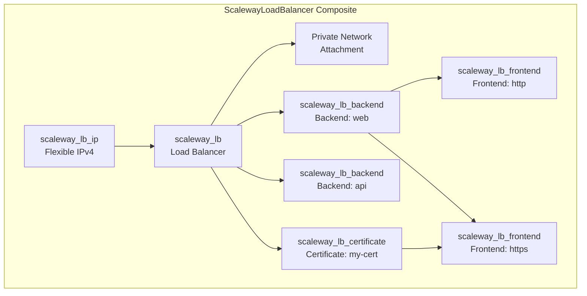

# Scaleway Load Balancer Resource Kind (R05)

**Date**: February 13, 2026
**Type**: Feature
**Components**: API Definitions, Pulumi CLI Integration, Provider Framework, Resource Management

## Summary

Implemented ScalewayLoadBalancer (R05), the most complex Scaleway composite resource kind. It bundles a Flexible IP, Load Balancer appliance, backend server pools, frontend listeners, and TLS certificates into a single declarative resource with named backend/frontend linking -- a pattern new to OpenMCF. This is the 5th of 19 Scaleway resource kinds.

## Problem Statement / Motivation

Scaleway's Load Balancer service requires 5 separate Terraform resources to function: an IP, the LB itself, backends, frontends, and certificates. Deploying these individually is tedious, error-prone, and doesn't compose well in infra charts.

### Pain Points

- A Load Balancer without backends, frontends, and an IP is useless
- Users must manually wire Terraform resource IDs between LB sub-resources
- No existing OpenMCF resource exposes the Scaleway LB service
- The LB is a critical building block for production traffic management

## Solution / What's New

A single `ScalewayLoadBalancer` manifest creates the complete LB stack. The composite bundles 5 Terraform resource types and introduces a **named backend/frontend linking** pattern: frontends reference backends by name, and the IaC module resolves names to resource IDs at execution time.

### Composite Architecture



### Named Linking Pattern

Frontends reference backends and certificates by name, not ID:

```yaml
backends:
  - name: web            # ← named backend
    serverIps: [...]
frontends:
  - name: https
    backendName: web     # ← references by name
    certificateNames:
      - my-cert          # ← references by name
certificates:
  - name: my-cert        # ← named certificate
```

The Pulumi module builds `map[string]*Backend` and `map[string]*Certificate` at runtime to resolve names to Pulumi resource IDs. The Terraform module uses `for_each` key lookups.

## Implementation Details

### Proto Schema (4 files)

- `spec.proto` -- 8 message types: `ScalewayLoadBalancerSpec`, `Backend`, `Frontend`, `Certificate`, `Letsencrypt`, `CustomCertificate`, `HealthCheck` + the spec itself
- `stack_outputs.proto` -- 3 outputs: `lb_id`, `lb_ip_address`, `lb_ip_id`
- `api.proto` -- Resource envelope with validation
- `stack_input.proto` -- IaC input contract

Key design: backends have per-backend health checks (TCP/HTTP/HTTPS), unlike DigitalOcean's single shared health check. This matches Scaleway's architecture accurately.

### Pulumi Go Module (7 files)

Orchestration sequence in `main.go`:
1. Create Flexible IP (`loadbalancers.NewIp`)
2. Create Load Balancer with IP and optional Private Network (`loadbalancers.NewLoadBalancer`)
3. Create certificates (`loadbalancers.NewCertificate`) -- before frontends
4. Create backends with health checks (`loadbalancers.NewBackend`) -- returns `map[string]*Backend`
5. Create frontends with backend/cert resolution (`loadbalancers.NewFrontend`)

### Terraform HCL Module (5 files)

Uses `for_each` with name-keyed maps for all repeated resources. Terraform-native cross-references via `scaleway_lb_backend.backends[each.value.backend_name].id`.

### Health Check Model

Flat message with `type` discriminator instead of separate TCP/HTTP/HTTPS messages:

```protobuf
message ScalewayLoadBalancerHealthCheck {
  string type = 1;           // "tcp", "http", "https"
  string uri = 2;            // meaningful for http/https
  int32 expected_code = 3;   // meaningful for http/https
  // ... interval, timeout, retries, port
}
```

### Documentation (2 files)

- `README.md` -- Component overview, bundled resources table, upstream/downstream dependencies, LB types
- `examples.md` -- 6 examples: minimal HTTP, HTTPS with Let's Encrypt, multi-service, TCP proxy, full-featured, valueFrom composition

## Benefits

- **Single manifest** creates complete LB stack (5 resource types)
- **Named linking** makes configurations self-documenting
- **Per-backend health checks** match Scaleway's native architecture
- **Private Network integration** via `StringValueOrRef` enables infra-chart composition
- **Let's Encrypt support** with zero manual certificate management
- **Multi-service support** with separate backends for web, API, etc.

## Impact

### Users
- Can deploy production load balancers with a single YAML manifest
- Multi-service setups (web + API) supported natively

### Infra Charts
- LB composes with ScalewayPrivateNetwork (upstream) and ScalewayDnsRecord (downstream)
- `lb_ip_address` output enables DNS record creation

### Platform
- 5 of 19 Scaleway resource kinds complete (26%)
- Named backend/frontend linking establishes a new pattern for composite resources

## Deferred Features

Consciously excluded from v1 (can be added without breaking changes):
- Routes (`scaleway_lb_route`) -- host/path/SNI-based traffic routing
- ACLs (`scaleway_lb_acl`) -- access control lists
- IPv6 Flexible IPs
- Multiple IP attachment

## Files Created

- `apis/org/openmcf/provider/scaleway/scalewayloadbalancer/v1/` -- 18 files
  - 4 proto schemas
  - 7 Pulumi Go module files (+ Pulumi.yaml)
  - 5 Terraform HCL module files
  - 2 documentation files (README.md, examples.md)

## Related Work

- **R01-R04**: ScalewayVpc, ScalewayPrivateNetwork, ScalewayPublicGateway, ScalewayInstanceSecurityGroup
- **DD01**: Composite resources design decision (bundles sub-resources that are useless in isolation)
- **Next**: R06 ScalewayInstance (composite: server + IP + volume + private_nic)

---

**Status**: Production Ready
**Timeline**: Single session implementation
