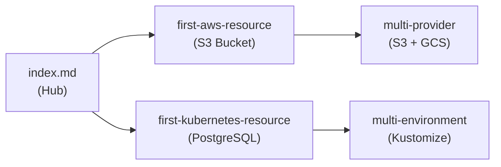

# Tutorials Section — Complete Documentation

**Date**: February 13, 2026
**Type**: Feature
**Components**: Documentation, Site

## Summary

Created an entirely new tutorials section for the OpenMCF documentation site with 5 pages (1,015 lines) covering end-to-end deployment walkthroughs across AWS, Kubernetes, multi-environment Kustomize workflows, and cross-provider comparisons. All manifests verified against protobuf definitions, all CLI commands verified against source, zero Planton references.

## Problem Statement / Motivation

The OpenMCF documentation had conceptual reference material (concepts section), command documentation (CLI section), and how-to guides (guides section), but lacked step-by-step tutorials that walk users through complete deployment workflows from start to finish.

### Pain Points

- New users had no linear path from "I installed the CLI" to "I deployed a production resource"
- The getting-started page covered a minimal hello-world deployment but not production-oriented configurations
- No documentation showed the cross-provider consistency pattern — the core value proposition
- No documentation demonstrated Kustomize overlays for multi-environment workflows
- Evaluators comparing OpenMCF to other tools had no concrete end-to-end examples to assess

## Solution / What's New

Five new tutorial pages in `site/public/docs/tutorials/` forming a progressive learning path:

### Tutorial 1: Deploy Your First AWS Resource

End-to-end S3 bucket deployment covering manifest writing, plan/apply/destroy lifecycle, and idempotent updates via lifecycle rule addition.

**Component**: `AwsS3Bucket` (`aws.openmcf.org/v1`)
**Proto-verified fields**: `awsRegion`, `versioningEnabled`, `encryptionType`, `tags`, `lifecycleRules`

### Tutorial 2: Deploy Your First Kubernetes Resource

Production-oriented PostgreSQL on Kubernetes with custom databases, named users, resource tuning, port-forwarding for local access, and `--set` runtime overrides.

**Component**: `KubernetesPostgres` (`kubernetes.openmcf.org/v1`)
**Proto-verified fields**: `namespace` (StringValueOrRef), `createNamespace`, `container` (replicas, resources, diskSize), `databases`, `users`, `ingress`

### Tutorial 3: Multi-Environment Deployments

Kustomize overlays deploying the same PostgreSQL component to dev, staging, and production with progressive resource scaling. Covers directory structure, strategic merge patches, and `--kustomize-dir` / `--overlay` flags.

### Tutorial 4: Deploy Across Providers

Cross-provider object storage comparison (AwsS3Bucket + GcpGcsBucket) demonstrating the consistent KRM interface. Side-by-side manifests, concept mapping table, identical CLI workflow.

**Components**: `AwsS3Bucket` + `GcpGcsBucket`
**Proto-verified fields**: AWS (`awsRegion`, `encryptionType`, `tags`), GCP (`gcpProjectId`, `location`, `bucketName`, `gcpLabels`, `uniformBucketLevelAccessEnabled`)

### Tutorial 5: Index

Navigational hub with tutorial descriptions, prerequisites per tutorial, and suggested reading order.

## Implementation Details

### Deduplication Architecture

Tutorials link to existing docs for theory rather than duplicating content:

- Credential setup links to `guides/aws-provider-setup`, `guides/gcp-provider-setup`
- KRM model explanation links to `concepts/manifests`
- Component anatomy links to `concepts/deployment-components`
- Full flag reference links to `cli/cli-reference`
- Kustomize theory links to `guides/kustomize`

### Proto-Accurate Manifests

Every YAML manifest was cross-referenced against the component's protobuf definition:

- Field names use camelCase (proto JSON serialization), matching existing examples in `openmcf/examples/`
- Enum values use exact proto names (e.g., `ENCRYPTION_TYPE_SSE_S3`, `STORAGE_CLASS_STANDARD_IA`)
- Required fields verified: `AwsS3BucketSpec.aws_region`, `GcpGcsBucketSpec.gcp_project_id/location/bucket_name`, `KubernetesPostgresSpec.namespace`
- Validation rules documented: `bucketName` regex pattern, `diskSize` CEL expression, `ingress.hostname` conditional requirement
- `StringValueOrRef` wrapper pattern shown correctly for `namespace` and `gcpProjectId`

### CLI Commands Verified

All commands verified against `cmd/openmcf/root/` and `internal/cli/iacflags/manifest_source_flags.go`:

- `openmcf plan -f`, `openmcf apply -f`, `openmcf destroy -f` (unified commands)
- `--set spec.container.replicas=2` (runtime overrides)
- `--kustomize-dir` + `--overlay` (Kustomize integration, both required together)

### Key Design Decisions

- **AwsS3Bucket over AwsRdsInstance** for first-aws-resource — minimal prerequisites (no VPC/networking required)
- **Object storage over databases** for multi-provider — cleaner pattern demonstration, fewer prerequisites on both sides
- **KubernetesPostgres for both K8s tutorials** — natural progression builds reader knowledge incrementally

## Benefits

- New users have a clear path from installation to production-oriented deployments
- Evaluators can see concrete, working examples of OpenMCF's cross-provider consistency
- Multi-environment tutorial shows real-world CI/CD-ready Kustomize workflows
- All content source-verified — no broken manifests, no incorrect commands

## Impact

- **Documentation**: 5 new pages, 1,015 lines of new content
- **Coverage**: Tutorials section now exists (was entirely missing)
- **User journey**: Complete path from getting-started through single-provider, multi-environment, and multi-provider workflows

### Surprise Found

The `getting-started.md` manifest is missing two required proto fields (`namespace` and `container.diskSize`). Flagged for future audit pass — not fixed in this session to keep scope contained.

## Related Work

- Phase 0: Existing docs audit (2026-02-12) — `checkpoints/T01-phase0-audit-report.md`
- Phase 1: Concepts section complete rewrite (2026-02-13) — `_changelog/2026-02/2026-02-13-090244-concepts-section-complete-rewrite.md`
- Phase 2: CLI docs expansion (2026-02-13) — `_changelog/2026-02/2026-02-13-093830-cli-documentation-section-fresh-start-rewrite.md`
- Phase 3: Guides expansion (2026-02-13) — guides rewritten and expanded

---

**Status**: Production Ready
**Timeline**: Single session
