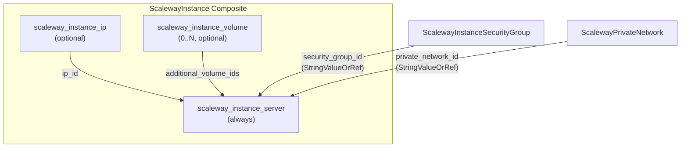

# ScalewayInstance Resource Kind (R06)

**Date**: February 13, 2026
**Type**: Feature
**Components**: API Definitions, Protobuf Schemas, Pulumi CLI Integration, Provider Framework

## Summary

Implemented the ScalewayInstance resource kind (R06) -- a composite resource that bundles a Scaleway compute instance with an optional Flexible IP, local volumes, private network attachment, and security group into a single declarative manifest. This is the sixth Scaleway resource kind and the first compute resource in the Scaleway provider.

## Problem Statement / Motivation

Scaleway's Terraform provider exposes compute instances as 4+ separate resources (`scaleway_instance_server`, `scaleway_instance_ip`, `scaleway_instance_volume`, `scaleway_instance_private_nic`), requiring users to manually wire them together. OpenMCF needs a single declarative resource that bundles the common case while supporting infra-chart composition via `StringValueOrRef`.

### Pain Points

- Users must create and wire 3-4 Terraform resources to get a usable instance
- No declarative way to express "instance with public IP, security group, and private network" as a single unit
- Infra charts need `StringValueOrRef` inputs and useful outputs for dependency wiring

## Solution / What's New

A composite `ScalewayInstance` resource kind that:

1. Always creates the instance server with configurable root volume
2. Optionally creates a dedicated Flexible IP (presence-based toggle via nested message)
3. Optionally creates and attaches local volumes (l_ssd, scratch)
4. Optionally attaches to a Private Network (inline block on server)
5. Accepts `StringValueOrRef` for both `security_group_id` and `private_network_id`

### Resource Composition

## Implementation Details

### New Design Pattern: Optional Public IP

Previous Scaleway composites (PublicGateway, LoadBalancer) always create a Flexible IP because they're network appliances. ScalewayInstance introduces **optional public IP** via a nested message presence check:

- `spec.public_ip` present (even empty `{}`) --> create Flexible IP
- `spec.public_ip` absent --> no public IP, private-only instance

This is the correct pattern for compute instances where most production workloads sit behind a Load Balancer or Public Gateway.

### Bundled Local Volume Creation

Additional volumes (`l_ssd`, `scratch`) are created as `scaleway_instance_volume` resources and attached via `additional_volume_ids`. These share the instance's lifecycle -- they're destroyed when the instance terminates. SBS (block) volumes with independent lifecycle are handled by the future `ScalewayBlockVolume` resource kind (R13).

### Files Created

**Proto schemas** (4 + 4 generated):
- `apis/org/openmcf/provider/scaleway/scalewayinstance/v1/spec.proto`
- `apis/org/openmcf/provider/scaleway/scalewayinstance/v1/stack_outputs.proto`
- `apis/org/openmcf/provider/scaleway/scalewayinstance/v1/api.proto`
- `apis/org/openmcf/provider/scaleway/scalewayinstance/v1/stack_input.proto`

**Pulumi Go module** (6 files):
- `iac/pulumi/main.go` -- Entrypoint
- `iac/pulumi/Pulumi.yaml` -- Project config
- `iac/pulumi/module/main.go` -- Resources entry point
- `iac/pulumi/module/instance.go` -- Composite creation (IP + volumes + server)
- `iac/pulumi/module/locals.go` -- StringValueOrRef resolution + tag building
- `iac/pulumi/module/outputs.go` -- Output name constants

**Terraform HCL module** (5 files):
- `iac/tf/provider.tf` -- Scaleway provider config (zone-based)
- `iac/tf/variables.tf` -- Input variables
- `iac/tf/locals.tf` -- Local values + tag generation
- `iac/tf/main.tf` -- Resources (conditional IP, for_each volumes, server)
- `iac/tf/outputs.tf` -- Stack outputs

**Documentation** (2 files):
- `README.md` -- Component overview, dependencies, outputs, instance types
- `examples.md` -- 8 YAML examples (minimal, production, cloud-init, volumes, bastion, full, infra-chart, stopped)

### Key Design Decisions

- **Public IP optional** -- breaks the "always create IP" pattern from PublicGateway/LoadBalancer for good reason
- **Root volume inline** -- configured on the server, not a separate resource
- **Additional volumes = local only** -- l_ssd/scratch created by composite; SBS deferred to R13
- **Single private network** -- consistent with PublicGateway; multi-network deferred
- **Image required** -- no volume-boot in v1
- **Cloud-init only** -- general user_data map deferred

## Benefits

- **Single manifest** provisions a complete, production-ready instance
- **Infra-chart ready** with `StringValueOrRef` inputs and useful outputs
- **Private-first** topology supported (no public IP by default)
- **Flexible** -- from minimal DEV1-S to full PRO2 with volumes and cloud-init

## Impact

- 6 of 19 Scaleway resource kinds complete (32%)
- First Scaleway compute resource kind
- Enables the `kapsule-environment` infra chart's worker node pattern
- Enables bastion host and standalone server infra chart scenarios

## Related Work

- **R01-R05**: Networking foundation (VPC, PrivateNetwork, PublicGateway, SecurityGroup, LoadBalancer)
- **R07-R08**: ScalewayKapsuleCluster and ScalewayKapsulePool (next in queue, managed Kubernetes)
- **DD01**: Composite resource bundling decision
- **DD02**: Private Network as universal connector

---

**Status**: Production Ready
**Timeline**: Single session implementation
