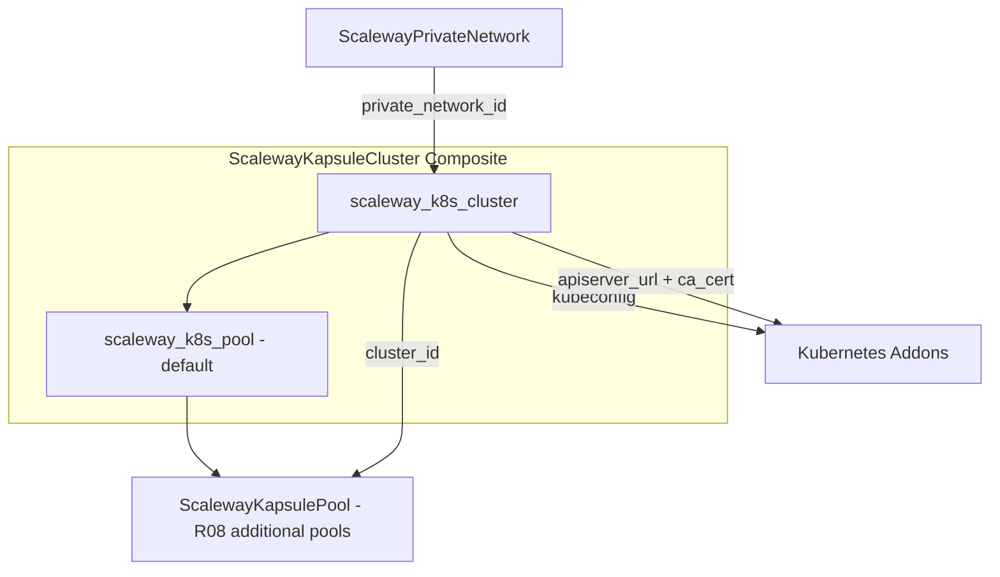

# ScalewayKapsuleCluster Resource Kind (R07)

**Date**: February 13, 2026
**Type**: Feature
**Components**: API Definitions, Pulumi CLI Integration, Provider Framework

## Summary

Implemented `ScalewayKapsuleCluster` -- the seventh Scaleway resource kind and the first Kubernetes resource in the Scaleway provider. This is a composite resource that bundles a Kapsule managed cluster with an embedded default node pool, giving users a working Kubernetes cluster from a single resource declaration.

## Problem Statement / Motivation

Scaleway's Kapsule is a managed Kubernetes service, and it's the centerpiece of the planned `kapsule-environment` infra chart. Without this resource kind, users cannot provision Kubernetes clusters on Scaleway through Planton, and the most important infra chart cannot be built.

### Design Challenge

Scaleway's Terraform provider separates clusters and pools into independent resources (`scaleway_k8s_cluster` + `scaleway_k8s_pool`). This means a cluster resource alone creates only an empty control plane with zero compute capacity -- useless without at least one pool.

The design decision was to embed a default node pool in the cluster spec (matching the DigitalOcean pattern), making the resource a composite that bundles both. Users get a working cluster from one resource, and can add more pools via separate `ScalewayKapsulePool` (R08) resources.

## Solution / What's New

### Composite Resource Architecture

### Key Design Decisions

1. **Embedded default pool** -- One resource = working cluster. Additional pools via separate ScalewayKapsulePool resources.
2. **Private Network required** -- Aligns with Scaleway's current architecture and DD02 (Private Network as universal connector).
3. **CNI selection exposed** -- Cilium (recommended) or Calico. Immutable after creation.
4. **Autoscaler config at cluster level** -- Per Scaleway's architecture, autoscaler behavior is cluster-wide; individual pools toggle autoscaling on/off.
5. **Version drift ignored** -- Both Pulumi and Terraform `ignore_changes` on `version` to accommodate auto-upgrade patches.
6. **Pulumi `kubernetes` subpackage** -- Uses `kubernetes.NewCluster()` and `kubernetes.NewPool()` from the new SDK subpackage (not the deprecated top-level functions).

## Implementation Details

### Proto Schemas (4 files)

- `spec.proto` -- 5 nested messages: `ScalewayKapsuleClusterSpec`, `ScalewayKapsuleDefaultNodePool`, `ScalewayKapsuleAutoUpgrade`, `ScalewayKapsuleAutoscalerConfig`, `ScalewayKapsuleNodePoolUpgradePolicy`
- `stack_outputs.proto` -- 6 outputs: `cluster_id`, `kubeconfig`, `apiserver_url`, `cluster_ca_certificate`, `wildcard_dns`, `default_pool_id`
- `api.proto` -- KRM structure with `scaleway.planton.dev/v1` apiVersion
- `stack_input.proto` -- Standard stack input with ScalewayProviderConfig

### Pulumi Go Module (6 files)

- `cluster.go` -- Composite orchestrator: creates cluster first, then default pool with `pulumi.DependsOn`. Extracts kubeconfig and CA certificate from `Kubeconfigs` array output.
- Import path: `github.com/pulumiverse/pulumi-scaleway/sdk/go/scaleway/kubernetes`

### Terraform HCL Module (5 files)

- `main.tf` -- Two resources: `scaleway_k8s_cluster.cluster` + `scaleway_k8s_pool.default`. Dynamic blocks for `auto_upgrade`, `autoscaler_config`, and `upgrade_policy`.
- `outputs.tf` -- Kubeconfig and CA cert marked as `sensitive = true`.

### Documentation (2 files)

- `README.md` -- Component overview, dependency map, composition layer, Scaleway docs links.
- `examples.md` -- 4 scenarios: minimal dev, production with autoscaling, infra-chart composition with valueFrom, dedicated control plane.

## Benefits

- Users can provision a working Kapsule cluster from a single YAML manifest
- The cluster is immediately composable into the `kapsule-environment` infra chart
- 6 stack outputs provide everything needed for downstream K8s addon deployment
- Autoscaler config is cluster-wide (matching Scaleway's architecture) -- no need to duplicate settings per pool

## Impact

- **7 of 19** Scaleway resource kinds now implemented
- Unlocks R08 (ScalewayKapsulePool) which depends on `cluster_id` output
- Foundational for IC01 (kapsule-environment infra chart)
- First composite Scaleway resource with a required `StringValueOrRef` input

## File Summary

**24 files** in `apis/dev/planton/provider/scaleway/scalewaykapsulecluster/v1/`:
- 4 proto schemas + 3 generated `.pb.go` stubs
- 2 generated `BUILD.bazel` files
- 6 Pulumi Go files (main.go, Pulumi.yaml, module/{main,locals,cluster,outputs}.go)
- 5 Terraform HCL files (provider.tf, variables.tf, locals.tf, main.tf, outputs.tf)
- 2 documentation files (README.md, examples.md)

## Related Work

- R01-R06: Foundation Scaleway kinds (VPC, PrivateNetwork, PublicGateway, SecurityGroup, LoadBalancer, Instance)
- R08 (next): ScalewayKapsulePool -- additional node pools
- IC01 (future): kapsule-environment infra chart

---

**Status**: Production Ready
