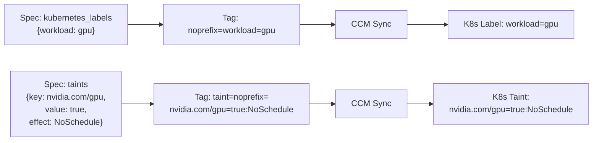

# ScalewayKapsulePool Resource Kind (R08)

**Date**: February 13, 2026
**Type**: Feature
**Components**: API Definitions, Pulumi CLI Integration, Terraform Modules, Provider Framework

## Summary

Implemented ScalewayKapsulePool -- the eighth Scaleway resource kind -- for additional Kubernetes node pools in Kapsule clusters. Introduces a first-class labels/taints abstraction over Scaleway's Cloud Controller Manager tag convention, giving users the same clean experience as DigitalOcean while using the correct Scaleway-native mechanism under the hood.

## Problem Statement / Motivation

The ScalewayKapsuleCluster (R07) bundles a default node pool for immediate usability. However, production Kubernetes deployments require multiple, independently configurable pools for different workload classes: GPU compute, batch processing, application serving, and system services.

### Pain Points

- No way to add specialized pools (GPU, high-memory, CPU-optimized) alongside the default pool
- No mechanism for Kubernetes workload isolation (labels, taints) at the pool level
- Scaleway's label/taint mechanism is non-obvious -- they use Cloud Controller Manager tags, not native API fields
- Users shouldn't need to know Scaleway's CCM tag conventions to apply standard Kubernetes scheduling features

## Solution / What's New

A standalone (non-composite) resource kind that creates a single `scaleway_k8s_pool` resource. The key innovation is the labels/taints abstraction layer.

### Labels and Taints via CCM Tags

Scaleway's Cloud Controller Manager syncs pool tags to Kubernetes node labels and taints:

The `noprefix=` variant is used so users get exactly the label/taint keys they specify, without the default `k8s.scaleway.com/` prefix. Since IaC manages the full tag lifecycle, the auto-removal caveat of `noprefix=` tags is irrelevant.

### Spec Design

Required fields: `region`, `cluster_id` (StringValueOrRef), `node_type`, `size`.

Optional fields cover autoscaling, autohealing, container runtime, root volume, public IP, zone placement, placement groups, Kubernetes labels, taints, upgrade policy, and kubelet args.

## Implementation Details

### Files Created (18 files)

**Proto schemas** (`apis/dev/planton/provider/scaleway/scalewaykapsulepool/v1/`):
- `api.proto` -- Resource wrapper with api_version and kind constants
- `spec.proto` -- Full spec with labels, taints, and comprehensive documentation
- `stack_input.proto` -- StackInput (target + ScalewayProviderConfig)
- `stack_outputs.proto` -- Outputs: pool_id, pool_version, current_size

**Pulumi Go module** (`iac/pulumi/`):
- `main.go` -- Entry point
- `Pulumi.yaml` -- Project config
- `module/main.go` -- Resources() orchestrator
- `module/locals.go` -- Tag generation: merges standard + label + taint tags
- `module/node_pool.go` -- `kubernetes.NewPool()` with all args
- `module/outputs.go` -- Output constants

**Terraform HCL module** (`iac/tf/`):
- `main.tf` -- `scaleway_k8s_pool` resource with merged tags
- `variables.tf` -- Input variables
- `outputs.tf` -- Outputs: pool_id, pool_version, current_size, pool_status
- `locals.tf` -- Tag generation with label comprehension and taint comprehension
- `provider.tf` -- Scaleway provider config

**Documentation**:
- `README.md` -- Overview, CCM tag explanation, dependencies, constraints, infra chart composition
- `examples.md` -- 5 examples: basic, autoscaling, GPU with taints, multi-pool, infra chart composition

**Tests**:
- `spec_test.go` -- Proto validation tests (valid/invalid inputs, taint field validation)

### Tag Generation Pattern

Both Pulumi and Terraform modules implement the same three-category tag merge:

1. **Standard Planton tags**: `planton-ai_resource=true`, `planton-ai_name=...`, etc.
2. **Label tags**: `noprefix={key}={value}` for each entry in `kubernetes_labels`
3. **Taint tags**: `taint=noprefix={key}={value}:{Effect}` for each entry in `taints`

In Pulumi (Go), tags are built as `[]string` in `initializeLocals()`. In Terraform, tags are built using `concat()` with list comprehensions in `locals.tf`.

### Infra Chart Composability

The pool satisfies the infra chart checklist:
- **Input**: `cluster_id` as `StringValueOrRef` → `ScalewayKapsuleCluster.status.outputs.cluster_id`
- **Outputs**: `pool_id`, `pool_version`, `current_size` -- all useful for monitoring and management
- **Layer**: Layer 3 in kapsule-environment (below cluster, above K8s addons)

## Benefits

- **Clean UX**: Users specify labels and taints as structured proto fields -- no need to know CCM tag conventions
- **Provider consistency**: Same first-class label/taint experience as DigitalOcean and AWS node pools
- **Production-ready**: Autoscaling, autohealing, zone placement, upgrade policies, and placement groups
- **Power-user escape hatch**: `kubelet_args` field for advanced Kubernetes node configuration
- **Infra chart ready**: StringValueOrRef wiring enables dependency-aware composition

## Impact

- **8 of 19** Scaleway resource kinds now implemented
- Completes the Kubernetes layer: cluster (R07) + additional pools (R08)
- Enables the `kapsule-environment` infra chart to template multi-pool architectures
- Establishes the CCM tag abstraction pattern that could be reused if other Scaleway resources need similar tag-based features

## Related Work

- R07: ScalewayKapsuleCluster -- parent cluster that this pool references
- Reference: DigitalOceanKubernetesNodePool -- structural template for this implementation
- Scaleway CCM documentation -- source of truth for the tag convention

---

**Status**: Production Ready
**Timeline**: Single session implementation
