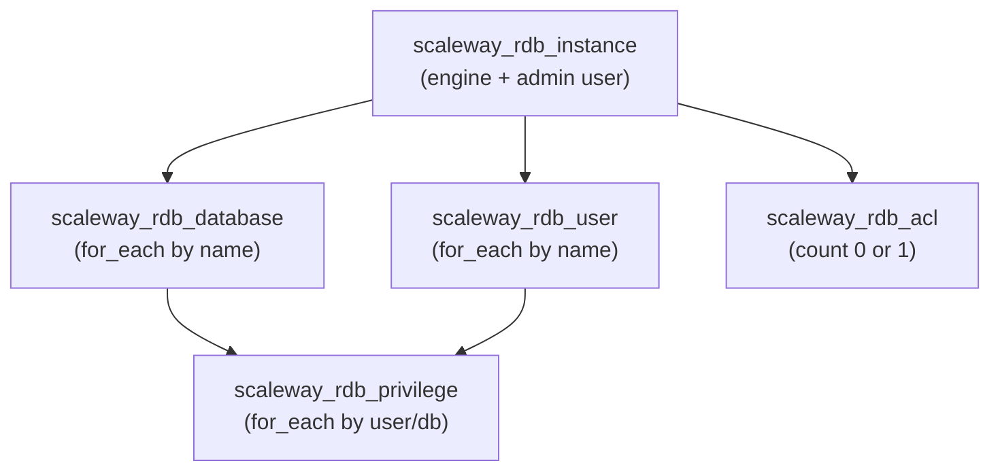

# ScalewayRdbInstance Resource Kind (R09)

**Date**: February 13, 2026
**Type**: Feature
**Components**: API Definitions, Protobuf Schemas, Pulumi CLI Integration, Provider Framework

## Summary

Implemented `ScalewayRdbInstance`, the ninth Scaleway resource kind and the first in the database tier. This is a composite resource that bundles a Scaleway Managed Database (RDB) instance with logical databases, users, per-database privileges, and network ACL rules into a single declarative unit. Supports PostgreSQL and MySQL engines with high availability, Private Network integration, encryption at rest, and fine-grained access control.

## Problem Statement / Motivation

Users deploying managed databases on Scaleway need to orchestrate five separate Terraform resources just to get a working, accessible database: the instance, databases, users, privilege grants, and ACL rules. Each resource depends on the instance ID, and privileges depend on both users and databases existing first. This multi-resource coordination is error-prone and creates unnecessary complexity.

### Pain Points

- Creating a bare database instance leaves it with no application databases, no application users, and no access controls -- effectively useless
- Privilege grants require careful cross-referencing between users and databases
- Scaleway's ACL model (single resource per instance, replaces all rules atomically) is unintuitive when managed as a standalone resource
- Five separate manifests for a single "database" concept violates the 80/20 usability principle

## Solution / What's New

A single `ScalewayRdbInstance` manifest creates a complete, ready-to-use database with all the resources applications need to connect.

### Composite Architecture

### Key Design Decisions

- **Inline privileges on users**: Each user's privileges are defined as a nested list on the user message (not a flat top-level list). This is more natural for the 80% case (1-2 databases, 1-3 users) and avoids orphaned privilege references.
- **Admin user separate from users list**: The initial admin user (`admin_user` + `admin_password`) maps to the instance creation parameters. Additional users in the `users` list are created via separate Terraform/Pulumi resources.
- **ACL optional**: If no ACL rules are specified, no ACL resource is created (Scaleway default: all IPs allowed). Documentation recommends always setting ACL rules for production.
- **IPAM by default**: When a Private Network is attached, IPAM auto-assigns an IP. No static IP field needed for the 80% case.
- **No password in outputs**: Unlike DigitalOcean (auto-generated passwords), Scaleway passwords are user-specified. Exporting them to state is unnecessary security exposure.

## Implementation Details

### Proto Schema (4 files)

- `spec.proto`: 18 fields covering core config, networking, HA, storage, backup, security, admin user, databases, users with inline privileges, and engine settings. Engine validation via regex pattern `^(PostgreSQL|MySQL)-[0-9]+$`. Permission validation via string enum `["readonly", "readwrite", "all", "none"]`.
- `stack_outputs.proto`: 6 outputs -- instance_id, public endpoint (ip + port), private endpoint (ip + port), TLS certificate.
- `api.proto`: Standard resource wrapper with `scaleway.openmcf.org/v1` API version.
- `stack_input.proto`: Target + ScalewayProviderConfig.

### Pulumi Go Module (6 files)

- `instance.go`: Creates the RDB instance with admin user, optional Private Network (IPAM), HA, backup, encryption, volume, and engine settings. Exports all 6 stack outputs.
- `databases_users.go`: Creates databases, users, privileges, and ACL in dependency order. Uses name-keyed maps for privileges.
- `locals.go`: Resolves `StringValueOrRef` for private_network_id, builds standard Scaleway tags.
- `main.go`: Orchestrator calling instance → databasesAndUsers.
- Uses `databases` subpackage: `databases.NewInstance`, `databases.NewDatabase`, `databases.NewUser`, `databases.NewPrivilege`, `databases.NewAcl`.

### Terraform HCL Module (5 files)

- `main.tf`: All 5 resource types. Instance uses dynamic `private_network` block. Databases and users use `for_each` on name-keyed maps. Privileges use `for_each` on `"user_name/database_name"` composite keys. ACL uses `count` (0 or 1) with dynamic `acl_rules` block.
- `locals.tf`: Builds `databases_map`, `users_map`, and `privileges_map` (flattened from users' inline privileges using nested `for` expressions with `merge(...)`).
- `variables.tf`: Full spec type definition with nested objects for databases, users, and privileges.

### Documentation (2 files)

- `README.md`: Overview, bundled resources table, features, quick start examples, dependency table, output table, configuration reference, permission levels, node types, production checklist, security best practices, Scaleway doc links.
- `examples.md`: 7 examples covering dev minimal, production HA, MySQL, multi-user RBAC, ACL lockdown, infra chart valueFrom pattern, and bare instance.

## Benefits

- **One manifest = working database**: Users get an instance + databases + users + access rules from a single resource
- **Fine-grained RBAC**: Per-database permission grants enforce least-privilege for application accounts
- **Infra-chart ready**: `StringValueOrRef` on `private_network_id` enables DAG composition in the database-stack infra chart
- **Production hardening built-in**: HA, encryption, ACL, and backup configuration are first-class spec fields, not afterthoughts
- **Consistent patterns**: Follows the same composite bundling pattern as ScalewayLoadBalancer (5 Terraform resource types), with name-keyed maps for `for_each`

## Impact

- **9 of 19 Scaleway resource kinds** now implemented (47% complete)
- **Database tier unlocked**: R10 (ScalewayRedisCluster) and R11 (ScalewayMongodbInstance) can now proceed
- **database-stack infra chart** can begin composition planning with RDB as the primary resource
- This is the **most feature-rich Scaleway composite** after LoadBalancer, bundling 5 resource types with cross-resource dependency management

## Related Work

- **R02: ScalewayPrivateNetwork** -- Upstream dependency for private database connectivity
- **R05: ScalewayLoadBalancer** -- Established the name-keyed map pattern used here for databases, users, and privileges
- **DigitalOceanDatabaseCluster** -- Reference implementation (simpler: cluster only, no bundled databases/users)
- **DD01: Composite Resources** -- Design decision confirming the bundling of instance + database + user + ACL
- **IC03: database-stack** -- Planned infra chart that composes VPC + PrivateNetwork + RdbInstance + optional Redis + MongoDB

---

**Status**: Production Ready
**Timeline**: Single session implementation
