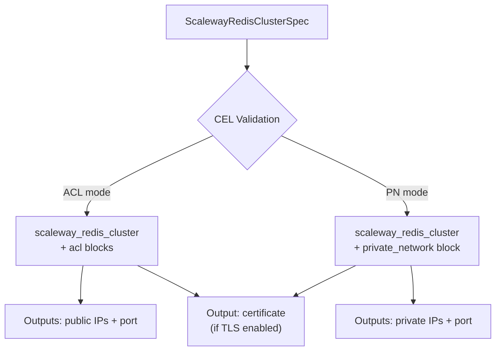

# ScalewayRedisCluster Resource Kind (R10)

**Date**: February 13, 2026
**Type**: Feature
**Components**: API Definitions, Protobuf Schemas, Pulumi CLI Integration, Provider Framework

## Summary

Implemented `ScalewayRedisCluster`, the tenth Scaleway resource kind and the first to use CEL message-level validation for enforcing mutual exclusivity between networking modes. This standalone resource provisions a managed Redis cluster on Scaleway with configurable deployment modes (standalone, HA, cluster/sharding), TLS encryption, ACL or Private Network access control, and Redis engine tuning.

## Problem Statement / Motivation

Users deploying managed Redis on Scaleway need to configure a cluster with the right sizing, networking, and access control. While Scaleway's Redis is a single Terraform resource (unlike RDB which requires five), it has a unique constraint: ACL rules and Private Network attachment are mutually exclusive. Without schema-level enforcement, users discover this conflict only at apply time, wasting deployment cycles.

### Pain Points

- ACL vs Private Network mutual exclusivity is not obvious from field names alone
- Cluster sizing modes (standalone/HA/cluster) have different lifecycle implications that need documentation
- TLS changes force cluster recreation -- a surprise if not documented prominently
- Cluster mode Private Network attachment is immutable after creation

## Solution / What's New

A single `ScalewayRedisCluster` manifest creates a managed Redis cluster with the appropriate networking mode and deployment topology.

### CEL Validation for Mutual Exclusivity

This is the first Scaleway resource kind to use `buf.validate.message` CEL expressions for cross-field validation, following the pattern established by `AzureVirtualMachineSpec`:

```protobuf
option (buf.validate.message).cel = {
  id: "acl_private_network_mutual_exclusivity"
  message: "acl_rules and private_network_id are mutually exclusive"
  expression: "size(this.acl_rules) == 0 || !has(this.private_network_id)"
};
```

This catches invalid configurations at schema validation time, before any cloud API calls are made.

### Architecture



## Implementation Details

### Proto Schema (4 files)

- `spec.proto`: 10 fields covering zone, version, node_type, cluster_size, tls_enabled, user_name, password, acl_rules, private_network_id (StringValueOrRef), and settings. CEL validation enforces ACL/PN mutual exclusivity at the message level.
- `stack_outputs.proto`: 6 outputs -- cluster_id, public network endpoint (port + IPs), private network endpoint (port + IPs), TLS certificate. Only one endpoint set is populated based on networking mode.
- `api.proto`: Standard resource wrapper with `scaleway.planton.dev/v1` API version.
- `stack_input.proto`: Target + ScalewayProviderConfig.

### Pulumi Go Module (6 files)

- `cluster.go`: Creates `redis.NewCluster()` with conditional ACL or Private Network blocks. Exports all 6 stack outputs using `ApplyT` for computed endpoint fields. Fixed `*int` pointer dereference for port outputs.
- `locals.go`: Resolves `StringValueOrRef` for private_network_id, builds standard Scaleway tags.
- `main.go`: Orchestrator calling locals -> provider -> cluster.
- Uses `redis` subpackage: `redis.NewCluster`, `redis.ClusterArgs`, `redis.ClusterAclArgs`, `redis.ClusterPrivateNetworkArgs`.

### Terraform HCL Module (5 files)

- `main.tf`: Single `scaleway_redis_cluster` resource with dynamic `acl` and `private_network` blocks (mutually exclusive via conditional `for_each`/list toggle). Password changes ignored in lifecycle.
- `outputs.tf`: Uses `tolist()` to convert `private_network` set to list for indexed access. Public/private outputs conditionally populated based on networking mode.
- `locals.tf`: Builds standard Planton tags, conditional networking flags.

### Documentation (2 files)

- `README.md`: Overview, deployment modes table, networking mutual exclusivity explanation, lifecycle warnings (TLS recreation, cluster mode PN immutability), production checklist, security best practices.
- `examples.md`: 7 examples covering standalone dev, production HA with PN, cluster mode sharding, ACL lockdown, session store with custom settings, infra chart valueFrom pattern, and bare cluster.

## Benefits

- **CEL validation catches conflicts early**: Users get a clear error message about ACL/PN mutual exclusivity before any API calls
- **Infra-chart ready**: `StringValueOrRef` on `private_network_id` enables DAG composition in the database-stack infra chart
- **Three deployment modes documented**: Standalone, HA, and Cluster mode with clear lifecycle implications
- **Consistent patterns**: Follows the same locals/provider/resource structure as all other Scaleway kinds

## Impact

- **10 of 19 Scaleway resource kinds** now implemented (53% complete)
- **Database tier advancing**: R10 (Redis) done, R11 (MongoDB) is next
- **database-stack infra chart** (IC03) can now plan Redis composition alongside RDB
- **First Scaleway kind with CEL validation**: Establishes the pattern for future cross-field constraints

## Related Work

- **R02: ScalewayPrivateNetwork** -- Upstream dependency for private Redis connectivity
- **R09: ScalewayRdbInstance** -- Sibling database resource (composite, unlike Redis which is standalone)
- **DigitalOceanDatabaseCluster** -- Reference implementation (single resource, similar scope)
- **AzureVirtualMachineSpec** -- Established the `buf.validate.message` CEL pattern used here
- **IC03: database-stack** -- Planned infra chart that composes VPC + PrivateNetwork + RdbInstance + RedisCluster + optional MongoDB

---

**Status**: Production Ready
**Timeline**: Single session implementation
