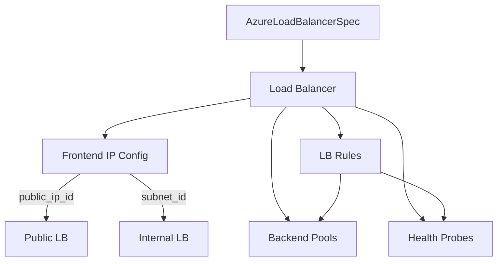
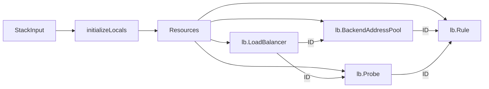

# Azure Load Balancer Resource Kind

**Date**: February 13, 2026
**Type**: Feature
**Components**: API Definitions, Azure Provider, Pulumi CLI Integration, Terraform Module

## Summary

Added AzureLoadBalancer as a new deployment component in OpenMCF, providing Layer 4 (TCP/UDP) load balancing for Azure workloads. The component bundles the load balancer with backend pools, health probes, and load balancing rules. This is R09 in the Azure resource expansion project (10th of 24 Azure resources).

## Problem Statement / Motivation

The Azure resource expansion project aims to grow Azure coverage from 10 to 33 cloud resource kinds. AzureLoadBalancer is a core networking resource required by the enterprise-network-foundation infra chart and serves as the Layer 4 traffic distribution mechanism for production Azure deployments.

### Pain Points

- No Layer 4 load balancing capability in OpenMCF for Azure
- Enterprise network architectures require both L4 (LB) and L7 (Application Gateway) traffic distribution
- SQL AlwaysOn, HA clustering, and NVA scenarios require Standard LB with floating IP support

## Solution / What's New

### Complete Deployment Component

The AzureLoadBalancer component follows the forge pattern with full proto API, dual IaC (Pulumi + Terraform), comprehensive documentation, and 28 validation tests.

### Key Design Corrections from T02 Spec

Eight corrections were applied during deep provider research:

1. Added `resource_group` (StringValueOrRef) -- missing from T02
2. Added `region` (string) -- missing from T02
3. Dropped `sku` field -- hardcoded to Standard (Basic retired Sept 2025)
4. Dropped `is_internal` boolean -- redundant with public_ip_id/subnet_id
5. Added `private_ip_address` -- static IP for internal LB
6. Added `number_of_probes` -- unhealthy threshold tunable
7. Used string+CEL for protocols -- matches NSG pattern
8. Simplified outputs -- single `backend_pool_id` instead of repeated

## Implementation Details

### Proto API (4 proto files + tests)

- `spec.proto` -- AzureLoadBalancerSpec with 3 sub-messages (AzureBackendPool, AzureHealthProbe, AzureLoadBalancingRule)
- `stack_outputs.proto` -- 5 outputs (lb_id, lb_name, frontend_ip_address, frontend_ip_configuration_id, backend_pool_id)
- `api.proto` -- KRM wiring with api_version `azure.openmcf.org/v1`
- `stack_input.proto` -- IaC module input
- `spec_test.go` -- 28 validation tests (8 valid + 20 invalid scenarios)

### Pulumi Module (azure classic v6)

- Standard SKU hardcoded
- Frontend config auto-derived: `"{name}-frontend"`
- Pools and probes tracked by name maps for rule lookups
- Runtime validation: rules referencing unknown pools/probes produce clear errors

### Terraform Module

- Feature parity with Pulumi module
- `for_each` on pools, probes, and rules
- Locals-based pool/probe lookup maps for rule references
- Same Standard SKU hardcoding

### StringValueOrRef Dependencies

| Field | Default Kind | Output Field |
|-------|-------------|-------------|
| `resource_group` | AzureResourceGroup | `resource_group_name` |
| `public_ip_id` | AzurePublicIp | `public_ip_id` |
| `subnet_id` | AzureSubnet | `subnet_id` |

## Benefits

- **Enterprise-ready**: Standard SKU with zone redundancy, HA ports, floating IP
- **Infra chart composable**: All cross-resource references use StringValueOrRef
- **Dual IaC**: Pulumi and Terraform with full feature parity
- **Well-tested**: 28 validation tests covering all constraint boundaries
- **Production docs**: 7 YAML examples covering minimal, internal, multi-pool, SQL AlwaysOn, and infra chart patterns

## Impact

- **New capability**: Layer 4 load balancing for Azure in OpenMCF
- **Enum registration**: `AzureLoadBalancer = 417` in cloud_resource_kind.proto
- **Infra chart enablement**: Unlocks enterprise-network-foundation chart component
- **Files created**: ~30 files across proto, Go, HCL, YAML, and Markdown

## Related Work

- **R04 AzurePublicIp** -- Provides frontend IP for public LBs
- **R05 AzureSubnet** -- Provides subnet for internal LBs
- **R06 AzureNetworkSecurityGroup** -- Established bundled sub-resource pattern
- **R10 AzureApplicationGateway** -- Next in queue (Layer 7 complement)
- **Enterprise-network-foundation infra chart** -- T03, will compose LB + AppGW + NSG + PublicIP

---

**Status**: Production Ready
**Timeline**: Single session, R09 of 24 Azure resources
