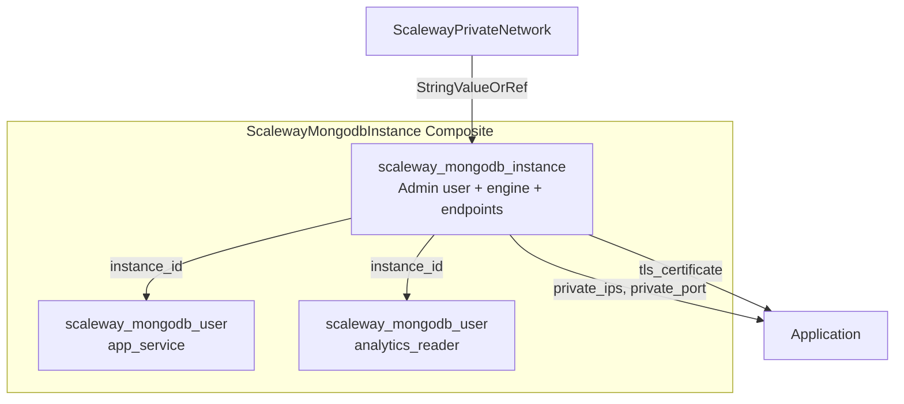

# ScalewayMongodbInstance Resource Kind (R11)

**Date**: February 13, 2026
**Type**: Feature
**Components**: API Definitions, Provider Framework, Protobuf Schemas

## Summary

Implemented the eleventh Scaleway resource kind: `ScalewayMongodbInstance`. This is a composite resource bundling a managed MongoDB instance with application users and role-based access control. It completes the third database-tier resource (after RDB and Redis) and introduces several patterns unique to MongoDB's simpler resource model.

## Problem Statement / Motivation

The Scaleway provider in OpenMCF needed managed MongoDB support to complete the database tier. MongoDB is a widely-used document database that complements the existing relational (RDB) and in-memory (Redis) offerings. The `database-stack` infra chart needs all three database types to provide comprehensive data platform coverage.

### Pain Points

- No managed MongoDB option in OpenMCF for Scaleway
- Users deploying MongoDB on Scaleway must manually create instances and configure users
- No infra-chart composability for MongoDB in the dependency DAG

## Solution / What's New

A composite resource kind (`ScalewayMongodbInstance`) that bundles 2 Terraform resource types into a single declarative unit:

1. `scaleway_mongodb_instance` -- The managed MongoDB engine with admin user
2. `scaleway_mongodb_user` -- Additional database users with role-based access (for_each)

### Architecture



### Key Design Decisions

**Lighter composite than RDB.** MongoDB's resource surface is fundamentally different from relational databases:

- **No database resource**: MongoDB databases are created implicitly on first write. No `scaleway_mongodb_database` equivalent exists.
- **No ACL resource**: MongoDB has no IP-based access control. Network security is controlled entirely by the Private Network / Public Network toggle.
- **No separate privilege resource**: User permissions are expressed as role assignments directly on the user resource.

This results in a 2-type composite (vs RDB's 5 types).

**Network security model.** Unlike RDB (which has `scaleway_rdb_acl` for CIDR-based access control), MongoDB's only security boundary is endpoint choice. When a Private Network is attached, the default is private-only (no public endpoint). Users can opt-in to a public endpoint via `enable_public_network`, but that endpoint is accessible from any IP with no ACL filtering. This is prominently documented as a security consideration.

**Node number validation via CEL.** Scaleway MongoDB supports exactly 1 (standalone) or 3 (replica set) nodes. A CEL message-level validation enforces this at the schema level, catching invalid configurations before any cloud API calls. The CEL expression required `uint()` casts because protobuf `uint32` maps to CEL `uint` type, which cannot be compared directly to integer literals.

**Role-based access with mutual exclusivity.** Each user role has a scope: either a specific `database_name` or `any_database` (all databases). A CEL validation on the `ScalewayMongodbUserRole` message ensures exactly one scope is set. The `sync` role is intentionally excluded (niche replication role).

## Implementation Details

### Files Created

**Proto schemas** (4 files):
- `api.proto` -- Standard OpenMCF API wrapper
- `spec.proto` -- ScalewayMongodbInstanceSpec with users, roles, and CEL validations
- `stack_outputs.proto` -- 7 outputs (instance_id, public/private endpoints, TLS cert)
- `stack_input.proto` -- Standard stack input

**Pulumi Go module** (7 files):
- Entry point (`iac/pulumi/main.go`) loading stack input
- Module orchestrator (`module/main.go`) creating instance then users
- Instance creation (`module/instance.go`) with endpoint output extraction
- User creation (`module/users.go`) with role assembly
- Locals initialization (`module/locals.go`) with tag generation
- Output constants (`module/outputs.go`)
- Pulumi project file (`iac/pulumi/Pulumi.yaml`)

**Terraform HCL module** (5 files):
- `main.tf` -- Instance + users with dynamic blocks for networking and roles
- `variables.tf` -- Variable definitions mirroring proto spec
- `outputs.tf` -- 7 outputs using `try()` for conditional endpoints
- `locals.tf` -- Computed values, user maps, standard tags
- `provider.tf` -- Scaleway provider config (regional)

**Documentation** (2 files):
- `README.md` -- Overview, bundled resources, features, config reference, node types, security model
- `examples.md` -- 7 examples (dev, production, multi-user, hybrid, bare, infra-chart, large volume)

### Pulumi SDK Discovery

The `mongodb.UserRoleArgs.Role` field is `pulumi.StringInput` (not `pulumi.StringPtrInput` as initially expected from the SDK documentation). This required using `pulumi.String()` instead of `pulumi.StringPtr()`. The `DatabaseName` and `AnyDatabase` fields correctly use Ptr types.

### Networking Logic

The Terraform module uses two `dynamic` blocks to handle the endpoint matrix:

```hcl
# Private Network: attached when private_network_id is set
dynamic "private_network" {
  for_each = local.has_private_network ? [1] : []
  content { pn_id = local.private_network_id }
}

# Public Network: attached when PN is set AND user opts in
dynamic "public_network" {
  for_each = local.has_private_network && local.enable_public_network ? [1] : []
  content {}
}
```

When no PN is set, Scaleway creates a public endpoint by default (no explicit block needed).

## Benefits

- **Ready-to-use MongoDB**: One resource = working database with pre-configured users and roles
- **Secure by default**: Private-only when PN is attached (no public endpoint unless opted in)
- **Schema-level validation**: CEL catches invalid node counts and malformed role scopes before any API call
- **Infra-chart composable**: `StringValueOrRef` on `private_network_id` enables `valueFrom` wiring in chart templates
- **Comprehensive documentation**: README with security model, node types, and connection guide; 7 examples covering all deployment patterns

## Impact

- **11 of 19 Scaleway resource kinds complete** (58%)
- **Database tier complete**: RDB (PostgreSQL/MySQL) + Redis + MongoDB
- **8 remaining**: ObjectBucket, BlockVolume, ContainerRegistry, DnsZone, DnsRecord, ServerlessFunction, ServerlessContainer, SecretManager

## Related Work

- R09: ScalewayRdbInstance (primary reference for composite database pattern)
- R10: ScalewayRedisCluster (CEL validation pattern reference)
- DD02: Private Network as universal connector
- IC03: scaleway/database-stack infra chart (will compose all three database kinds)

---

**Status**: Production Ready
**Timeline**: Single session (~1 hour)
