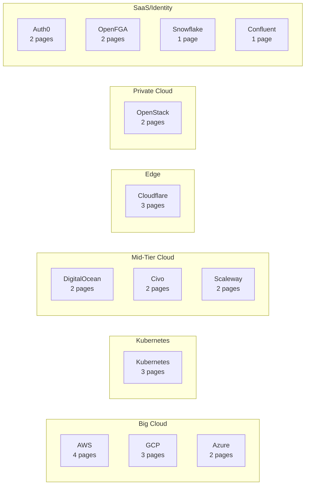
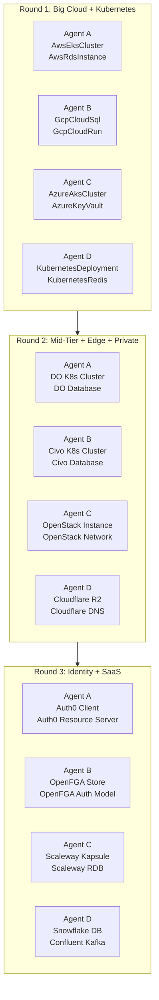

# Catalog Page Expansion: 24 Hand-Written Pages Across All 13 Providers

**Date**: February 13, 2026
**Type**: Feature
**Components**: Documentation, Catalog Pages, Provider Coverage

## Summary

Expanded the hand-written catalog page inventory from 5 exemplars to 29 total, covering every active cloud provider in the OpenMCF framework. Each page is source-verified against spec.proto, stack_outputs.proto, and the Pulumi IaC module, following the 9-section standard established in the catalog page rewrite system. The expansion was executed in 3 rounds of 4 parallel agents, each handling 2 components, completing in a single session.

## Problem Statement / Motivation

The catalog page rewrite system (2026-02-13) established a standard for hand-written, source-verified catalog pages and produced 5 exemplars. However, 5 pages out of ~178 components left the vast majority of the catalog using the old auto-generated research documents — multi-hundred-line essays about deployment maturity spectrums and technology comparisons that bury the actual OpenMCF-specific content.

### Pain Points

- Only 5 of ~178 components had the new catalog page experience
- Developers landing on unmigrated catalog pages saw research documents instead of actionable deployment guides
- No reference exemplars existed for 8 of the 13 providers (Azure, DigitalOcean, Civo, OpenStack, OpenFGA, Auth0, Scaleway, Snowflake, Confluent)
- Future automated migration of the remaining ~149 components lacked provider-specific reference material to guide AI agents
- The complexity spectrum was narrow — exemplars only covered low-to-high complexity, missing the extremes (1-field specs like OpenfgaStore, 29-field specs like Auth0Client)

## Solution / What's New

24 new catalog pages written across all 13 active providers, selected as high-value reference exemplars covering different complexity levels, infrastructure patterns, and proto structures.

### Provider Coverage



### Selection Criteria

Components were chosen to maximize reference value across three dimensions:

1. **Complexity spectrum** — from 1-field (OpenfgaStore) to 29-field/9-nested (Auth0Client)
2. **Infrastructure patterns** — managed K8s (5 providers), databases (5), compute (2), serverless (1), storage (2), networking (2), DNS (2), secrets (1), identity/auth (4), streaming (1), data warehouse (1)
3. **Provider variety** — every provider now has at least 1 hand-written reference page

## Implementation Details

### Components Written

| Provider | Component | Complexity | Fields | Nested Messages |
|----------|-----------|-----------|--------|-----------------|
| AWS | AwsEksCluster | High | 7 | 0 |
| AWS | AwsRdsInstance | Medium | 16 | 0 |
| GCP | GcpCloudSql | Medium-High | 16 | 5 |
| GCP | GcpCloudRun | Medium | 13 | 6 |
| Azure | AzureAksCluster | High | 14 | 5 |
| Azure | AzureKeyVault | Medium | 8 | 1 |
| Kubernetes | KubernetesDeployment | Medium | 8 | 9 |
| Kubernetes | KubernetesRedis | Medium | 5 | 2 |
| DigitalOcean | DigitalOceanKubernetesCluster | Medium-High | 12 | 1 |
| DigitalOcean | DigitalOceanDatabaseCluster | Medium | 9 | 0 |
| Civo | CivoKubernetesCluster | Medium | 9 | 1 |
| Civo | CivoDatabase | Medium | 10 | 0 |
| Cloudflare | CloudflareR2Bucket | Low-Medium | 6 | 1 |
| Cloudflare | CloudflareDnsZone | Low | 6 | 1 |
| OpenStack | OpenstackInstance | High | 15 | 2 |
| OpenStack | OpenstackNetwork | Medium | 9 | 0 |
| OpenFGA | OpenfgaStore | Minimal | 1 | 0 |
| OpenFGA | OpenfgaAuthorizationModel | Low | 3 | 0 |
| Auth0 | Auth0Client | High | 29 | 9 |
| Auth0 | Auth0ResourceServer | Medium | 10 | 1 |
| Scaleway | ScalewayKapsuleCluster | High | 14 | 4 |
| Scaleway | ScalewayRdbInstance | Medium-High | 18 | 4 |
| Snowflake | SnowflakeDatabase | Medium | 18 | 1 |
| Confluent | ConfluentKafka | Medium | 8 | 2 |

### Execution Architecture

The work was parallelized into 3 rounds of 4 agents:



Each agent followed the same workflow:

1. Read `write-openmcf-component-catalog-page.mdc` rule
2. Read AWS ALB exemplar as gold standard
3. Read component source files (api.proto, spec.proto, stack_outputs.proto, Pulumi module)
4. Write catalog page following the 9-section structure
5. Run 6-point verification protocol

### Verification Results

All 24 pages passed all 6 verification checks:

| Check | Description | Result |
|-------|-------------|--------|
| Source Code | Every field, resource, and output traced to proto/Go source | Pass (24/24) |
| Command | CLI commands verified against `cmd/openmcf/` | Pass (24/24) |
| Manifest | KRM structure, camelCase fields, valid values | Pass (24/24) |
| Link | Internal catalog links point to existing components | Pass (24/24) |
| Planton | Zero references to Planton/SaaS/commercial platform | Pass (24/24) |
| Webapp | Zero references to webapp/cloud-resource/credential commands | Pass (24/24) |

### Notable Findings During Writing

- **OpenFGA components use `tofu` provisioner** — the OpenFGA Pulumi modules are pass-through wrappers; these components are natively OpenTofu/Terraform-based. The catalog pages correctly use `openmcf.org/provisioner: tofu` labels.
- **Auth0Client is the densest spec** — 29 fields across 9 nested messages, requiring careful organization of the Configuration Reference into logical sub-sections (OAuth, JWT, Refresh Tokens, Mobile, etc.)
- **CloudflareR2Bucket has implementation notes** — `publicAccess` requires manual dashboard enablement, `versioningEnabled` is accepted but silently ignored. Both documented from source code comments.
- **OpenfgaStore demonstrates minimal spec handling** — 1 field, 3 examples. The examples find meaningful variation through naming patterns for different isolation strategies (dev, per-app, production).

## Benefits

- **Full provider coverage** — every developer evaluating OpenMCF for any of the 13 supported providers now finds at least 1-2 hand-written, source-verified catalog pages
- **Rich reference set for automation** — the 29 pages cover every complexity level and infrastructure pattern, providing AI agents comprehensive reference material for migrating the remaining ~149 components
- **Consistent quality** — all pages follow the same 9-section structure, persona, and tone established by the original exemplars
- **Parallelization validated** — the 3-round execution pattern proved that the `write-openmcf-component-catalog-page.mdc` rule is self-contained enough for parallel agent execution

## Impact

### Users
- Developers evaluating OpenMCF now see professional, source-verified documentation for flagship components across all providers
- The catalog pages provide copy-pasteable manifests, complete field references, and progressive examples

### Documentation System
- 29 of ~178 components (16%) now use the new catalog page format
- The remaining ~149 components can be migrated using the same rule and agent pattern
- Provider-specific patterns are now documented (SaaS providers, identity providers, private cloud, edge)

### Future Work
- ~149 components remain to be migrated from legacy research docs to hand-written catalog pages
- The established parallelization pattern (4 agents, 2 components each) can process ~8 components per round

## Related Work

- [Catalog Page Rewrite System](2026-02-13-150154-catalog-page-rewrite-system.md) — established the standard, rules, build pipeline, and 5 exemplars
- [Getting Started Page Fresh Rewrite](2026-02-13-140937-getting-started-page-fresh-rewrite.md) — rewrote the entry point page
- [Phase 6 Final Audit](2026-02-13-120312-phase6-final-audit-and-env-var-rename.md) — audited all 40 docs pages

## Files Created

24 new `catalog-page.md` files under `apis/org/openmcf/provider/`:

```
aws/awsekscluster/v1/catalog-page.md
aws/awsrdsinstance/v1/catalog-page.md
gcp/gcpcloudsql/v1/catalog-page.md
gcp/gcpcloudrun/v1/catalog-page.md
azure/azureakscluster/v1/catalog-page.md
azure/azurekeyvault/v1/catalog-page.md
kubernetes/kubernetesdeployment/v1/catalog-page.md
kubernetes/kubernetesredis/v1/catalog-page.md
digitalocean/digitaloceankubernetescluster/v1/catalog-page.md
digitalocean/digitaloceandatabasecluster/v1/catalog-page.md
civo/civokubernetescluster/v1/catalog-page.md
civo/civodatabase/v1/catalog-page.md
cloudflare/cloudflarer2bucket/v1/catalog-page.md
cloudflare/cloudflarednszone/v1/catalog-page.md
openstack/openstackinstance/v1/catalog-page.md
openstack/openstacknetwork/v1/catalog-page.md
openfga/openfgastore/v1/catalog-page.md
openfga/openfgaauthorizationmodel/v1/catalog-page.md
auth0/auth0client/v1/catalog-page.md
auth0/auth0resourceserver/v1/catalog-page.md
scaleway/scalewaykapsulecluster/v1/catalog-page.md
scaleway/scalewayrdbinstance/v1/catalog-page.md
snowflake/snowflakedatabase/v1/catalog-page.md
confluent/confluentkafka/v1/catalog-page.md
```

---

**Status**: Production Ready
**Timeline**: Single session, 3 rounds of parallel execution
