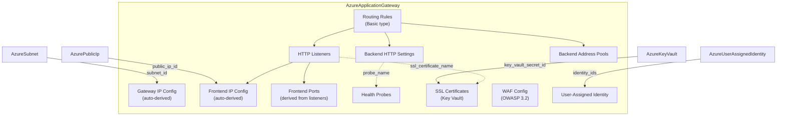

# Azure Application Gateway Resource Kind

**Date**: February 13, 2026
**Type**: Feature
**Components**: Azure Provider, API Definitions, Pulumi CLI Integration, Terraform Module

## Summary

Added AzureApplicationGateway (enum 416, id_prefix: azagw) as a new OpenMCF cloud resource kind, providing Layer 7 (HTTP/HTTPS) load balancing with SSL termination, host-based routing, custom health probes, cookie-based session affinity, and optional WAF protection. This is R10 in the Azure resource expansion project, completing the networking tier alongside the previously implemented AzureLoadBalancer (L4).

## Problem Statement / Motivation

The Azure resource expansion project targets 24 resource kinds to enable enterprise Azure infrastructure patterns. The first 10 (R00-R09) established the foundation: resource groups, monitoring, identity, and L4 networking. R10 (Application Gateway) fills the critical L7 gap -- most enterprise Azure deployments require HTTP-aware traffic management for SSL offloading, host-based routing, and web application firewall protection.

### Pain Points

- No L7 load balancing capability in the Azure provider -- only L4 via AzureLoadBalancer
- Enterprise architectures need SSL termination at the gateway, not on every backend
- Host-based routing (multiple domains on one gateway) is a common requirement
- WAF protection against OWASP Top 10 attacks requires Application Gateway WAF_v2 SKU

## Solution / What's New

A complete deployment component for Azure Application Gateway with both Pulumi and Terraform IaC modules, 57 validation tests, and production-quality documentation.

### Architecture

### 10 Corrections from T02 Spec

Deep research into the `azurerm_application_gateway` Terraform provider schema (17+ nested block types) revealed 10 corrections to the original T02 spec design:

1. **Added `resource_group` and `region`** -- missing from T02, required per DD05 pattern
2. **Added `backend_http_settings`** -- CRITICAL missing component; App GW cannot route without it
3. **Added health probes** -- important for production; Azure's default probes are unreliable
4. **Added SSL certificates** -- Key Vault reference for HTTPS (primary L7 use case)
5. **Restructured frontend ports** -- auto-derived from listener port values
6. **Fixed routing rules** -- added `backend_http_settings_name` (required), made `priority` required
7. **Clarified capacity vs autoscale** -- mutually exclusive configuration
8. **Limited to Basic routing** -- PathBasedRouting deferred to v2 (significant complexity reduction)
9. **Added WAF mode** -- Detection vs Prevention (not just bool enable)
10. **Fixed enum value** -- queue says 416, spec text said 415

### Key Design Decisions

- **Single monolithic resource**: Unlike the LB (4 separate resources), App GW is one Pulumi/Terraform resource with nested blocks. Simpler module structure, more complex resource definition.
- **V2 SKU only**: Standard_v2 and WAF_v2 (v1 is legacy, lacks autoscale and zone redundancy)
- **Auto-derived internal names**: Gateway IP config, frontend IP config, and frontend port names are auto-derived by the IaC modules. Users never touch these.
- **SSL via Key Vault only**: No PFX upload in v1. Key Vault reference is the production pattern.
- **Basic routing only**: No path-based routing (url_path_map) in v1. Host-based routing via listener `host_name` is included.

## Implementation Details

### Proto API (4 files)

- **spec.proto**: 8 message types -- `AzureApplicationGatewaySpec`, `AzureApplicationGatewayAutoscale`, `AzureBackendAddressPool`, `AzureBackendHttpSettings`, `AzureHttpListener`, `AzureRequestRoutingRule`, `AzureHealthProbe`, `AzureSslCertificate`
- **stack_outputs.proto**: `app_gateway_id`, `app_gateway_name`
- **api.proto**: KRM-style `AzureApplicationGateway` with metadata/spec/status
- **stack_input.proto**: Target resource + Azure provider config

### Validation (57 tests)

- 14 valid input tests: minimal HTTP, WAF enabled, Detection mode, HTTPS with SSL cert, custom health probes, autoscale, multiple pools, host-based routing, HTTPS backend settings, HTTP/2, cookie affinity, fixed capacity, valueFrom resource_group, HTTPS probe
- 43 invalid input tests: wrong api_version, wrong kind, missing metadata/spec/region/resource_group/name/subnet/public_ip, invalid SKU, capacity bounds, autoscale bounds, empty arrays, empty names, port ranges, invalid protocols, invalid affinity values, timeout ranges, priority ranges, probe validation, SSL cert validation, WAF mode validation

### Pulumi Module

Uses `network.NewApplicationGateway` from `pulumi-azure/sdk/v6/go/azure/network`. Single resource call with all sub-components as nested `Args` structs.

### Terraform Module

Single `azurerm_application_gateway` resource with dynamic blocks for all repeated elements. Uses `for_each` maps for named sub-resources.

## Benefits

- **L7 load balancing**: SSL termination, host-based routing, WAF -- the core enterprise networking primitives
- **Infra chart ready**: All references use `StringValueOrRef` for composability in enterprise-network-foundation
- **Production-quality**: 57 tests, comprehensive documentation, both IaC implementations
- **Clean 80/20**: Covers the primary use cases without the complexity of path-based routing, redirects, or rewrite rules

## Impact

- **Azure provider**: 11th resource kind (R10 of 24 in the expansion queue)
- **Infra charts**: Enables the L7 ingress point in enterprise-network-foundation
- **Users**: Can deploy production Application Gateways with SSL, WAF, host routing, and health probes
- **Next resource**: R11 AzurePostgresqlFlexibleServer (database tier begins)

## Related Work

- R09 AzureLoadBalancer -- L4 complement (previous session)
- R04 AzurePublicIp -- required dependency (public IP for frontend)
- R05 AzureSubnet -- required dependency (dedicated subnet)
- R03 AzureUserAssignedIdentity -- optional dependency (for Key Vault SSL access)
- DD03 Composite Bundling Rules -- App GW bundles all structural sub-resources
- DD05 AzureResourceGroup First-Class -- resource_group as StringValueOrRef

---

**Status**: Production Ready
**Test Results**: 57/57 passed
**Build**: go build + go test green
