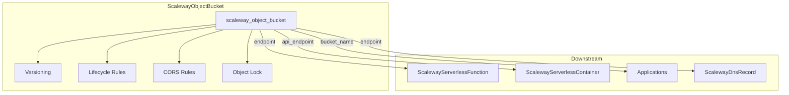

# Scaleway Object Storage Bucket Resource Kind

**Date**: February 13, 2026
**Type**: Feature
**Components**: API Definitions, Pulumi IaC Module, Terraform IaC Module, Provider Framework

## Summary

Implemented ScalewayObjectBucket (R12) -- the twelfth Scaleway resource kind and the first in the storage tier. This is a standalone resource wrapping a single `scaleway_object_bucket` with inline versioning, lifecycle rules, and CORS support. Two architectural surprises were discovered and handled: Object Storage uses key-value map tags (not flat string tags like all other Scaleway resources), and the Pulumi SDK has a deprecated-to-new subpackage migration path.

## Problem Statement / Motivation

The Scaleway cloud provider expansion in OpenMCF needs object storage support. S3-compatible storage is foundational infrastructure that downstream resources (serverless functions, containers, applications) need for file storage, backups, media hosting, and log archival.

### Pain Points

- No Scaleway object storage resource kind existed in OpenMCF
- Teams managing Scaleway infrastructure couldn't declaratively provision buckets
- Missing piece for infra chart compositions that need storage (serverless-environment, database-stack backup targets)

## Solution / What's New

A standalone ScalewayObjectBucket resource kind that covers the 80% use case of S3-compatible object storage: bucket creation, versioning, lifecycle rules for cost management, and CORS for web applications.

### Architecture

### Key Design Decisions

1. **Standalone resource** -- All meaningful config (versioning, lifecycle, CORS) is inline on the single Terraform resource. No composite bundling needed.

2. **No `StringValueOrRef` inputs** -- Object buckets are leaf resources with no upstream dependencies. Downstream resources reference the bucket's outputs.

3. **Map-based tags** -- Object Storage uses S3-compatible `map<string, string>` tags, unlike other Scaleway resources that use flat `[]string` tags. The IaC modules handle this transparently.

4. **New Pulumi subpackage** -- Uses `scaleway/object.Bucket` (new path) instead of deprecated `scaleway.ObjectBucket`, following the same subpackage pattern as ScalewayKapsuleCluster (`scaleway/kubernetes`).

5. **Noncurrent version expiration excluded** -- The Scaleway Terraform provider doesn't support `noncurrent_version_expiration` blocks in lifecycle rules (this is an AWS S3 concept). Discovered during `terraform validate` and cleanly removed from spec and all modules.

## Implementation Details

### Files Created (18 new files in openmcf)

**Proto schemas (4)**:
- `apis/org/openmcf/provider/scaleway/scalewayobjectbucket/v1/api.proto`
- `apis/org/openmcf/provider/scaleway/scalewayobjectbucket/v1/spec.proto`
- `apis/org/openmcf/provider/scaleway/scalewayobjectbucket/v1/stack_outputs.proto`
- `apis/org/openmcf/provider/scaleway/scalewayobjectbucket/v1/stack_input.proto`

**Pulumi Go module (6)**:
- `iac/pulumi/Pulumi.yaml`
- `iac/pulumi/main.go`
- `iac/pulumi/module/main.go`
- `iac/pulumi/module/locals.go`
- `iac/pulumi/module/outputs.go`
- `iac/pulumi/module/bucket.go`

**Terraform HCL module (5)**:
- `iac/tf/provider.tf`
- `iac/tf/variables.tf`
- `iac/tf/locals.tf`
- `iac/tf/main.tf`
- `iac/tf/outputs.tf`

**Documentation (2)**:
- `README.md`
- `examples.md`

### Spec Design

The spec includes 6 user-facing fields with CEL validation enforcing that Object Lock requires versioning:

- `region` (required) -- Regional resource: fr-par, nl-ams, pl-waw
- `versioning_enabled` -- S3-compatible object versioning
- `object_lock_enabled` -- WORM protection (requires versioning, CEL validated)
- `lifecycle_rules` -- Cost management automation with transitions and expiration
- `cors_rules` -- Cross-origin resource sharing for web applications
- `force_destroy` -- Allow deletion with objects inside

### Stack Outputs

5 outputs enabling downstream composition:
- `bucket_id` -- Unique identifier (region/name format)
- `endpoint` -- FQDN endpoint for S3 client access
- `api_endpoint` -- S3 API endpoint URL
- `bucket_name` -- Bucket name for client config
- `region` -- Deployment region

### Surprise: Tag Model Difference

Other Scaleway resources use flat string tags: `["key=value"]`

Object Storage uses S3-compatible key-value map tags: `{"key": "value"}`

This required adapting the tag generation in both Pulumi (`locals.go` uses `map[string]string` instead of `[]string`) and Terraform (`locals.tf` uses `merge()` with map literals instead of `compact()` with formatted strings).

## Benefits

- **S3 compatible** -- Works with AWS CLI, s3cmd, rclone, and all S3 SDKs
- **Cost management** -- Lifecycle rules automate storage class transitions and object expiration
- **Web-ready** -- CORS configuration enables direct browser uploads
- **Production-safe** -- `force_destroy: false` default prevents accidental data loss
- **Compliance-ready** -- Object Lock enables WORM protection with CEL validation

## Impact

- **12 of 19** Scaleway resource kinds now implemented (63%)
- Storage tier begins (R12 ObjectBucket, R13 BlockVolume remaining)
- Downstream consumers (R17 ServerlessFunction, R18 ServerlessContainer) can now reference bucket outputs
- First Scaleway resource with map-based tags (pattern established for future S3-compatible resources)

## Related Work

- **Predecessor**: R11 ScalewayMongodbInstance (completed database tier)
- **Next**: R13 ScalewayBlockVolume (continues storage tier)
- **Reference**: DigitalOceanBucket (pattern reference for spec design)
- **Reference**: AwsS3Bucket (feature comparison for lifecycle rules and CORS)

---

**Status**: Production Ready
**Timeline**: Single session implementation with one Terraform validate surprise (noncurrent version expiration not supported by Scaleway)
