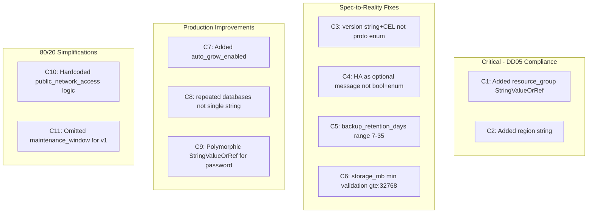
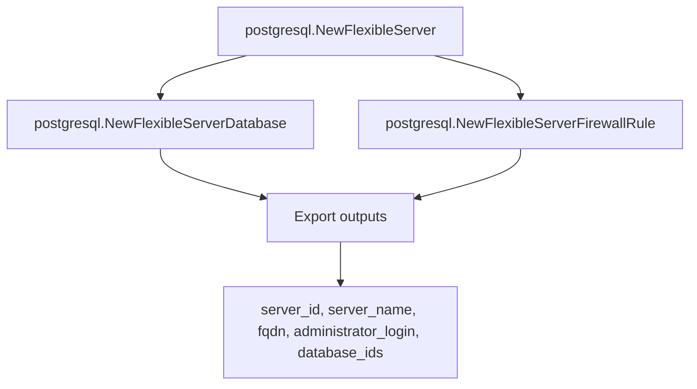

# AzurePostgresqlFlexibleServer Deployment Component

**Date**: February 13, 2026
**Type**: Feature
**Components**: Azure Provider, API Definitions, Pulumi Module, Terraform Module, Documentation

## Summary

Forged the AzurePostgresqlFlexibleServer deployment component (R11 in the Azure resource expansion queue), providing a fully managed PostgreSQL Flexible Server with bundled databases, firewall rules, VNet integration, and zone-redundant high availability. Applied 11 corrections to the original T02 spec based on deep research of the Terraform provider source (API version 2025-08-01) and Pulumi SDK.

## Problem Statement / Motivation

The Azure resource expansion sub-project (20260212.05) requires 24 new Azure resource kinds to enable enterprise infra charts. PostgreSQL Flexible Server is the first database resource in the queue and a critical building block for the database-stack, container-apps-environment, and web-app-environment infra charts.

### Pain Points

- No managed PostgreSQL resource existed in Planton for Azure
- The original T02 spec design had 11 gaps discovered during deep provider research
- Database resources require careful handling of ForceNew fields, secrets, and network modes

## Solution / What's New

### Complete Deployment Component (31 files)

A production-ready AzurePostgresqlFlexibleServer component following the forge workflow's 19-step process:

- **4 proto files** -- spec, api, stack_input, stack_outputs with comprehensive buf.validate rules
- **37 validation tests** -- covering valid inputs (public, VNet, HA, databases, valueFrom references) and invalid inputs (missing fields, range violations, invalid versions, invalid HA modes)
- **Pulumi IaC module** -- using `pulumi-azure` v6 classic provider (`postgresql` package)
- **Terraform module** -- with feature parity using `azurerm_postgresql_flexible_server`
- **Production-quality documentation** -- README, 6 YAML examples, comprehensive research docs
- **Registered** as enum 430 in `cloud_resource_kind.proto`

### 11 Corrections from T02 Spec

## Implementation Details

### Proto Design

- **17 spec fields** across 4 messages (spec, HA, database, firewall rule)
- **String+CEL validation** for version ("12"-"17") and HA mode ("ZoneRedundant"/"SameZone")
- **Polymorphic StringValueOrRef** for `administrator_password` (no default_kind, password source varies)
- **Provider-authentic field names**: `storage_mb`, `sku_name`, `auto_grow_enabled`
- **Proactive defaults**: version="16", backup_retention_days=7, auto_grow_enabled=false, geo_redundant_backup_enabled=false, database charset="UTF8", collation="en_US.utf8"

### Pulumi Module Architecture

**Network mode logic**: `delegated_subnet_id` set -> `PublicNetworkAccessEnabled = false`; not set -> `true`. No separate boolean field.

**Database ID map**: Exported as `pulumi.StringMap` following KeyVault's `secret_id_map` pattern.

### Stack Outputs

| Output | Type | Purpose |
|--------|------|---------|
| `server_id` | string | Azure RM ID, referenced by AzurePrivateEndpoint |
| `server_name` | string | Server name |
| `fqdn` | string | Connection string construction |
| `administrator_login` | string | Connection string construction |
| `database_ids` | map | Individual database resource IDs |

## Benefits

- **First database resource** in the Azure expansion, unlocking the database-stack infra chart
- **37 validation tests** ensuring all buf.validate rules are correct and exercised
- **Dual IaC** with Pulumi and Terraform feature parity
- **6 YAML examples** covering minimal, VNet, HA, infra-chart valueFrom, database-stack pattern, and geo-redundant backup
- **11 corrections** from deep provider research prevent production surprises

## Impact

- **Azure resource count**: 12 of 24 complete (was 11)
- **Database resources**: 1 of 5 complete (PostgreSQL done; MySQL, MSSQL, CosmosDB, Redis pending)
- **Infra chart readiness**: database-stack chart can now be prototyped
- **Pattern established**: Database resource pattern (bundled server + databases + firewall rules) reusable for MySQL and MSSQL

## Related Work

- **R00-R10**: Previous Azure resources forged in this sub-project
- **DD03**: Composite bundling rules (server + databases + firewall rules)
- **DD05**: AzureResourceGroup as first-class resource (resource_group field)
- **R12 next**: AzureMysqlFlexibleServer (will follow this same pattern)

---

**Status**: Production Ready
**Timeline**: Single session (R11 forge)
