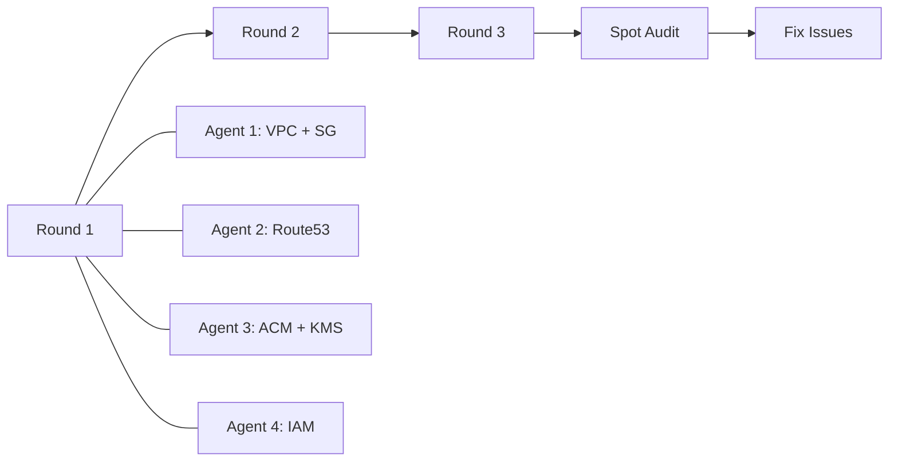

# AWS Catalog Pages: Complete Provider Coverage

**Date**: February 13, 2026
**Type**: Feature
**Components**: Documentation, Catalog Pages, AWS Provider

## Summary

Wrote hand-written, source-verified catalog pages for all 21 remaining AWS deployment components, completing the AWS provider's catalog documentation at 25/25 components. Each page follows the established 9-section standard with progressive examples, configuration reference tables verified against protobuf definitions, and resource lists verified against Pulumi module source. Also fixed an incorrect foreign key field path (`subnet_ids` to `public_subnets[0].id` / `private_subnets[0].id`) in the ALB exemplar and ECS Service pages.

## Problem Statement / Motivation

The OpenMCF docs catalog had only 4 of 25 AWS components with hand-written catalog pages (ALB, EKS Cluster, RDS Instance, S3 Bucket). The remaining 21 components relied on auto-generated research documents that contained technology landscape essays, deployment maturity spectrums, and tool comparisons -- content that belongs in a blog post, not a deployment catalog. Developers evaluating OpenMCF's AWS coverage had no quick-reference documentation for VPC, IAM, Lambda, ECS, CloudFront, or any other AWS service.

### Pain Points

- 84% of AWS components (21/25) had no developer-facing catalog documentation
- Auto-generated docs were 300-1000+ lines of research prose, not actionable deployment guides
- No quick-start manifests, no configuration reference tables, no stack output documentation
- Developers had to read raw protobuf files to understand configuration options

## Solution / What's New

21 new `catalog-page.md` files written across 3 execution rounds using 4 parallel documentation agents per round. Each page follows the mandatory 9-section structure established by the `write-catalog-page.mdc` rule and verified against the `audit-catalog-page.mdc` checklist.

### Components Covered

**Round 1 -- Networking + Security Foundations (8 components)**
- AwsVpc, AwsSecurityGroup, AwsRoute53Zone, AwsRoute53DnsRecord
- AwsCertManagerCert, AwsKmsKey, AwsIamRole, AwsIamUser

**Round 2 -- Compute + Containers (8 components)**
- AwsEcsCluster, AwsEcsService, AwsEksNodeGroup, AwsLambda
- AwsCloudFront, AwsEcrRepo, AwsEc2Instance, AwsClientVpn

**Round 3 -- Databases + Storage (5 components)**
- AwsRdsCluster, AwsDocumentDb, AwsDynamoDb, AwsSecretsManager, AwsS3ObjectSet

### Execution Pipeline

Each agent reads `api.proto`, `spec.proto`, `stack_outputs.proto`, and `iac/pulumi/module/*.go` before writing, then runs the 6-point verification protocol.

## Implementation Details

### Complexity Spectrum

The 21 components span a wide range of complexity:

- **Minimal** (0 required fields): AwsEcsCluster -- empty `spec: {}` creates a valid Fargate cluster
- **Simple** (1 required field): AwsSecretsManager -- just `secretNames` list
- **Medium** (3-5 required fields): AwsRoute53Zone, AwsKmsKey, AwsEc2Instance
- **Complex** (8+ required fields): AwsEcsService (35 fields across 6 sub-messages), AwsRdsCluster (27 optional fields with cross-field CEL validations)

### Source Verification Findings

Notable discoveries during source reading:

- **AwsEcsService**: Hardcodes `FARGATE` launch type and `awsvpc` network mode despite proto comments mentioning EC2
- **AwsEc2Instance**: Auto-generates RSA-4096 key pairs via `pulumi-tls` for BASTION/INSTANCE_CONNECT connection methods
- **AwsDocumentDb**: Creates both cluster and instances in a single component (unlike RDS which separates them)
- **AwsSecretsManager**: Seeds placeholder values and uses `IgnoreChanges` for GitOps-safe secret management
- **AwsRdsCluster**: `subnetIds` and `dbSubnetGroupName` are mutually exclusive (CEL validation)
- **AwsClientVpn**: Only `certificate` authentication is supported in v1 despite enum defining `directory` and `cognito`
- **AwsCloudFront**: `hosted_zone_id` output is hardcoded to `Z2FDTNDATAQYW2` (global CloudFront zone)

### Bug Fix: Foreign Key Field Paths

The spot audit identified incorrect foreign key paths in the AwsAlb exemplar and AwsEcsService catalog pages. The VPC stack outputs define `public_subnets` and `private_subnets` (each with `.id`, `.name`, `.cidr` sub-fields), not `subnet_ids`. Fixed in both files.

## Benefits

- AWS provider goes from 16% to **100%** catalog page coverage (4/25 to 25/25)
- Total project catalog coverage goes from 29 to **50** of ~197 production components
- Every AWS component now has: quick-start manifest, configuration reference with validation rules, progressive examples, and stack output documentation
- Foreign key `valueFrom` examples demonstrate cross-component references where applicable
- Consistent 9-section structure enables developers to navigate any AWS component page with the same mental model

## Impact

- **Developers evaluating OpenMCF**: Can now see complete AWS coverage documentation for all 25 components
- **DevOps engineers**: Have copy-pasteable manifests and configuration reference tables for every AWS resource
- **Documentation system**: The `write-catalog-page.mdc` and `audit-catalog-page.mdc` rules proved effective at scale (21 pages in one session)
- **Quality bar**: Spot audit of 4 pages (VPC, Lambda, ECS Service, DynamoDB) showed 3/4 passing with zero issues; 1 critical fix applied

## Related Work

- [Catalog Page Rewrite System](2026-02-13-150154-catalog-page-rewrite-system.md) -- established the 9-section standard and 5 exemplar pages
- [Catalog Page Expansion](2026-02-13-154844-catalog-page-expansion-across-all-providers.md) -- initial expansion to 29 pages across all 13 providers
- [Phase 6 Final Audit](2026-02-13-120312-phase6-final-audit-and-env-var-rename.md) -- env var rename and final docs audit

---

**Status**: Production Ready
**Timeline**: Single session (~45 minutes for 21 pages across 3 rounds)
