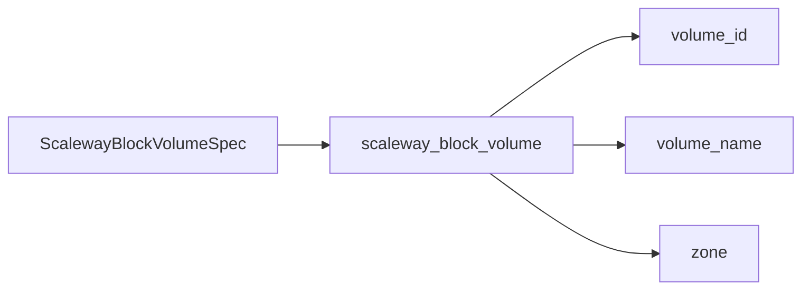

# Scaleway Block Storage Volume Resource Kind (R13)

**Date**: February 13, 2026
**Type**: Feature
**Components**: API Definitions, Protobuf Schemas, Pulumi IaC Module, Terraform IaC Module

## Summary

Implemented the ScalewayBlockVolume resource kind -- the thirteenth Scaleway resource and first block storage kind. This is a standalone (non-composite) resource wrapping a single `scaleway_block_volume` Terraform resource. Introduces a performance tier enum (`sbs_5k`/`sbs_15k`) instead of raw IOPS integers, making the API self-documenting and preventing invalid configurations.

## Problem Statement / Motivation

Scaleway Block Storage provides network-attached NVMe SSD volumes that persist independently of Instance lifecycle. These are the fundamental building blocks for any stateful workload: databases, message queues, application data, and backup storage.

### Pain Points

- No OpenMCF kind existed for Scaleway block storage, forcing users to manage volumes outside the declarative framework
- The Scaleway API uses raw IOPS integers (5000/15000) which are opaque without documentation context
- Block volumes are required for production deployments that need persistent, high-performance storage attached to Instances

## Solution / What's New

### ScalewayBlockVolume Resource Kind

A standalone resource kind that provisions a Scaleway Block Storage volume with:

- **Performance tier enum** -- `sbs_5k` (5,000 IOPS) or `sbs_15k` (15,000 IOPS) instead of raw integers
- **Size validation** -- 5 GB to 10 TB with buf-validate constraints
- **Snapshot restore** -- Optional `snapshot_id` for cloning and disaster recovery
- **Zonal placement** -- Explicit zone field ensuring co-location awareness
- **Auto-tagging** -- Standard OpenMCF metadata labels applied as flat Scaleway tags



## Implementation Details

### Performance Tier Enum

The key design decision for this resource was introducing `ScalewayBlockVolumePerformanceTier` as a protobuf enum rather than exposing the raw `uint32 iops` field from the Terraform resource:

| Enum Value | Maps To | Scaleway Product |
|---|---|---|
| `sbs_5k` | 5,000 IOPS | SBS 5K |
| `sbs_15k` | 15,000 IOPS | SBS 15K |

The IaC modules (both Pulumi and Terraform) contain a mapping table that resolves the enum to the integer IOPS value at execution time. This provides:
- IDE auto-completion for valid values
- Self-documenting spec (no magic numbers)
- Compile-time validation via `defined_only = true`

### File Structure

```
apis/org/openmcf/provider/scaleway/scalewayblockvolume/v1/
├── spec.proto                    # Spec with performance tier enum
├── stack_outputs.proto           # volume_id, volume_name, zone
├── api.proto                     # Resource definition
├── stack_input.proto             # Stack input (target + provider config)
├── README.md                     # Component documentation
├── examples.md                   # 5 usage examples + advanced patterns
├── iac/
│   ├── pulumi/
│   │   ├── main.go               # Entry point
│   │   ├── Pulumi.yaml           # Project config
│   │   └── module/
│   │       ├── main.go           # Orchestration
│   │       ├── locals.go         # Locals with flat string tags
│   │       ├── volume.go         # block.NewVolume with enum-to-IOPS mapping
│   │       └── outputs.go        # Output name constants
│   └── tf/
│       ├── main.tf               # scaleway_block_volume resource
│       ├── variables.tf          # metadata + spec + credentials
│       ├── outputs.tf            # volume_id, volume_name, zone
│       ├── locals.tf             # Performance tier lookup map + tags
│       └── provider.tf           # Scaleway provider (zonal)
```

### Patterns Used

- **Zonal resource** -- Provider configured with `zone` (not `region`), consistent with SecurityGroup (R04), Instance (R06), KapsulePool (R08)
- **Flat string tags** -- `"key=value"` format, consistent with all non-Object-Storage Scaleway resources
- **Standalone resource** -- Single Terraform resource, no composite bundling needed
- **No StringValueOrRef** -- Leaf resource with no upstream dependencies
- **Pulumi `block` subpackage** -- Uses `scaleway/block.NewVolume` (not deprecated `scaleway.BlockVolume`), following the subpackage migration pattern from R07 and R12

### What Was Consciously Excluded

- **`instance_volume_id`** -- One-time migration tool for legacy `b_ssd` volumes. Operational, not declarative.
- **Filesystem type** -- Scaleway block volumes are raw block devices. Formatting is an OS-level concern.
- **Block snapshots** -- Separate lifecycle resource; can be a future kind.

## Benefits

- **Self-documenting API** -- Performance tier enum eliminates magic IOPS numbers
- **Validation at schema level** -- buf-validate catches invalid sizes and undefined tiers before any cloud API call
- **Infra-chart ready** -- `volume_id` output enables future `StringValueOrRef` composition with ScalewayInstance
- **Complete documentation** -- README with constraints and examples with 5 real-world patterns

## Impact

- **Scaleway resource kinds**: 13 of 19 complete (68%)
- **Storage tier**: 2 of 2 planned resources complete (ObjectBucket + BlockVolume)
- **Enum range**: ScalewayBlockVolume = 2865 in the 2800-2880 range

## Related Work

- R12: ScalewayObjectBucket (first storage tier resource, map-based tags)
- R06: ScalewayInstance (future consumer of block volume IDs via `additional_volume_ids`)
- R04: ScalewayInstanceSecurityGroup (zonal resource pattern reference)

---

**Status**: Production Ready
