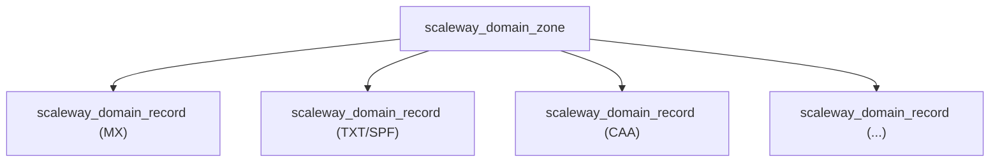

# Scaleway DNS Zone Resource Kind (R15)

**Date**: February 13, 2026
**Type**: Feature
**Components**: API Definitions, Pulumi CLI Integration, Provider Framework

## Summary

Implemented ScalewayDnsZone (R15) -- the fifteenth Scaleway resource kind and first in the DNS tier. This is a composite resource that bundles a DNS zone with optional inline DNS records, following the universal pattern established across all Planton DNS zone kinds (AWS, Azure, GCP, DigitalOcean, Cloudflare, Civo, OpenStack). Wraps `scaleway_domain_zone` + `scaleway_domain_record` Terraform resources.

## Problem Statement / Motivation

The Scaleway provider expansion needs DNS management capabilities for two critical use cases:

1. **Domain delegation** -- Users need to create DNS zones in Scaleway and configure nameservers at their domain registrar
2. **Record management** -- Static records (MX, SPF, CAA) should be bundled with the zone for convenience, while dynamic records (pointing to LB IPs, cluster endpoints) use the standalone ScalewayDnsRecord kind (R16) for DAG visibility

### Pain Points

- No DNS zone management in the Scaleway provider prior to this work
- Infra charts cannot compose DNS with other Scaleway resources without a zone kind
- The upcoming ScalewayDnsRecord (R16) needs a zone to reference

## Solution / What's New

### Composite Resource Architecture

### Dual Record Management

Two approaches coexist for maximum flexibility:

- **Inline records** on the zone spec: convenience for static records (MX, SPF, DMARC, CAA)
- **Standalone ScalewayDnsRecord** (R16, upcoming): DAG-friendly for records referencing dynamic infrastructure

### Domain + Subdomain Split

Scaleway's DNS model requires explicit `domain` (immutable parent, e.g., `example.com`) and `subdomain` (mutable prefix, e.g., `staging` for `staging.example.com`). This is more precise than a single `domain_name` field and avoids ambiguity with complex domain structures.

## Implementation Details

### Proto Schema

- `ScalewayDnsZoneSpec` with `domain` (required), `subdomain` (optional), `repeated ScalewayDnsZoneRecord records`
- `ScalewayDnsZoneRecord` with `name`, `type` (shared `DnsRecordType` enum), `data` (`StringValueOrRef`), `ttl`, `priority`
- Record data uses `StringValueOrRef` so inline records can reference other resources' outputs

### Pulumi Module

Uses `domain.NewZone()` and `domain.NewRecord()` from the `scaleway/domain` subpackage (pulumiverse SDK v1.43.0). Zone is created first, records depend on the zone. Nameserver outputs are exported from the zone resource's computed attributes.

### Terraform Module

`scaleway_domain_zone` resource + `scaleway_domain_record` with `for_each` over a flattened record map. Record type mapping from shared enum to Scaleway API strings via `locals.record_type_map`. Priority is conditionally set (only for MX/SRV).

### No Tags

Like Container Registry (R14), Scaleway DNS zones and records do not support tags in the API. Locals are simplified to skip tag building entirely.

## Benefits

- **Universal pattern compliance** -- Follows the zone+records pattern used by all 7 existing DNS zone kinds
- **Infra chart ready** -- `zone_name` output enables downstream ScalewayDnsRecord references via `StringValueOrRef`
- **Self-contained email setup** -- Inline MX, SPF, DMARC records ship with the zone in a single manifest
- **Subdomain delegation** -- Supports both root zones and delegated subdomain zones

## Impact

- **15 of 19 Scaleway resource kinds complete** (79%)
- DNS tier started; ScalewayDnsRecord (R16) is next in queue
- Unblocks infra chart DNS integration for `scaleway/kapsule-environment`

## Files Created

**Proto (4):**
- `apis/dev/planton/provider/scaleway/scalewaydnszone/v1/spec.proto`
- `apis/dev/planton/provider/scaleway/scalewaydnszone/v1/stack_outputs.proto`
- `apis/dev/planton/provider/scaleway/scalewaydnszone/v1/api.proto`
- `apis/dev/planton/provider/scaleway/scalewaydnszone/v1/stack_input.proto`

**Pulumi Go (6):**
- `apis/dev/planton/provider/scaleway/scalewaydnszone/v1/iac/pulumi/main.go`
- `apis/dev/planton/provider/scaleway/scalewaydnszone/v1/iac/pulumi/Pulumi.yaml`
- `apis/dev/planton/provider/scaleway/scalewaydnszone/v1/iac/pulumi/module/main.go`
- `apis/dev/planton/provider/scaleway/scalewaydnszone/v1/iac/pulumi/module/locals.go`
- `apis/dev/planton/provider/scaleway/scalewaydnszone/v1/iac/pulumi/module/outputs.go`
- `apis/dev/planton/provider/scaleway/scalewaydnszone/v1/iac/pulumi/module/dns_zone.go`

**Terraform HCL (5):**
- `apis/dev/planton/provider/scaleway/scalewaydnszone/v1/iac/tf/main.tf`
- `apis/dev/planton/provider/scaleway/scalewaydnszone/v1/iac/tf/variables.tf`
- `apis/dev/planton/provider/scaleway/scalewaydnszone/v1/iac/tf/outputs.tf`
- `apis/dev/planton/provider/scaleway/scalewaydnszone/v1/iac/tf/provider.tf`
- `apis/dev/planton/provider/scaleway/scalewaydnszone/v1/iac/tf/locals.tf`

**Documentation (2):**
- `apis/dev/planton/provider/scaleway/scalewaydnszone/v1/README.md`
- `apis/dev/planton/provider/scaleway/scalewaydnszone/v1/examples.md`

## Related Work

- **R14: ScalewayContainerRegistry** -- Previous kind, shared no-tags pattern
- **R16: ScalewayDnsRecord** -- Next kind, references this zone's `zone_name` output
- **DigitalOceanDnsZone** -- Primary reference implementation for composite zone+records pattern

---

**Status**: Production Ready
**Timeline**: Single session implementation
