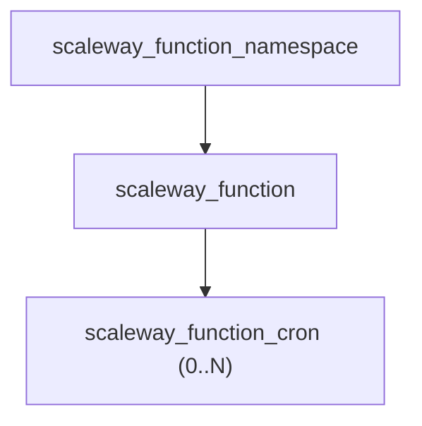

# Scaleway Serverless Function Resource Kind (R17)

**Date**: February 13, 2026
**Type**: Feature
**Components**: API Definitions, Provider Framework, Pulumi CLI Integration, Terraform Module

## Summary

Implemented ScalewayServerlessFunction (R17) -- the seventeenth Scaleway resource kind in the Planton provider. This is a composite resource that bundles a function namespace, serverless function, and optional cron triggers into a single declarable unit. Introduces a new Kubernetes-style environment variable pattern using repeated name-value messages (not maps) that preserves sort order and enables future `valueFrom` extension.

## Problem Statement / Motivation

The Scaleway provider needed a FaaS (Function-as-a-Service) resource kind to complete the serverless tier (R17-R18). Serverless functions are a key component of the planned `scaleway/serverless-environment` infra chart (IC02).

### Pain Points

- No way to declaratively manage Scaleway serverless functions through Planton
- Scaleway's function model requires a namespace + function + optional triggers -- three separate Terraform resources for a single logical function
- Previous environment variable patterns (`map<string, string>`) didn't preserve ordering and couldn't be extended with `valueFrom` semantics

## Solution / What's New

### Composite Resource Architecture



One namespace is created per function for clean lifecycle isolation. Cron triggers are bundled as optional repeated fields, following the composite pattern established by ScalewayLoadBalancer (backends/frontends) and ScalewayRdbInstance (databases/users).

### New Pattern: Kubernetes-Style Environment Variables

Instead of `map<string, string>`, environment variables are modeled as a nested `ScalewayServerlessFunctionEnv` message with two repeated fields:

```yaml
env:
  variables:
    - name: NODE_ENV
      value: production
  secrets:
    - name: DATABASE_URL
      value: postgresql://private-db:5432/mydb
```

This pattern:
- Preserves sort order (maps are unordered in protobuf)
- Groups variables and secrets cleanly in a single `env` field
- Enables future `valueFrom` extension for referencing external secret stores
- Follows Kubernetes Deployment env var conventions

The IaC modules convert repeated messages to `map[string]string` for the Scaleway API at execution time.

## Implementation Details

### Proto Schema

- `ScalewayServerlessFunctionSpec` with 16 fields covering runtime, scaling, networking, env, code deployment, and cron triggers
- `ScalewayServerlessFunctionEnv` message grouping `variables` and `secrets` repeated fields
- `ScalewayServerlessFunctionEnvVar` with `name` and `value` fields
- `ScalewayServerlessFunctionCronTrigger` with `name`, `schedule`, and `args`
- Two local enums: `ScalewayServerlessFunctionPrivacy` (public/private) and `ScalewayServerlessFunctionHttpOption` (enabled/redirected)
- All messages are component-local (no cross-component sharing)

### Pulumi Module

- Uses `functions.NewNamespace()`, `functions.NewFunction()`, and `functions.NewCron()` from the `scaleway/functions` subpackage (v1.43.0)
- Converts `env.Variables` and `env.Secrets` slices to `pulumi.StringMap{}`
- Auto-sets `Deploy: true` when `zip_file` is provided
- Loops over `cron_triggers` with unique resource names

### Terraform Module

- `scaleway_function_namespace` + `scaleway_function` + `scaleway_function_cron` with `for_each`
- `locals.tf` converts repeated env var lists to maps: `{ for ev in var.spec.env.variables : ev.name => ev.value }`
- `lifecycle.ignore_changes` on `secret_environment_variables` to prevent unnecessary updates
- `deploy` auto-set to `true` when `zip_file` is non-empty

### Key Design Decisions

- **Runtime as string** (not enum): Scaleway adds runtimes frequently; string avoids proto staleness
- **Zip deployment opt-in**: `zip_file`/`zip_hash` included for IaC-managed code; deploy flag set internally
- **Cron triggers bundled**: Enables scheduled-function pattern from a single manifest
- **Tokens and custom domains excluded**: Tokens are security artifacts; domains solved by ScalewayDnsRecord CNAME
- **Env vars on function only** (not namespace): One namespace per function makes namespace-level env vars redundant

## Benefits

- **Single-resource experience**: Users declare one ScalewayServerlessFunction to get a fully configured function with scheduled triggers
- **VPC connectivity**: Private Network attachment for secure database/Redis access without public internet
- **Infra chart composability**: `private_network_id` (StringValueOrRef) and `domain_name` output enable dependency-aware infra charts
- **New env var standard**: Kubernetes-style repeated messages set the pattern for R18 (ServerlessContainer) and R19 (SecretManager)

## Impact

- **17th of 19** Scaleway resource kinds implemented (89% complete)
- **2 remaining**: ScalewayServerlessContainer (R18), ScalewaySecretManager (R19)
- **New pattern introduced**: `ScalewayServerlessFunctionEnv` with repeated `EnvVar` messages -- future resource kinds should follow this pattern instead of `map<string, string>`

## Files Created

- `apis/dev/planton/provider/scaleway/scalewayserverlessfunction/v1/api.proto`
- `apis/dev/planton/provider/scaleway/scalewayserverlessfunction/v1/spec.proto`
- `apis/dev/planton/provider/scaleway/scalewayserverlessfunction/v1/stack_input.proto`
- `apis/dev/planton/provider/scaleway/scalewayserverlessfunction/v1/stack_outputs.proto`
- `apis/dev/planton/provider/scaleway/scalewayserverlessfunction/v1/iac/pulumi/module/main.go`
- `apis/dev/planton/provider/scaleway/scalewayserverlessfunction/v1/iac/pulumi/module/locals.go`
- `apis/dev/planton/provider/scaleway/scalewayserverlessfunction/v1/iac/pulumi/module/function.go`
- `apis/dev/planton/provider/scaleway/scalewayserverlessfunction/v1/iac/pulumi/module/outputs.go`
- `apis/dev/planton/provider/scaleway/scalewayserverlessfunction/v1/iac/pulumi/Pulumi.yaml`
- `apis/dev/planton/provider/scaleway/scalewayserverlessfunction/v1/iac/tf/main.tf`
- `apis/dev/planton/provider/scaleway/scalewayserverlessfunction/v1/iac/tf/variables.tf`
- `apis/dev/planton/provider/scaleway/scalewayserverlessfunction/v1/iac/tf/outputs.tf`
- `apis/dev/planton/provider/scaleway/scalewayserverlessfunction/v1/iac/tf/provider.tf`
- `apis/dev/planton/provider/scaleway/scalewayserverlessfunction/v1/iac/tf/locals.tf`
- `apis/dev/planton/provider/scaleway/scalewayserverlessfunction/v1/README.md`
- `apis/dev/planton/provider/scaleway/scalewayserverlessfunction/v1/examples.md`
- Plus generated Go stubs and BUILD.bazel files (via buf generate + Gazelle)

## Related Work

- **Predecessor**: R16 ScalewayDnsRecord (completed same day)
- **Next**: R18 ScalewayServerlessContainer (CaaS, completes serverless tier)
- **Infra Chart**: IC02 `scaleway/serverless-environment` will compose this resource with VPC, PrivateNetwork, DNS, and optional databases

---

**Status**: Production Ready
**Timeline**: Single session implementation
