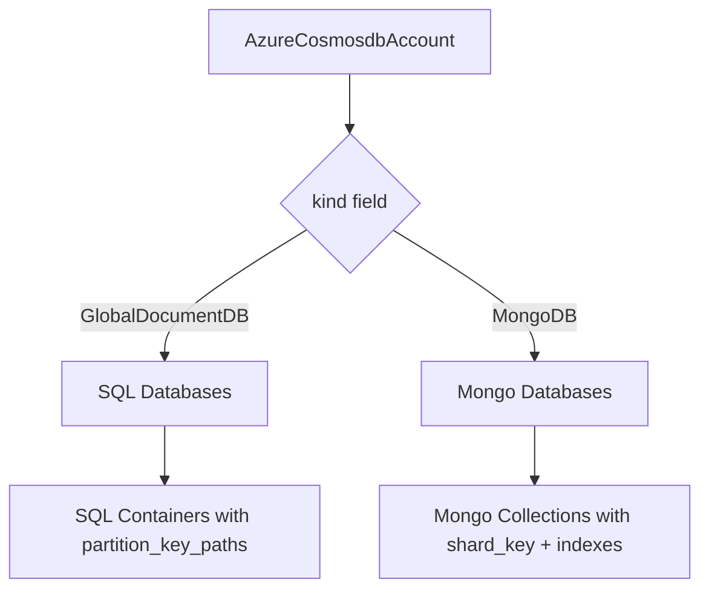

# Azure Cosmos DB Account Deployment Component

**Date**: February 13, 2026
**Type**: Feature
**Components**: API Definitions, Azure Provider, Pulumi IaC, Terraform IaC

## Summary

Added AzureCosmosdbAccount as a new Planton deployment component supporting both SQL/NoSQL API (GlobalDocumentDB) and MongoDB API through a single unified resource. The component bundles the Cosmos DB account with SQL databases/containers and MongoDB databases/collections, following DD03 composite bundling rules. This is the 15th Azure resource kind (R14 in the Azure resource expansion queue) and the first NoSQL database in the Azure provider.

## Problem Statement / Motivation

The Azure resource expansion project (20260212.05.sp) targets 24 new Azure resource kinds. After completing the relational database trifecta (PostgreSQL, MySQL, MSSQL), the next gap was NoSQL/document database coverage. Enterprise Azure architectures frequently require Cosmos DB for globally distributed, low-latency document storage alongside relational databases.

### Pain Points

- No NoSQL database option in the Azure Planton provider
- Enterprise Azure infra charts (database-stack) need Cosmos DB as an optional component
- Teams using Cosmos DB had to fall back to raw Terraform/Pulumi, breaking the Planton abstraction

## Solution / What's New

A single `AzureCosmosdbAccount` component that supports both Cosmos DB API modes via a `kind` field, matching how Azure itself models the resource (one `azurerm_cosmosdb_account` with a kind parameter).

### Architecture

### Key Design Decision: One Component, Not Two

Initial design considered splitting into AzureCosmosdbSqlAccount and AzureCosmosdbMongoAccount. After critical evaluation, a single component was chosen because:

1. Azure users think of Cosmos DB as one service (portal, Terraform, Pulumi all model it as one resource)
2. 90% of account-level configuration is identical between API modes
3. Infra charts are cleaner with one resource (no conditional includes)
4. Maintenance burden is halved (one spec, one module, one test suite)

## Implementation Details

### 12 Corrections from T02 Spec

Deep research into the Terraform azurerm provider source (`internal/services/cosmos/`) revealed 12 corrections to the original T02 plan:

1. Added `resource_group` (StringValueOrRef) -- per DD05
2. Added `region` -- per established pattern
3. Hardcoded `offer_type = "Standard"` -- only valid Azure value
4. String + CEL instead of proto enums -- provider-authentic values
5. Added `ConsistentPrefix` -- 5th consistency level missed in T02
6. Renamed `is_free_tier` to `free_tier_enabled` -- provider-authentic
7. Renamed `multi_region_write_enabled` to `multiple_write_locations_enabled`
8. Added `zone_redundant` to GeoLocation
9. Added `public_network_access_enabled`
10. Added `ip_range_filter` (IP-based firewall)
11. Replaced flat `consistency_level` with `AzureCosmosdbConsistencyPolicy` block
12. Replaced `initial_database_name` with deep-bundled databases + containers/collections

### Proto API (4 files)

- **spec.proto**: 10 message types (the most of any Azure component), covering account config, consistency policy, geo locations, VNet rules, backup policy, SQL databases/containers, and MongoDB databases/collections
- **stack_outputs.proto**: 7 outputs including both SQL and MongoDB connection strings
- **api.proto**: Standard KRM wiring
- **stack_input.proto**: Standard IaC module input

### Validation Tests (35 tests)

Comprehensive spec_test.go with 35 Ginkgo test cases:
- 11 valid input tests (minimal, SQL DBs, MongoDB, multi-region, BoundedStaleness, backup policies, VNet rules, autoscale, hierarchical partition keys, free tier, all consistency levels)
- 24 invalid input tests (empty region, missing resource_group, name validation, geo_location constraints, invalid enums, range validations, empty collections, missing partition keys)

### Pulumi Module

- `cosmosdb.NewAccount` with auto-added `EnableMongo` capability for MongoDB kind
- Kind-based branching: GlobalDocumentDB creates SQL databases/containers, MongoDB creates Mongo databases/collections
- Throughput/autoscale mutual exclusivity handled per database and per container/collection
- Backup policy conditional: Periodic (interval, retention, redundancy) vs Continuous (tier)

### Terraform Module

- Dynamic blocks for geo_location, capabilities, virtual_network_rule, backup
- Flattened locals for nested containers/collections (`for_each` on flattened lists)
- Conditional `for_each` based on `kind` for SQL vs MongoDB sub-resources

## Benefits

- **Unified API**: One component covers both SQL and MongoDB Cosmos DB APIs
- **Deep bundling**: Account + databases + containers/collections in one deployment
- **Global distribution**: Multi-region with automatic failover, zone redundancy
- **Five consistency levels**: BoundedStaleness with configurable staleness parameters
- **Serverless support**: `EnableServerless` capability for pay-per-request mode
- **Network security**: VNet rules, IP firewall, private endpoint integration
- **Backup flexibility**: Periodic or Continuous with point-in-time restore

## Impact

- **Users**: Can deploy Cosmos DB (SQL or MongoDB API) with the same Planton workflow as all other Azure resources
- **Infra charts**: database-stack chart can now include Cosmos DB as an optional NoSQL database
- **Azure provider**: 15 of 24 resource kinds complete (62.5% of expansion target)

## Related Work

- R11-R13: PostgreSQL, MySQL, MSSQL (established the database bundling pattern)
- DD03: Composite Bundling Rules (databases + containers bundled with account)
- DD05: AzureResourceGroup as first-class resource (StringValueOrRef resource_group)
- T02: Azure resource expansion queue (R14 now complete)

---

**Status**: Production Ready
**Files**: 34 new files (30 in apis/, 4 in app/frontend/), 4 modified files
**Tests**: 35/35 passing
