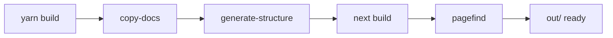

# Docs Sidebar Static Export Fix and Manual Deploy Workflow

**Date**: February 14, 2026
**Type**: Bug Fix / Enhancement
**Components**: Build System, CI/CD, User Experience

## Summary

Fixed the documentation sidebar not loading on the production site (GitHub Pages) by discovering that Yarn Berry 4.x silently ignores `prebuild` lifecycle scripts. Replaced the broken lifecycle hook with explicit build chaining in `yarn build`, making the build self-contained. Also added a manual website deploy workflow for deploying from any branch on demand.

## Problem Statement / Motivation

The docs sidebar fetches its navigation structure from a static JSON file (`/docs-structure.json`). A previous fix replaced the broken API route approach with a build-time script that generates this file, placed in `prebuild` so it runs before `next build`.

### Pain Points

- The sidebar loaded correctly on `localhost:3000` (because the script had been run manually during testing) but returned **404 on production** (`https://planton.dev/docs-structure.json`)
- Root cause: **Yarn Berry (4.x) does not fire `prebuild` lifecycle scripts**. The hook was silently ignored during `yarn build`, so the structure JSON was never generated in CI
- The CI workflows had a redundant `yarn copy-docs` step that ran separately from the build, creating an implicit coupling between workflow steps and the build contract
- No way to deploy the website from a feature branch for previewing changes before merging

## Solution / What's New

### Self-Contained Build Script

Removed the broken `prebuild` hook and chained all preparation steps directly into the `build` script:

```json
"build": "yarn copy-docs && yarn generate-structure && next build --turbopack && pagefind ..."
```

This makes `yarn build` a single command that always produces a correct `out/` directory — no lifecycle hooks, no prerequisites, no implicit dependencies.



### Simplified CI Workflows

Removed the separate `yarn copy-docs` step from both `release.website.yaml` and `auto-release.website.yaml`. Since `yarn build` now handles everything, the CI just needs:

```yaml
- name: Build site
  run: yarn build
```

### Manual Deploy Workflow

Created `deploy.website.yaml` — a lightweight `workflow_dispatch` workflow that builds and deploys to GitHub Pages from any branch selected in the GitHub Actions UI. No tagging, no GitHub release creation — just build and deploy.

## Implementation Details

### package.json Changes

```diff
- "prebuild": "yarn copy-docs && tsx scripts/generate-docs-structure.ts",
- "build": "next build --turbopack && pagefind ...",
+ "generate-structure": "tsx scripts/generate-docs-structure.ts",
+ "build": "yarn copy-docs && yarn generate-structure && next build --turbopack && pagefind ...",
```

Key decisions:
- `generate-structure` exposed as a named script for standalone use (e.g., `make dev` target)
- No lifecycle hooks — explicit chaining is deterministic across all package managers

### Makefile Changes

```diff
- build: deps copy-docs
+ build: deps
    yarn build
```

The `build` target no longer calls `copy-docs` separately since `yarn build` is self-contained. The `generate-structure` target remains for the `dev` workflow which doesn't go through `yarn build`.

### CI Workflow Changes

Both `release.website.yaml` and `auto-release.website.yaml` had a 3-line `Copy component documentation` step removed. The build contract is now: `yarn build` produces a complete, deployable `out/` directory.

### New Manual Deploy Workflow

`deploy.website.yaml` uses GitHub's native branch picker (part of `workflow_dispatch` UI) — no custom inputs needed. Identical build steps to the release workflows, minus the release ceremony.

## Benefits

- **Production sidebar works**: The structure JSON is now reliably generated during every build
- **No lifecycle hook surprises**: Explicit chaining in the `build` script works identically across npm, Yarn Classic, and Yarn Berry
- **Self-contained build**: `yarn build` always produces correct output regardless of context (Make, CI, or direct invocation)
- **Simplified CI**: Fewer moving parts, single build command
- **Branch preview deploys**: Can deploy from any branch to verify site changes before merging

## Impact

- **End users**: Docs sidebar now loads correctly on `planton.dev`
- **Developers**: `yarn build` and `make preview-site` work reliably from clean state
- **CI/CD**: Simpler workflows, fewer implicit dependencies between steps
- **Operations**: Manual deploy capability for any branch

## Related Work

- Previous session: Created `scripts/generate-docs-structure.ts`, updated `DocsSidebar.tsx` fetch URL, deleted API route, updated `.gitignore`
- Docs feature parity project: `_projects/20260212.03.planton-docs-feature-parity/`

---

**Status**: Production Ready
**Timeline**: ~2 hours across 2 sessions (diagnosis + fix + Yarn Berry discovery + CI updates)
