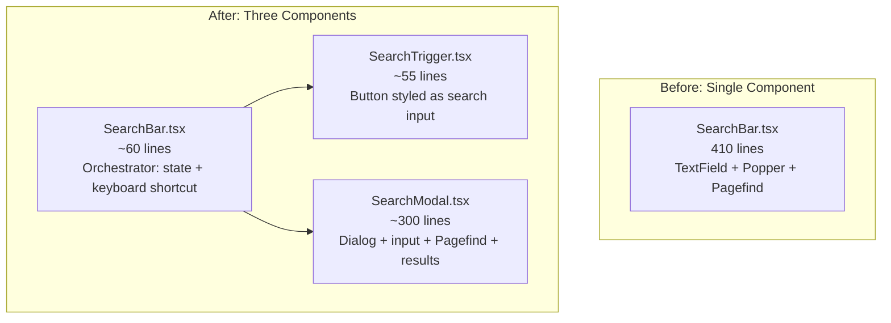

# Docs Search: Trigger Button + Centered Modal

**Date**: February 14, 2026
**Type**: Enhancement
**Components**: Documentation Site, User Experience

## Summary

Refactored the docs site search from an inline header input with a corner-anchored dropdown into a trigger-button-plus-centered-modal pattern. The header now displays a compact button that opens a full-width modal dialog on click or via `⌘K` / `Ctrl+K`. The modal provides a wider search input, scrollable grouped results, keyboard navigation (arrow keys + Enter), and footer shortcut hints.

## Problem Statement / Motivation

The previous search implementation was a 410-line monolith component (`SearchBar.tsx`) that combined an MUI `TextField` in the header with a `Popper` dropdown for results. This had several UX limitations:

### Pain Points

- The search input was `w-64` (256px) in the header, which squeezed the `⌘K` badge against the placeholder text
- Results appeared in a narrow dropdown anchored to the top-right corner, capped at 576px wide
- The dropdown lacked keyboard navigation through results (only focus/blur)
- The `Popper` component required manual blur-delay hacks (`setTimeout` 200ms) to allow clicking results before the dropdown closed
- Single-component architecture mixed presentation (trigger), logic (Pagefind integration), and state management (focus, anchor, results) in one file

## Solution / What's New

Adopted the trigger-button-plus-modal pattern used by Tailwind CSS, Vercel, Next.js, and Stripe documentation sites.

### Architecture

### Key Features

- **SearchTrigger**: A `<button>` styled to look like the previous input — search icon, placeholder text, `⌘K` badge. No input state management.
- **SearchModal**: MUI `Dialog` positioned near the top of the viewport (not dead-center). Contains an autofocused text input, scrollable results grouped by page, and a footer showing keyboard hints (`↵ select`, `↑↓ navigate`, `esc close`).
- **SearchBar**: Thin orchestrator that renders the trigger, controls the modal's open/close state, and owns the global `⌘K` / `/` keyboard shortcut. ~60 lines, down from 410.

## Implementation Details

### SearchTrigger (`SearchTrigger.tsx`)

- Native `<button>` element with Tailwind classes (no MUI `TextField` overhead)
- Platform detection (`navigator.userAgent`) deferred to `useEffect` to avoid SSR hydration mismatch
- Width: `w-64` matching the original search bar width
- `⌘K` badge hidden on `xs` screens via `hidden sm:inline-flex`

### SearchModal (`SearchModal.tsx`)

- MUI `Dialog` with custom positioning: `alignItems: 'flex-start'` + `pt: 15vh` — modal appears near the top, not dead-center, keeping it close to where the user's eyes are
- Native `<input>` with Tailwind for the search field (lighter than MUI `TextField`)
- Pagefind integration unchanged: same dynamic import via `addBasePath`, same `debouncedSearch` API, same `.html` extension stripping
- **Keyboard navigation**: Flat index over all sub-results. `ArrowDown`/`ArrowUp` cycle through results, `Enter` navigates to the active result. `data-result-index` attributes enable `scrollIntoView({ block: 'nearest' })` for the active item.
- `onMouseEnter` on each result syncs the active index, so keyboard and mouse navigation are consistent
- State resets on every open (query, results, error, active index) for a fresh experience each time
- Footer bar with `FooterHint` helper renders keyboard shortcut hints

### SearchBar (`SearchBar.tsx`)

- Reduced from 410 lines to ~60 lines
- `useState(false)` for modal open/close
- Global `keydown` listener for `⌘K` / `Ctrl+K` / `/` — opens the modal
- Exception: `⌘K` works even when focused inside an input (standard pattern — matches VS Code, Linear, etc.)
- Renders `<SearchTrigger onClick={handleOpen} />` + `<SearchModal open={open} onClose={handleClose} />`

### What Did NOT Change

- `DocsHeader.tsx` — still imports `<SearchBar />`, zero modifications needed
- `layout.tsx`, `page.tsx`, `RightSidebar.tsx` — untouched
- Pagefind build pipeline — same `pagefind --site out` in the build script
- Color scheme — same purple accent (`#a855f7`), same slate backgrounds

## Benefits

- **Better UX**: Wide modal gives results room to breathe; keyboard navigation enables hands-on-keyboard workflow
- **Cleaner architecture**: Three focused components instead of one monolith; each file has a single responsibility
- **No blur-delay hacks**: MUI Dialog handles focus trapping and backdrop click natively — no more `setTimeout` 200ms workarounds
- **Accessibility**: Dialog provides `role="dialog"`, focus trapping, scroll lock, and Escape-to-close out of the box
- **Consistent with industry**: Matches the pattern users already know from Tailwind, Vercel, Next.js, Stripe, and Algolia DocSearch

## Impact

- **Users**: Search is now a first-class modal experience — wider, keyboard-navigable, visually prominent
- **Developers**: Three small, focused files are easier to maintain than one 410-line component
- **No breaking changes**: The public API (`<SearchBar />` import) is preserved; no other files needed modification

## Related Work

- Docs sidebar static export fix (2026-02-14) — ensured sidebar loads on GitHub Pages
- Docs site UX fixes (2026-02-14) — sidebar labels, URL slugs, navigation flash, code copy button

---

**Status**: Production Ready
**Build**: Verified — 259 pages, 255 indexed, zero errors
